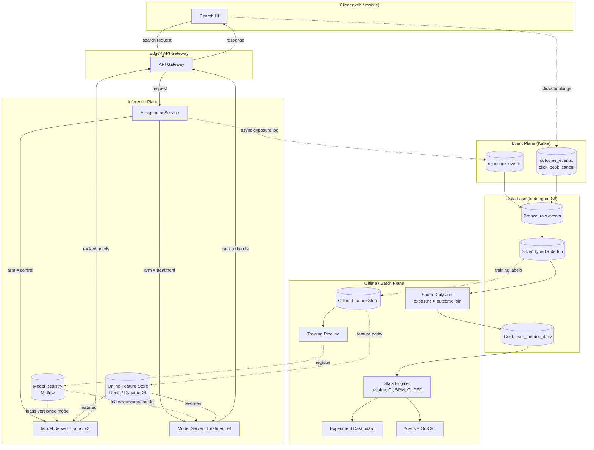
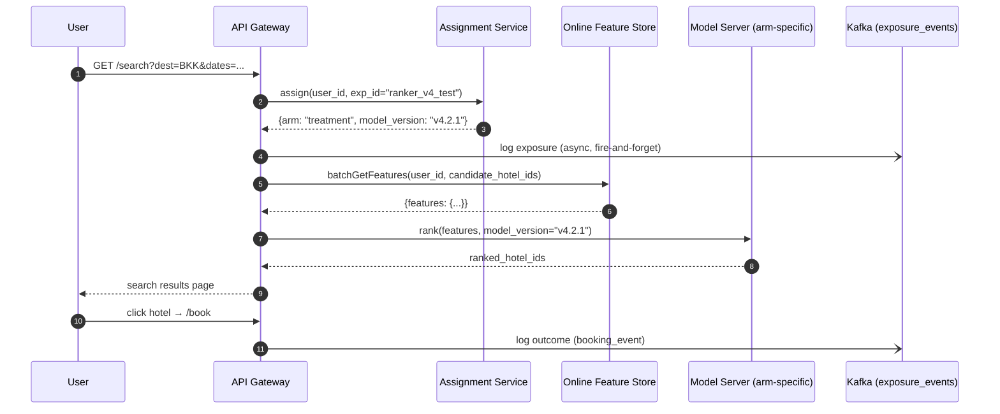
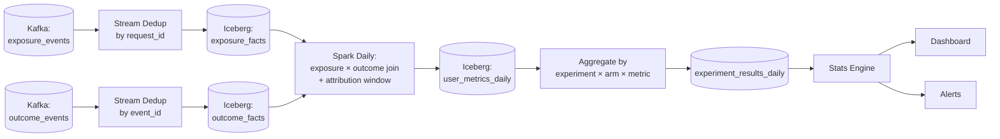

# Agoda Data Engineering — System Design Interview Prep (Round 2)

> **Audience:** Rishin — preparing for Agoda's 2nd round (System Design, Data Engineering).
> **Scope:** End-to-end DE system design tailored for an OTA (Online Travel Agency) at Agoda's scale.
> **How to use:** Read sequentially first (concepts build on each other), then drill into Part 7 (mock questions) for active recall before the interview.

---

## What Agoda actually runs (anchor your answers in these numbers)

These are public, sourced from Agoda's engineering blog, Firebolt podcast, and InfoQ articles (2021–2026). Drop them into your interview to show you've researched:

| Metric | Value |
|---|---|
| Kafka events/day | **~1.5 trillion** |
| Data lake size | **tens of petabytes** (12 PB ingested/month) |
| ML predictions/day | **60 billion+** |
| Concurrent A/B experiments | **up to 1,000** |
| Accommodation listings | **3.6M+ properties** |
| Tech stack (data) | Kafka, Spark, Hadoop/HDFS → moving to object store, Kubernetes, MLflow, Kubeflow, **VastStorage**, **StarRocks**, Elasticsearch |
| Languages | Scala (heavy), Kotlin, C#, Python, Rust, Go |
| Notable internal systems | **Hadin** (next-gen Kafka→Hadoop ingester, replaced Camus), **FINUDP** (Financial Unified Data Pipeline on Spark) |

## Table of contents

**Part 1** — How to Approach a DE System Design Interview (the framework)
**Part 2** — OTA-Specific System Designs (7 deep dives)
&nbsp;&nbsp;2.1 Hotel Search & Availability
&nbsp;&nbsp;2.2 Supplier Inventory Sync (CDC, real-time)
&nbsp;&nbsp;2.3 Dynamic Pricing Platform
&nbsp;&nbsp;2.4 Booking / Reservation transaction system
&nbsp;&nbsp;2.5 Clickstream Analytics & A/B Testing
&nbsp;&nbsp;2.6 ML Feature Store for Recommendations
&nbsp;&nbsp;2.7 Financial Data Pipeline (FINUDP-style)

**Part 3** — Data Engineering Deep Dives (Kafka, Spark, modeling, formats, orchestration)
**Part 4** — Performance & Scalability at 1M+ QPS / PB scale
**Part 5** — Operational Excellence (DQ, monitoring, DR, backfills)
**Part 6** — Advanced Topics (exactly-once, idempotency, event sourcing, multi-region)
**Part 7** — Mock Interview Questions with Detailed Model Answers (10 questions)
**Part 8** — Common Mistakes, Tricks, and Cheat-Sheet of Numbers

# Part 0 — Fundamentals, Terminology & The 5 Rejection Patterns

> **Why this part exists:** the recruiter shared the exact reasons candidates fail this round. Every section below is engineered to neutralize one of those five patterns. Read this part first — it is the *grammar* of the rest of the notebook.

## 0.0 — What the recruiter actually told us

Five rejection buckets, in order of frequency:

| # | Rejection pattern | What it sounds like in your answer | Where this notebook fixes it |
|---|---|---|---|
| 1 | **Missing production readiness** | "I'd write data to S3, then load to the warehouse." (No DQ checks, no replay, no idempotency) | §0.6 + Part 5 |
| 2 | **Weak trade-off justification** | "I'd use Spark for this." (No "because X, accepting cost Y") | §0.4 + every "Why this over that" callout |
| 3 | **Shallow data fundamentals** | "I'd partition by date." (Why? Cardinality? Skew?) | §0.5 + Part 3 |
| 4 | **Sizing/estimation gaps** | "It'll be a lot of data." (No QPS, no GB/day, no bottleneck) | §0.7 + Part 1 math |
| 5 | **Structure & communication** | Diving into Kafka configs before clarifying requirements | Part 1 framework |

**Mental rule for the interview:** every architectural choice you make must end with the words *"because… accepting that…"* — even silently. If you can't finish that sentence, you don't have a design, you have a vocabulary list.

## 0.1 — Terminology Glossary (every term in this notebook, plain English)

Skim the whole list once; you'll forget half — that's fine. Come back when a term shows up later.

### Streaming & messaging
- **Kafka** — distributed append-only log. Producers write to *topics*; topics are split into *partitions*; consumers read at their own pace. Think "durable replayable queue at internet scale."
- **Topic** — named stream of events (e.g., `bookings.created.v1`).
- **Partition** — ordered shard of a topic. Order is guaranteed *within* a partition, not across. Number of partitions = max parallelism.
- **Consumer group** — set of consumers that share work for a topic; each partition is read by exactly one consumer in the group.
- **Offset** — position in a partition (0, 1, 2…). Consumers track the last processed offset.
- **Broker** — a Kafka server. A cluster has many brokers; partitions are replicated across them.
- **ISR (In-Sync Replicas)** — replicas of a partition that are caught up with the leader. `acks=all` = leader waits for all ISRs before acknowledging.
- **Schema Registry** — central store for Avro/Protobuf/JSON schemas, enforces compatibility (backward, forward, full) so producers can't break consumers.
- **Flink** — true streaming engine (event-at-a-time, native windowing, true exactly-once via two-phase commit). Use over Spark Streaming when latency must be <100 ms or windowing logic is complex.
- **Spark Structured Streaming** — micro-batch streaming on Spark. Easier ops, lower throughput floor, ~1s minimum latency. Good default if you already have Spark.
- **Kinesis / Pulsar / RabbitMQ** — alternatives to Kafka. Kinesis is managed Kafka-like (AWS); Pulsar separates compute & storage; RabbitMQ is a smart broker (good for RPC, bad for replay/scale).

### Batch & compute
- **Spark** — distributed in-memory compute engine. Reads from anywhere, writes to anywhere, runs on any cluster manager (YARN, K8s, standalone). Lazy DAG of *transformations* (filter, join) executed on *actions* (count, write).
- **Stage** — set of Spark transformations with no shuffle between them.
- **Shuffle** — repartitioning data across the cluster (triggered by `groupBy`, `join`, `repartition`). The single most expensive Spark operation; minimize it.
- **Skew** — one partition has much more data than others; the whole job waits for the straggler. Fixed via salting, AQE, broadcast joins.
- **Broadcast join** — small table is shipped to every executor; no shuffle. Use when one side is <100 MB-ish.
- **AQE (Adaptive Query Execution)** — Spark 3.x runtime optimizer that dynamically coalesces partitions, switches join strategies, and handles skew based on actual stats.
- **Driver / Executor** — driver = brain (plans the job); executors = workers (run tasks, hold cached data).
- **Pandas / Polars / DuckDB** — single-node tools. Fast for <100 GB on one machine. Pick over Spark when data fits in RAM and ops simplicity matters.
- **Trino / Presto** — distributed SQL query engine over multiple sources (S3, Hive, Postgres). No storage of its own. Use for federated ad-hoc analytics.

### Storage & file formats
- **Row store** — rows physically together (Postgres, MySQL, MongoDB). Fast for "give me this whole row." Bad for analytics scans.
- **Columnar store** — columns physically together (Parquet, ORC, ClickHouse, Snowflake). Fast for "sum this column over a billion rows." Bad for single-row updates.
- **OLTP** — Online Transaction Processing. Many small reads/writes, ACID, low latency. Postgres, MySQL.
- **OLAP** — Online Analytical Processing. Few huge scans, eventual consistency OK, throughput-oriented. Snowflake, BigQuery, Redshift, ClickHouse.
- **HTAP** — Hybrid (TiDB, SingleStore). Mostly a marketing term; usually you still want two systems.
- **Parquet** — columnar file format. Default for data lakes. Splittable, compressed, schema-embedded, predicate-pushdown via row-group statistics.
- **ORC** — like Parquet, slightly better for Hive ecosystem. Pick Parquet unless you have a reason.
- **Avro** — row-based binary format with schema. Default for Kafka payloads (streaming, schema evolution).
- **JSON / CSV** — text formats. Use for interchange, never for analytics storage. CSV has no types, no schema, no nesting — say "no" if proposed for a pipeline.
- **Iceberg / Delta / Hudi** — *table formats* that sit on top of Parquet files in object storage. Add ACID transactions, time travel, schema evolution, hidden partitioning. This is the modern "data lakehouse" foundation.
- **Object storage (S3, GCS, Azure Blob)** — cheap, infinite, eventually consistent (now strongly consistent for most ops on S3). Replaces HDFS for most new pipelines.
- **HDFS** — Hadoop Distributed File System. Co-locates compute and storage. Mostly being decommissioned in favor of object storage + K8s.

### Databases
- **Postgres / MySQL** — relational, ACID, single-node primary with replicas. Default OLTP.
- **Cassandra / ScyllaDB** — wide-column, masterless, eventually consistent, tuned for high write throughput. Pick when writes >> reads and you can model around the partition key.
- **DynamoDB** — managed key-value/document on AWS. Predictable single-digit-ms latency. Pay per request. Schema-on-read.
- **MongoDB** — document store. Flexible schema. Good for product catalogs, bad for joins.
- **Redis** — in-memory key-value store. Used for caching, session, rate limiting, pub/sub, leaderboards. Single-threaded per shard.
- **Elasticsearch / OpenSearch** — inverted-index search engine. Use for full-text search and faceted filtering, not as the primary store.
- **StarRocks / ClickHouse / Druid / Pinot** — real-time OLAP engines. Sub-second analytical queries on streaming data. Used for dashboards, A/B test results, observability.

### Data modeling
- **Star schema** — fact table (events/transactions) + dimension tables (descriptors). Optimized for BI.
- **Snowflake schema** — normalized star (dims have sub-dims). Saves space, more joins.
- **Data Vault** — hubs/links/satellites. Audit-friendly, ugly to query directly.
- **OBT (One Big Table)** — denormalize everything into a wide table. Cheapest for columnar engines, painful to update.
- **Medallion (Bronze/Silver/Gold)** — Databricks-popular layering: raw → cleaned → business-ready.
- **SCD (Slowly Changing Dimension)** — how to track historical changes to dimensions. Type 1 = overwrite, Type 2 = new row with valid_from/valid_to, Type 3 = previous-value column.
- **Surrogate key (sk)** — meaningless integer key generated by the warehouse, decoupled from source IDs. Survives source-system changes.
- **CDC (Change Data Capture)** — stream every insert/update/delete from a source DB (via WAL/binlog). Tools: Debezium, AWS DMS, Fivetran.

### Pipeline guarantees
- **At-most-once** — message delivered 0 or 1 times. Possible loss, no duplicates. Almost never what you want.
- **At-least-once** — message delivered 1 or more times. No loss, possible duplicates. Default for Kafka. Requires *idempotent* consumers.
- **Exactly-once** — message effect applied exactly once. Hard. Achieved via idempotency keys + transactional sink, or end-to-end transactions (Kafka EOS, Flink + transactional sink).
- **Idempotent** — applying the operation twice has the same effect as once. The cheapest path to "exactly-once *semantics*."
- **Outbox pattern** — write business state + event to the same DB transaction; CDC streams the event. Solves "what if I committed the order but Kafka was down?"
- **Saga** — long-running transaction split into steps with compensating actions. Used when 2PC is unavailable (microservices, third-party APIs).
- **2PC (Two-Phase Commit)** — coordinator asks all participants to prepare, then commit. Blocking, fragile across networks; avoid in distributed systems.

### Consistency & availability
- **CAP theorem** — under network partition (P), choose Consistency or Availability. (P is non-negotiable in real distributed systems.)
- **PACELC** — extends CAP: when there's no partition (E), trade Latency vs Consistency.
- **Strong consistency** — every read sees the latest committed write.
- **Eventual consistency** — replicas converge "soon"; reads may see stale data.
- **Read-your-writes** — a client always sees its own writes (weaker than strong, stronger than eventual).
- **Linearizability** — there is a single global order of operations consistent with real time. Strongest single-object guarantee.
- **Serializability** — multi-object transactions appear to execute in some serial order. The DB world's "strongest."

### Orchestration & workflows
- **Airflow** — DAG-based scheduler. Python-defined. Battle-tested but task-graph centric (not data-centric).
- **Dagster** — asset-centric orchestrator. Models *data assets* not just tasks. Better lineage, modern.
- **Prefect** — Pythonic Airflow alternative.
- **Temporal** — durable workflow engine. State machines that survive restarts. Great for sagas/long-running business workflows; not a data-pipeline tool.
- **dbt** — SQL-based transformation framework. Models = SELECTs; testing, docs, lineage built in. Owns the "T" in ELT.

### Observability
- **SLI** — Service Level Indicator: a metric you measure (e.g., 99th-percentile freshness lag).
- **SLO** — Service Level Objective: target for the SLI (e.g., "p99 freshness < 5 min, 99.9% of the month").
- **SLA** — Service Level Agreement: contract with consequences (refunds, etc.). Almost never set internal SLAs.
- **Error budget** — 1 − SLO. If SLO is 99.9%, you have 0.1% of the month to spend on outages/risky deploys.
- **Four pillars** — metrics, logs, traces, *and* events (some say three; for DE add "data quality").

## 0.2 — Technology Fundamentals (what problem each tool solves, and when NOT to use it)

The recruiter said: *"picking tools/patterns without explaining why."* The fix is to know **what problem each tool was invented to solve**. If your problem isn't that problem, pick another tool.

### Kafka — *"I need a durable, replayable, ordered stream that scales horizontally."*
- **Solves:** decoupling producers and consumers, replayability (consumers can rewind), high throughput (millions of events/sec), durable buffer between systems.
- **Don't use when:** you need request-reply RPC (use gRPC), you need fan-in to a single consumer with complex routing (RabbitMQ), or your volume is < 1000 events/sec and you don't need replay (just call the API).
- **Key trade-off:** ordering is per-partition only. If you need global ordering, you need 1 partition = no parallelism.

### Spark — *"I need to process more data than fits on one machine, with SQL or DataFrames."*
- **Solves:** distributed batch and micro-batch processing, ETL on TB–PB data, ML on big data via MLlib.
- **Don't use when:** data fits in RAM on one machine (use Pandas/Polars/DuckDB — 10× faster, 1/10 the ops), you need <100 ms latency (use Flink), you need ad-hoc SQL on warehouse-resident data (use the warehouse).
- **Key trade-off:** JVM overhead and shuffle cost. Anything under ~50 GB is usually faster on one big node.

### Flink — *"I need true streaming with sub-second latency, complex windows, and exactly-once."*
- **Solves:** event-time processing, low-latency stream joins, complex CEP, true EOS via 2PC sinks.
- **Don't use when:** you already have a Spark team and your latency budget is >1s.
- **Key trade-off:** higher operational complexity than Spark.

### Object storage (S3/GCS) — *"I need infinite, cheap, durable storage."*
- **Solves:** cost ($0.023/GB/month vs. $0.10+ for block storage), 11 nines durability, decoupling of storage and compute (any engine can read).
- **Don't use when:** you need <10 ms latency per object, or random updates inside files (it's append-only / replace-only).
- **Key trade-off:** higher per-request latency (~50 ms first byte) vs. block storage. Solved by parallelism and large files.

### Iceberg / Delta / Hudi — *"I need ACID and schema evolution on a data lake."*
- **Solves:** atomic commits to S3 (no half-written tables), schema evolution without rewrites, time travel, hidden partitioning, MERGE INTO for CDC sinks.
- **Don't use when:** you have one writer and never change schema (raw Parquet is fine), or you're a Snowflake-only shop.
- **Trade-off table:**

| | Iceberg | Delta | Hudi |
|---|---|---|---|
| Engine-neutral | ✅ best | OK (Spark-first) | OK |
| Streaming upserts | OK | OK | ✅ best (designed for it) |
| Backed by | Apache (Netflix-led) | Databricks | Uber/Apache |
| Pick when | multi-engine future | Databricks-heavy | high-frequency upserts (CDC) |

### Cassandra — *"I need extreme write throughput with predictable latency, masterless."*
- **Solves:** millions of writes/sec, multi-DC active-active, no single point of failure.
- **Don't use when:** you need ad-hoc queries (you must model around the partition key), strong consistency by default (it's tunable but eventual by default), or joins.
- **Key trade-off:** schema is rigid in *access pattern*, flexible in columns. Wrong partition key = career-limiting.

### Postgres — *"I need ACID, joins, SQL, and have <10 TB of data."*
- **Solves:** 95% of OLTP needs, JSON via JSONB, full-text search, time-series via TimescaleDB, vectors via pgvector. The boring correct answer.
- **Don't use when:** you need horizontal write scale (use Cassandra/Spanner/Cockroach), or you're doing 100B-row analytics (use a warehouse).

### Redis — *"I need sub-millisecond cache or simple in-memory data structures."*
- **Solves:** read caching, session storage, rate limiting (token bucket via Lua), leaderboards (sorted sets), pub/sub for low-volume notifications.
- **Don't use when:** you need durability as the primary store (it's cache-first), you need >1 TB (it's RAM), or complex queries.

### Elasticsearch — *"I need full-text search or faceted filtering at scale."*
- **Solves:** inverted indexes, BM25 ranking, geo search, aggregations on millions of docs in <100 ms.
- **Don't use when:** as the primary source of truth (data corruption, expensive resyncs), for OLTP, or for analytics-heavy SQL (use ClickHouse).
- **Key trade-off:** read-optimized; ingest is heavy and the JVM hates you.

### StarRocks / ClickHouse / Druid — *"I need sub-second analytical queries on streaming data."*
- **Solves:** real-time dashboards, A/B test analytics, observability backends.
- **Don't use when:** for OLTP, for batch ETL (use Spark), or as the warehouse (limited SQL surface for complex transforms).

### Snowflake / BigQuery / Databricks SQL — *"I need a managed warehouse that auto-scales."*
- **Solves:** ELT-style analytics, separated storage and compute, time travel, data sharing.
- **Don't use when:** you need <10 ms latency, or your data is so structured that Postgres handles it.
- **Trade-offs:** Snowflake = great UX, vendor lock-in via FF/proprietary functions. BigQuery = serverless billing surprise risk. Databricks = best for ML + open formats.

### Airflow vs Dagster vs Temporal — *"I need to coordinate multi-step pipelines."*
- **Airflow:** task-centric DAGs, time-based scheduling. Use when "things run on a schedule."
- **Dagster:** asset-centric. Use when "I care about the data assets and lineage." Newer, sharper.
- **Temporal:** durable workflows for *business processes* (booking + payment + email + retry). Not for analytics ETL.

### dbt — *"I need versioned, tested, documented SQL transformations on my warehouse."*
- **Solves:** putting transformations under git, testing data, generating docs/lineage.
- **Don't use when:** your transforms aren't SQL, or you don't have a warehouse.

## 0.3 — The Trade-off Justification Framework

Recruiter feedback #2: *"picking tools/patterns without explaining why."* This is the single highest-leverage habit to fix.

### The "BECAUSE / ACCEPTING" template

> *"I'd use **[X]** over **[Y]** **because** of **[primary requirement]**, **accepting** **[the cost we pay for it]**."*

Practice these out loud until they feel automatic:

**Spark vs Pandas:**
> "I'd use **Spark** over Pandas **because** the daily volume is 12 PB and a single node can't hold even one partition, **accepting** ~30 s of JVM cold start and shuffle overhead that wouldn't exist in Pandas."

**Parquet vs CSV:**
> "I'd store the lake in **Parquet** over CSV **because** queries scan a few columns out of 200 and Parquet's columnar layout + predicate pushdown gives 10–100× IO savings, **accepting** that Parquet is binary and harder to debug ad-hoc."

**At-least-once vs exactly-once:**
> "I'd choose **at-least-once delivery + idempotent sinks** over end-to-end EOS **because** EOS via Kafka transactions adds latency and operational complexity, while idempotency on the booking_id natural key gives the same business outcome, **accepting** that we must design every consumer to be replay-safe."

**Outbox vs dual-write:**
> "I'd use the **outbox pattern** over writing to DB and Kafka separately **because** dual-writes can't be atomic and will silently produce inconsistent state on failure, **accepting** the extra outbox table + CDC pipeline."

**Cassandra vs Postgres:**
> "I'd use **Cassandra** over Postgres for the inventory cache **because** we need 500K writes/sec across two regions with masterless replication, **accepting** that we lose ad-hoc query flexibility and must design every access path around the partition key upfront."

**Iceberg vs raw Parquet:**
> "I'd use **Iceberg** over raw Parquet directories **because** we need atomic multi-file writes, schema evolution without rewrites, and time travel for backfills, **accepting** the extra metadata layer and need for an Iceberg-aware writer."

**Lambda vs Kappa architecture:**
> "I'd start with **Kappa** (stream-only, recompute by replaying Kafka) **because** we have one codebase to maintain, **accepting** that backfilling years of history will be slower than a dedicated batch job and we must keep Kafka retention long enough."

**Broadcast join vs shuffle join:**
> "I'd **broadcast** the dim_country table (200 rows) into the fact_booking join **because** at 200 rows × 8 bytes it's 1.6 KB per executor, eliminating a 100 GB shuffle, **accepting** that if the table grows past ~100 MB we must switch back."

### The 7 dimensions you must mention at least one of

When justifying any choice, name at least one of:
1. **Latency** (p50/p95/p99)
2. **Throughput** (events/sec, GB/hour)
3. **Cost** ($/TB stored, $/query, $/hour compute)
4. **Consistency / correctness** (strong/eventual, EOS, ordering)
5. **Operational burden** (managed? team skills? blast radius of an outage?)
6. **Schema/evolution** (how often does shape change? backward compat?)
7. **Recovery** (RPO, RTO, replay-ability)

If your justification doesn't touch one of these seven, you're describing the tool, not defending the choice.

## 0.4 — Data Fundamentals (the things candidates get wrong)

Recruiter feedback #3: *"unclear partitioning/indexing strategy, incorrect assumptions about storage/file formats, vague consistency or pipeline guarantees."*

### Partitioning vs Bucketing vs Indexing — these are different things

| Concept | What it is | Where it lives | Optimizes |
|---|---|---|---|
| **Partitioning** (data lake) | Physical split of data into directories by a column value, e.g. `s3://lake/bookings/dt=2026-04-29/` | Directory layout | **Pruning** entire files at query time |
| **Bucketing** | Hash a column into N fixed buckets so equal keys land in the same file | File layout within a partition | **Co-located joins** without shuffle |
| **Indexing** (DB) | Auxiliary data structure (B-tree, LSM, inverted) mapping values → row pointers | Inside the storage engine | **Point lookups**, range scans, sorted reads |
| **Z-ordering / clustering** (Iceberg/Delta) | Multi-column sort that keeps correlated values close in files | File layout | **Multi-column pruning** via min/max stats |

**The candidate-killing partitioning mistakes:**
1. **Partitioning by high-cardinality columns** (`user_id`, `event_id`) → millions of tiny files = metadata explosion. Rule: cardinality < a few thousand.
2. **Partitioning by columns nobody filters on.** If 90% of queries filter `WHERE event_date = ?`, partition by `event_date`. If they filter by `country`, partition by country (or both).
3. **Partitioning by ingestion time when business cares about event time.** Late-arriving events end up in the wrong partition. Use event time + a watermark.
4. **One-level partitioning when you need two.** `dt=2026-04-29/` is fine, `dt=2026-04-29/country=th/` may be much better, but `dt=2026-04-29/country=th/hotel_id=12345/` is a disaster.

**Rule of thumb:** target file size **128 MB – 1 GB** per partition. Smaller = file overhead. Bigger = no parallelism.

### Indexing fundamentals (databases)
- **B-tree** — sorted, balanced. Ranges, equality, ORDER BY. Default in Postgres/MySQL.
- **Hash** — equality only, very fast. No ranges.
- **LSM-tree** — write-optimized, used by Cassandra/RocksDB. Compaction is the cost.
- **Bitmap** — low-cardinality columns; combined via AND/OR. Used by Druid, ClickHouse.
- **Inverted index** — term → list of doc IDs. Elasticsearch.
- **Bloom filter** — probabilistic "definitely not present / maybe present." Cheap to skip whole files in Parquet/Iceberg.

### Storage layout — row vs columnar — the ONE chart to memorize

```
ROW STORE (Postgres)              COLUMNAR (Parquet, ClickHouse)
+----+--------+---------+         hotel_id: [1,2,3,4,5,...]
| 1  | Hilton | Bangkok |         name:     [Hilton,Marriott,...]
+----+--------+---------+         city:     [Bangkok,Phuket,...]
| 2  | Marriott|Phuket  |         price:    [120,180,90,...]
+----+--------+---------+
fast: SELECT * WHERE id=2         fast: SELECT AVG(price) WHERE city='Bangkok'
slow: SELECT AVG(price)           slow: SELECT * WHERE id=2
```

**OLTP picks row, OLAP picks columnar — say this exact phrase in the interview.**

### Consistency models — speak this language precisely
- **Strong / linearizable** — single-key, latest write visible everywhere immediately. Cost: latency, availability under partition.
- **Read-your-writes** — you see your own writes; others may not yet. Cost: harder to enforce across replicas.
- **Monotonic reads** — you never see time go backwards. Cost: stickiness to a replica.
- **Causal** — if A causes B, everyone sees A before B. Used by social feeds, comments.
- **Eventual** — converges *eventually*. Cheapest. Default for caches and most NoSQL.

### Delivery semantics — the holy trinity
| Semantic | Loss? | Duplicates? | Cost | When to use |
|---|---|---|---|---|
| At-most-once | Possible | No | Cheapest | Fire-and-forget metrics |
| At-least-once | No | Possible | Default | Anything important + idempotent consumer |
| Exactly-once | No | No | Highest | Financial postings, billing |

**The truth:** most "exactly-once" systems in production are actually "at-least-once + idempotent sink." That counts. Say it.

### File format trade-offs — the cheat table

| Format | Type | Schema | Splittable | Compression | Updates | Use for |
|---|---|---|---|---|---|---|
| CSV | row, text | none | yes | weak | rewrite | interchange, never analytics |
| JSON | row, text | none | line-delimited | weak | rewrite | API payloads, events in transit |
| Avro | row, binary | embedded | yes | good | rewrite | Kafka payloads, schema evolution |
| Parquet | columnar, binary | embedded | yes | excellent | rewrite | data lake default |
| ORC | columnar, binary | embedded | yes | excellent | rewrite | Hive ecosystem |
| Iceberg/Delta/Hudi | table format on Parquet | yes | yes | inherits | **MERGE/UPDATE/DELETE** | modern lakehouse |

## 0.5 — Production Readiness Checklist (recruiter rejection #1)

The recruiter explicitly listed: *"no clear data quality checks (schema/freshness/volume/duplicates), no idempotency/replay/backfill plan, weak error handling/retries."*

For **every design** you propose, walk through this checklist out loud. The interviewer will hear you doing it and that alone separates you from the rejected pile.

### A. Data Quality (the four classes — name them all)
1. **Schema** — column count, names, types, nullability. Enforce at ingest with a schema registry; reject violators to a quarantine topic, don't drop silently.
2. **Volume** — daily/hourly row counts must be within Nσ of a rolling baseline. Fires when an upstream table is half-empty.
3. **Freshness** — `now() - max(event_time) < threshold`. Fires when ingestion is stuck.
4. **Distribution / semantic** — uniqueness on PKs, referential integrity (orphan FK%), value range checks (price > 0), null-ratio drift, anomaly detection on KPIs.

The Agoda-flavored answer: **three-layer DQ defense** = (a) schema enforcement at ingest, (b) assertion tests at transform boundaries (think dbt tests / Great Expectations / Deequ), (c) anomaly detection on the gold layer with alerting to the data team's pager.

### B. Idempotency (you cannot wave this away)
**Definition:** running a job/event twice produces the same final state as running it once.

How to actually achieve it:
- **Natural keys** — every event carries `event_id` (UUID). Sink does `INSERT … ON CONFLICT DO NOTHING` or MERGE on the key.
- **Deterministic transforms** — same input → same output (no `now()`, no random, no nondeterministic UDFs).
- **Idempotent writes** — overwrite-by-partition (`INSERT OVERWRITE PARTITION (dt='...')`) instead of append. Re-running the job for that day produces the same partition.
- **Transactional table formats** (Iceberg/Delta) — atomic commit semantics. A retry replaces, doesn't duplicate.
- **De-dup window** — for streaming, dedupe on `(event_id, processing_minute)` with TTL.

### C. Replay & backfill (mandatory questions)
For every pipeline you design, the interviewer expects you to answer:
1. **How far back can we replay?** (Kafka retention, source system retention, raw zone retention.)
2. **Can we replay without affecting live consumers?** (Separate consumer group, separate offset.)
3. **How do we backfill 90 days without running for 90× the time?** (Parallelize over partitions, scale the job out, cap concurrency to not DDoS the sink.)
4. **How do we backfill without double-counting?** (Idempotent sink — see B.)
5. **Schema evolution since the events were written?** (Schema registry + reader-writer compatibility rules.)

### D. Error handling & retries
- **Retries with exponential backoff + jitter.** Constant retries cause thundering herds.
- **Bounded retries → DLQ (Dead Letter Queue).** Never retry forever; after N failures, send to a quarantine topic with the original payload + the exception.
- **Poison-pill isolation.** One bad message must not block the whole partition. (Skip + DLQ + alert.)
- **Circuit breakers** on downstream calls (don't keep hammering a dead service).
- **Bulkheads.** Separate thread pools / consumer groups so a slow tenant doesn't starve fast ones.
- **Timeouts everywhere.** Default = "wait forever" = production outage.

### E. Monitoring & alerting (paste these SLIs into your answer)
- **Freshness lag** (time since latest event in sink) — p95 and max.
- **Throughput** (events/sec in & out) — alarm on % drop vs baseline.
- **Error rate** (DLQ depth, % failed) — alarm on absolute and % growth.
- **Resource saturation** (consumer lag, executor memory, disk).
- **Cost** (DBU/hr, S3 GB scanned/day) — track per pipeline; surprise bills get teams fired.

### F. Recovery (DR)
- **RPO (Recovery Point Objective)** — how much data can we lose? (e.g., 5 min)
- **RTO (Recovery Time Objective)** — how long to restore service? (e.g., 30 min)
- For each system: backup strategy (frequency, where), failover plan (manual? auto?), tested *recently*?

## 0.6 — Sizing Methodology + Bottleneck Identification (recruiter rejection #4)

Recruiter feedback #4: *"inconsistent or missing volume/QPS/storage/retention estimates, and no bottleneck identification."*

### The 6-step sizing ritual (do this on the whiteboard for EVERY design)

1. **Daily event volume.** *Ask the interviewer if they don't give it.*
2. **Average payload size in bytes.** Estimate; state the assumption.
3. **Peak QPS** = (daily / 86400) × peak_factor (typically 3–10×).
4. **Storage / day raw + compressed** (assume 4–10× Parquet/Snappy compression).
5. **Storage with retention** (× retention days × replication factor).
6. **Bottleneck**: which dimension hits a hard limit first? CPU? Network? IO? Storage cost?

### Worked example: hotel search queries

```
Assumption: 100M searches/day worldwide
Avg request: 2 KB in, 50 KB out (results JSON)
Peak factor: 5× (Asia evening peak)

QPS avg = 100e6 / 86400 ≈ 1,160 qps
QPS peak = 1,160 × 5 ≈ 5,800 qps

Network out (peak) = 5,800 × 50 KB = 290 MB/s ≈ 2.3 Gbps
→ FINE on a single LB, but 290 MB/s of CPU+JSON serialization is real
→ Need ~30 search nodes if each handles ~200 qps

Index size: 3.6M hotels × ~5 KB/doc × 1.5 (overhead)
≈ 27 GB primary, × 3 replicas = 81 GB → fits in RAM on every node
→ NOT bottlenecked on storage; bottlenecked on CPU + tail latency
```

That last line — **"bottlenecked on X"** — is the magic phrase. Most candidates don't say it. Saying it tells the interviewer you actually thought about scale.

### The "bottleneck identification" cheat list

Every system has ONE bottleneck before any other. Train yourself to spot it:

| If the system is dominated by… | The bottleneck is usually… | The first scaling lever |
|---|---|---|
| Many tiny reads | Network round-trips / IOPS | Cache, batch, gRPC streaming |
| Few huge scans | IO throughput / disk bandwidth | Columnar format, partition pruning |
| Joins on a big fact + big dim | Shuffle + memory | Pre-join, broadcast, bucket |
| Writes >> reads | Disk write throughput / WAL | LSM (Cassandra), batch commits |
| Reads >> writes | Read amplification | Read replicas, cache layer |
| Hot-key skew | One node | Salting, secondary key, request coalescing |
| Long-tail latency | GC, slow disk, cold cache | Hedged requests, p99 SLO not p50 |
| State size in stream | Memory + checkpoint cost | Windowing, TTL, RocksDB state backend |
| Cost | Storage tier, cross-AZ network, idle compute | Tiering, columnar, autoscaling |

### Numbers every DE should have memorized (you'll use them weekly)

| | Number |
|---|---|
| L1/L2 cache hit | < 10 ns |
| Main memory | ~100 ns |
| SSD random read | 100 µs |
| SSD sequential read | ~3 GB/s |
| HDD seek | 10 ms |
| Same-DC RTT | 0.5 ms |
| Cross-region RTT | 50–150 ms |
| 1 Gbps NIC | ~125 MB/s |
| Kafka per partition (write) | 10–50 MB/s realistic |
| Kafka cluster (typical) | ~1 GB/s sustained, 10s of GB/s tuned |
| Spark shuffle | 10s of MB/s/core, network-bound |
| Postgres single primary | 5K–50K writes/s |
| Cassandra single node | 10K–100K writes/s |
| Redis single shard | 100K+ ops/s |
| ES indexing | 10K–50K docs/s/node |
| S3 first-byte latency | 30–100 ms |
| S3 throughput | scales with parallelism, ~100 MB/s/connection |

## 0.7 — Structure & Communication Discipline (recruiter rejection #5)

Recruiter feedback #5: *"spending too long describing technologies instead of proposing a concrete design; not driving from requirements → high-level diagram → deep dive → trade-offs."*

### The 45-minute interview clock — keep this as your mental timer

| Time | Phase | What you say | Red flag (don't do) |
|---|---|---|---|
| 0–5 min | **Clarify requirements** | Functional & non-functional, scale, latency, consistency, who are the users | Jumping to "I'd use Kafka because…" |
| 5–8 min | **Sizing** | QPS, GB/day, storage, bottleneck guess | Skipping math entirely |
| 8–18 min | **High-level diagram** | 5–8 boxes max: source → ingest → process → store → serve. Draw arrows, label them. | 25-box masterpiece nobody can read |
| 18–35 min | **Deep dive** (1–2 components the interviewer picks) | Schema, partitioning, scale, failure mode, *with* code or pseudo-code | Bouncing across components |
| 35–42 min | **Production concerns** | DQ, idempotency, replay, monitoring, DR | "Oh and we'd add monitoring" as a one-liner |
| 42–45 min | **Trade-offs & alternatives** | "I chose X over Y because Z; if requirement W changed, I'd use Y" | Defensiveness when challenged |

### Three sentences that buy you credibility every time

1. *"Before I start designing, can I confirm a few requirements? **functional… non-functional… scale… latency…**"*
2. *"Let me size this before I commit to architecture. **At Xqps and Y bytes/event, we're at Z GB/day; the bottleneck looks like…**"*
3. *"I picked **A** over **B** because **of [requirement]**, accepting **[the cost]**. If **[that requirement changed]**, I'd switch to **B**."*

### Things that signal seniority (sprinkle, don't spam)

- Talking about **error budgets** when discussing SLOs.
- Naming the **CAP/PACELC trade-off** explicitly.
- Saying **"this would have a blast radius of X"** when discussing change risk.
- Calling out **schema contracts** between teams (producer-consumer compatibility).
- Volunteering **what you'd build later** ("v1 is at-least-once + idempotent, v2 we add EOS once we measure dup rate is unacceptable").
- Proposing **kill criteria** ("we'd revisit this design if QPS exceeds 50K, because at that point the single Postgres becomes the bottleneck").

## 0.8 — Anti-pattern phrase swap card (rehearse these)

| ❌ Don't say | ✅ Say instead |
|---|---|
| "I'd use Spark." | "I'd use Spark because the volume is X TB/day, accepting JVM overhead. Below ~50 GB I'd switch to Polars on one node." |
| "I'd use Kafka." | "I'd use Kafka because we need replay, decoupling, and 100K+ events/sec. If volume were <1K and we didn't need replay, I'd just call the API directly." |
| "I'd partition by date." | "I'd partition by event_date because 95% of queries filter on it; cardinality is bounded; I'll target 1 GB files via repartitioning before write." |
| "I'd add monitoring." | "I'd track freshness lag (p95 < 5 min), DLQ depth (alert on >0.1% of throughput), and consumer lag (alert on >5 min sustained). Error budget is 0.1%/month." |
| "It'll be eventually consistent." | "It's eventually consistent within ~200 ms across regions; for the booking write path I escalate to strong via the primary region only, accepting +50 ms cross-region RTT for users not in primary." |
| "I'd retry on failure." | "I retry with exponential backoff + jitter, max 5 attempts, then DLQ; circuit-breaker downstream after 50% errors over 30 s." |
| "I'd use exactly-once." | "True end-to-end EOS is expensive; I'd use at-least-once + idempotent sink keyed on event_id, which gives the same business outcome at much lower complexity." |
| "I'll cache it." | "I'll add a Redis read-through cache with 60 s TTL and stampede protection via single-flight; cache miss falls back to the warm secondary store." |

## 0.9 — When the interviewer pushes back

Pushback is **good** — they want to see how you reason under challenge.

- **"Why not use [other tool]?"** → Don't get defensive. Acknowledge the strength, then re-anchor on requirements: *"Right, [other tool] would be better if [different requirement]; given our requirement is [X], [my pick] is better because [reason]."*
- **"What if scale is 10× higher?"** → Walk the numbers; identify which component breaks first; propose the change. *"At 10×, the bottleneck moves from [A] to [B]; I'd then introduce [pattern]."*
- **"What if it fails halfway?"** → Walk the failure mode. *"If the consumer crashes after writing to the DB but before committing the offset, on restart it reprocesses the same message; the idempotent MERGE on event_id makes that safe."*
- **"You're over-engineering."** → Agree quickly, propose simpler. *"Fair. The minimum viable version is [X]; I added [Y] because [requirement Z]. If we don't need Z, drop Y."*

---

**End of Part 0.** Now move to Part 1 (interview framework) and the rest. Every design in Parts 2–7 implicitly uses the vocabulary, fundamentals, and trade-off patterns above — if you ever feel lost, come back here.

```python
# Reusable sizing helper — copy this mental model into the interview
def size_pipeline(name, events_per_day, bytes_per_event, peak_factor=5,
                  retention_days=30, replication=3, compression_ratio=6):
    qps_avg = events_per_day / 86_400
    qps_peak = qps_avg * peak_factor
    bytes_per_day = events_per_day * bytes_per_event
    gb_per_day_raw = bytes_per_day / 1e9
    gb_per_day_compressed = gb_per_day_raw / compression_ratio
    tb_total = gb_per_day_compressed * retention_days * replication / 1000

    print(f"\n=== {name} ===")
    print(f"  QPS avg / peak       : {qps_avg:>12,.0f} / {qps_peak:>12,.0f}")
    print(f"  GB/day raw / compressed : {gb_per_day_raw:>10,.1f} / {gb_per_day_compressed:>10,.1f}")
    print(f"  TB stored ({retention_days}d × {replication}× repl) : {tb_total:>10,.1f}")

    # crude bottleneck hint
    if qps_peak > 100_000:
        print("  ⚠ bottleneck risk: ingest QPS — partition aggressively, batch producers")
    if gb_per_day_compressed > 1000:
        print("  ⚠ bottleneck risk: storage cost — tier to Glacier/Archive after N days")
    if qps_peak * bytes_per_event * peak_factor > 1e9:
        print("  ⚠ bottleneck risk: network bandwidth — compress on the wire")

# A few examples mirroring Agoda-scale numbers
size_pipeline("Hotel search queries", events_per_day=100_000_000, bytes_per_event=2_000)
size_pipeline("Clickstream events",  events_per_day=10_000_000_000, bytes_per_event=500)
size_pipeline("Booking transactions", events_per_day=1_000_000, bytes_per_event=4_000,
              retention_days=2555)  # 7 years for finance
size_pipeline("ML feature writes",   events_per_day=60_000_000_000, bytes_per_event=200,
              retention_days=7)
```

# Part 1 — How to Approach a DE System Design Interview

Most candidates fail not because they don't know the tech, but because they **dive into the solution before clarifying the problem**. Agoda interviewers explicitly look for "asks clarifying questions and explains reasoning clearly."

## The 7-step framework (memorize the order)

1. **Clarify requirements** (5 min) — functional, non-functional, constraints
2. **Estimate scale** (3 min) — back-of-envelope; ground every later decision in these numbers
3. **Define the data contract** (2 min) — input schema, output schema, SLAs
4. **High-level architecture** (5 min) — boxes and arrows; ingestion → storage → processing → serving
5. **Drill down** (15 min) — pick the 2–3 components the interviewer cares about; show partitioning/indexing/format choices
6. **Operational concerns** (5 min) — failure modes, monitoring, replay, schema evolution
7. **Trade-offs & alternatives** (5 min) — explicitly state what you'd do differently with different constraints

## Clarifying questions you should always ask (memorize 5)

1. **Read vs. write ratio?** OTA search is read-heavy (1000:1); booking is write-heavy and transactional.
2. **Latency SLA?** "Last 5 minutes of data" vs "yesterday's data" → completely different architectures.
3. **Consistency model?** Strong consistency for inventory holds, eventual for search results.
4. **Data volume & growth rate?** Drives storage tier and partitioning.
5. **Who consumes the output?** Analysts (SQL/Tableau), ML (feature store), real-time apps (low-latency KV)?

## Anti-patterns interviewers immediately downgrade for

- Jumping to "I'd use Kafka and Spark" before requirements
- Naming buzzwords (lakehouse, data mesh) without justifying
- One-size-fits-all: applying batch architecture to real-time problem (or vice-versa)
- Ignoring failure modes ("happy path only")
- No back-of-envelope math
- Skipping data modeling (just saying "I'd put it in a database")
- Not asking about PII/GDPR (Agoda is Europe-regulated via Booking Holdings)

## Real Agoda DE interview questions (from Glassdoor, Medium, InfoQ, dev.to — 2022–2025)

These are the actual styles asked. Use them as practice prompts:

1. **"Design the architecture of Agoda's data warehouse."** (Glassdoor, 2nd round)
2. **"How would you replicate data across multiple data centers?"** (Bangkok onsite)
3. **"Design a system to ingest petabytes of clickstream data into Hadoop from Kafka with <30 min latency."** (mirrors Hadin)
4. **"Design Agoda's hotel search system. It needs to handle global QPS, complex filters, and supplier price changes."**
5. **"Design a real-time pricing system that updates 3.6M properties as competitor prices and demand change."**
6. **"How would you build a feature store powering 60B daily ML predictions?"**
7. **"Design a financial data pipeline that produces consistent margin/revenue numbers across teams."** (FINUDP)
8. **"Distributed computing concepts: explain how you'd handle a Spark job that's been running 5 hours and skewed."**
9. **"Design booking confirmation that survives a data center outage."**
10. **"How do you guarantee exactly-once delivery from Kafka to your data lake?"**

We'll work through model answers for all of these in Part 7.

## Back-of-envelope math you should do silently in your head

Memorize these orders of magnitude. When the interviewer says "design X for Agoda scale," you should immediately know whether you need single-node, distributed, or cross-region.

| Operation | Time | Mnemonic |
|---|---|---|
| L1 cache | 1 ns | "now" |
| L2 cache | 4 ns | |
| Main memory | 100 ns | "0.1 µs" |
| SSD random read | 150 µs | |
| Network round-trip same DC | 0.5 ms | |
| HDD seek | 10 ms | |
| Cross-region (US↔EU) RTT | 100–150 ms | |

**Throughput rules of thumb**
- A single Kafka broker: ~100 MB/s ingress per partition (pre-2.4 limit), can push more with batching
- A single Spark executor: scans Parquet at ~50–200 MB/s/core
- A single Postgres node: ~10K simple writes/sec, ~50K reads/sec
- Redis single instance: ~100K ops/sec (single-threaded but fast)
- A well-tuned Cassandra node: ~10–30K writes/sec
- Elasticsearch: ~1–5K queries/sec/node for complex queries

**Storage estimates for OTA**
- 1 booking row ≈ 2 KB (denormalized JSON)
- 1 click event ≈ 500 bytes (in Avro)
- 1 search query log ≈ 1 KB
- 1 hotel listing (full) ≈ 50 KB
- 1 day of clicks at 1B events ≈ 500 GB raw, ~150 GB compressed (Parquet+Snappy)

Let's actually compute these for Agoda's scale.

```python
# Agoda back-of-envelope sizing — practice this until it's reflexive

# === INGESTION ===
events_per_day = 1.5e12  # 1.5 trillion (Agoda public number)
avg_event_size_bytes = 500  # Avro-compact event

events_per_sec = events_per_day / 86_400
bytes_per_sec = events_per_sec * avg_event_size_bytes

print(f"Events/sec (avg):    {events_per_sec:>15,.0f}")
print(f"MB/sec (avg):        {bytes_per_sec/1e6:>15,.1f}")
print(f"GB/sec (avg):        {bytes_per_sec/1e9:>15,.2f}")
# Peak is typically 3-5x average -> need to size for peak
peak_multiplier = 4
print(f"Peak GB/sec (4x):    {bytes_per_sec*peak_multiplier/1e9:>15,.2f}")

# === STORAGE ===
raw_per_day_tb = events_per_day * avg_event_size_bytes / 1e12
print(f"\nRaw TB/day:          {raw_per_day_tb:>15,.1f}")

# After Snappy compression (~3x) on Parquet
compressed_tb_day = raw_per_day_tb / 3
print(f"Compressed TB/day:   {compressed_tb_day:>15,.1f}")

# Yearly with 2x replication factor (HDFS / object storage)
yearly_pb = compressed_tb_day * 365 * 2 / 1000
print(f"Yearly PB (with 2x): {yearly_pb:>15,.1f}")

# === PARTITION COUNT FOR KAFKA ===
# Rule: target 10-50 MB/sec per partition, leave headroom
target_per_partition_mb = 20
partitions = (bytes_per_sec * peak_multiplier / 1e6) / target_per_partition_mb
print(f"\nKafka partitions needed: {partitions:>10,.0f}")
print("(Distributed across topics — never put 30k partitions on one topic.)")
```

**Why this matters:** when you say "I'd use Kafka with 10 partitions," and the math says you need ~150K, the interviewer sees you don't think quantitatively. Always compute first.

# Part 2 — OTA-Specific System Designs

This is where you'll spend most of your interview. We cover **7 designs** that map directly to questions Agoda has asked. Each follows the same structure:

1. **Problem statement** — what the interviewer might say
2. **Clarifying questions** — what to ask back
3. **Scale estimates** — back-of-envelope
4. **Architecture diagram** (described in text — practice drawing on whiteboard/Excalidraw)
5. **Component deep dive** — the parts they'll grill you on
6. **Trade-offs** — what you'd change with different constraints
7. **Common mistakes** — what NOT to say

## 2.1 — Hotel Search & Availability System

> "Design Agoda's hotel search. A user enters destination + dates + #guests, gets ranked results in <500 ms p95, with prices and availability that are at most a few minutes stale."

### Clarifying questions (ask these out loud)
- p50/p95/p99 latency targets? (typically 200/500/1000 ms)
- Read:write ratio? (likely 10,000:1 — searches dominate bookings)
- How fresh must prices be? Critical: if stale, you risk **price disparity** (user sees X, gets charged Y → regulatory issue)
- Personalization required? (Agoda absolutely does — drives recommendations from 60B preds/day)
- Multi-region? (yes — APAC, EU, US)
- Number of properties? (3.6M global)
- Filters? (free cancel, breakfast, star rating, amenities, distance, price band — 30+)

### Scale (do this math)
- 3.6M hotels × ~365 future dates × ~5 room types × multi-currency = roughly **~10–20B (hotel × date × room) availability tuples** at any time
- Search QPS at peak: assume 100K QPS globally (conservative for Agoda)
- Each search filter-matches 1000s of hotels, returns top-50

### Architecture (high-level path)

```
[User] -> [CDN/Edge] -> [API Gateway] -> [Search Service]
                                              |
                          +-------------------+-------------------+
                          v                   v                   v
                   [Elasticsearch /     [Pricing &           [Personalization
                    Vespa cluster]      Availability         model server]
                                        cache: Redis]
                          |                   |
                          +---------+---------+
                                    | async updates
                          [Kafka: inventory_changes,
                           price_changes, availability_holds]
                                    |
                          [Stream processors: Flink/Spark Streaming]
                                    |
                                    v
                          [Source of truth: per-hotel partitioned
                           Cassandra/ScyllaDB for inventory state]
```

### The crucial separation

**Three different stores serve three different access patterns** — this is THE insight interviewers want:

| Store | Role | Access pattern | Tech |
|---|---|---|---|
| **Search Index** | "Find me hotels in Bangkok < $200, 4★+, free cancel" | Filter/rank | Elasticsearch, Vespa, OpenSearch |
| **Price/Avail Cache** | "What's the price of hotel X for these dates?" | Point lookup by `(hotel_id, checkin, checkout, room_type)` | Redis Cluster, Aerospike |
| **Source of Truth** | "Hold 1 room for 15 min while user checks out" | Strong consistency, conditional update | Cassandra + LWT, or Postgres shards |

Why three? An ES query for one hotel's price is 50× slower than a Redis GET. A Redis search across 3.6M hotels by amenities is impossible. A Cassandra LWT (Paxos-based) is too slow for search but mandatory for inventory holds.

### Drill-down: the Search Index

- **Document model**: one document per `(hotel_id, region, country)` containing denormalized hotel attributes + a **flattened price band per future month** (e.g., "Jul: $80-150"). Don't store every (date, room) — index would explode.
- **Why**: ES queries filter by min/max price band, then narrow further at the price-cache stage.
- **Sharding**: by **geo cell** (S2 cell or H3 hex at level 4–5). Reason: 95% of search queries have a location filter; geo-sharding co-locates relevant docs and reduces fan-out.
- **Replication**: 2× per shard for HA.
- **Refresh interval**: 30 sec (ES `refresh_interval`). Don't set to 1s — it tanks indexing throughput.

### Drill-down: the Price/Availability Cache

- Key: `price:{hotel_id}:{checkin_yyyymmdd}:{nights}:{room_type}:{currency}` -> value: `{price, taxes, available_count, ttl}`
- TTL: 60–300 sec (tunable per market). Shorter for high-demand cities (Tokyo on a holiday) -> less staleness risk; longer for tail (rural lodges) -> less load.
- **Cache invalidation**: triggered by stream processor consuming `price_changes` topic. Push, don't pull.

### Drill-down: holds and overbooking

- When user clicks "book," create a 15-min **soft hold** in the inventory store.
- Use Cassandra LWT (`UPDATE ... IF available_count > 0`) or a Redis-based distributed lock.
- The hold is the **only** place you need strong consistency.
- The cache & search index lag this by 1-5 sec — that's fine; the booking flow validates against the source of truth.

### Trade-offs you should mention
- **ES vs Vespa**: Vespa supports per-document ML ranking natively (better for personalized search at Agoda scale); ES is more familiar to ops teams. Trade-off: hiring market vs. native ranking quality.
- **Redis vs Aerospike**: Redis is faster for in-memory; Aerospike scales further with hybrid memory and is cheaper at PB scale.
- **Cassandra LWT vs CockroachDB**: LWT is slow (~10 ms) but Cassandra is well understood. CockroachDB gives true SQL transactions but adds a new dependency.

### Common mistakes
- "I'd put everything in Elasticsearch." (Will OOM at 10B docs and can't do strong consistency.)
- Forgetting that price freshness has a regulatory dimension (price disparity penalties in EU).
- Suggesting CAP-theorem buzzwords without saying which side you'd pick *per component*.
- Not mentioning hot-key problem: a single popular hotel (Marina Bay Sands during F1 weekend) destroys cache uniformity. Solution: **request coalescing + local in-process cache** in front of Redis.

```python
# Sample Elasticsearch document for a hotel — this is what you would describe on a whiteboard

hotel_doc = {
    "hotel_id": "agd_12345",
    "name": "Pan Pacific Bangkok",
    "geo": {"lat": 13.7563, "lon": 100.5018, "h3_l5": "85283473fffffff"},
    "country_code": "TH",
    "city_id": "city_bkk",
    "star_rating": 5,
    "review_score": 8.7,
    "review_count": 12453,
    "amenities": ["pool", "spa", "free_wifi", "parking", "breakfast"],
    "policies": {"free_cancel": True, "pay_at_property": True, "min_age": 18},
    # Denormalized price bands — pre-computed by stream processor
    # Do NOT store (date, room) tuples here; that is the cache job
    "price_bands": {
        "2026-05": {"min": 95, "max": 280, "median": 145, "currency": "USD"},
        "2026-06": {"min": 110, "max": 320, "median": 170, "currency": "USD"},
    },
    "supplier_count": 7,        # how many channels offer this property
    "popularity_score": 0.847,  # ML-derived, refreshed nightly
    "last_indexed": "2026-04-29T08:14:00Z"
}

search_query = {
    "query": {"bool": {"filter": [
        {"geo_distance": {"distance": "5km", "geo": {"lat": 13.7563, "lon": 100.5018}}},
        {"range":   {"price_bands.2026-05.min": {"lte": 200}}},
        {"range":   {"star_rating": {"gte": 4}}},
        {"term":    {"policies.free_cancel": True}},
        {"terms":   {"amenities": ["pool"]}}
    ]}},
    "sort": [{"_script": {
        "type": "number",
        "script": "doc['popularity_score'].value * params.user_affinity",
        "order": "desc"
    }}],
    "size": 50
}
print("Doc keys:", list(hotel_doc.keys()))
print("Filter clauses:", len(search_query["query"]["bool"]["filter"]))
```

## 2.2 — Real-time Supplier Inventory Sync (CDC pipeline)

> "Agoda gets price/availability updates from 100+ suppliers (chains, channel managers, GDS systems). Some push webhooks, some require polling. Design a system that keeps the search index and price cache fresh."

### The problem
- Heterogeneous sources: webhooks (push), proprietary APIs (pull), GDS messages (pseudo-streaming), CSV dumps (overnight)
- Update bursts: a chain might send 100K updates in 60 seconds when a campaign launches
- Out-of-order updates are common (network retries) — you cannot just "last write wins"

### Architecture

```
[Suppliers]--webhook--+
[Suppliers]--REST--pull-->|
[GDS feeds]----TCP------>| -->[Ingest Adapters]-->[Kafka: supplier_raw]
[CSV/SFTP nightly]-------+                              |
                                                        v
                                                 [Stream processor:
                                                  Flink/Spark Streaming]
                                                        |
                                       +----------------+---------------+
                                       v                v               v
                                  [Validation]   [Dedup by         [Currency
                                                  event_ts +       normalization]
                                                  supplier_id]
                                                        |
                                                        v
                                            [Kafka: supplier_normalized]
                                                        |
                                       +----------------+---------------+
                                       v                v               v
                                  [ES updater]   [Cache invalidator]  [SoT writer
                                                                        Cassandra]
```

### Key design decisions

**1. Idempotency keys**: every event must carry `(supplier_id, hotel_id, event_ts, sequence_no)`. Use this as your dedup key in the stream processor.

**2. Out-of-order handling**: use **event-time semantics**, not processing-time. Flink's watermarks are perfect; if using Spark Structured Streaming, set `withWatermark("event_ts", "10 minutes")`.

**3. Schema registry (Confluent or Apicurio)**: enforce Avro/Protobuf schemas. New supplier shouldn't be able to break downstream consumers.

**4. Backpressure**: when a supplier surges (100K events/sec), don't let it overwhelm downstream. Kafka naturally absorbs this. Flink/Spark consumes at their own pace.

**5. Dead-letter queue**: malformed events -> DLQ topic -> ops dashboard. Don't drop silently.

### The "Camus -> Hadin" Agoda lesson

Agoda originally used **Camus** (LinkedIn's Kafka->Hadoop tool, MapReduce-based, scheduled every 10 min). They migrated to **Hadin** because:

- Latency: Camus ran every 10 min -> p99 latency 15-45 min. Unacceptable for user-facing freshness.
- Coupling to Hadoop MR/Yarn — they wanted to move to Kubernetes + object store.
- Tech debt — wanted to consolidate on Spark.

Hadin is a Spark-based continuous streaming ingester. **Drop this story** in your interview as evidence you've researched Agoda specifically.

### Common mistakes
- "I'd just use Kafka Connect." Won't handle schema validation, transforms, or dedup at scale.
- Not having a DLQ — silent data loss is disastrous.
- Using processing-time windowing — you will lose late events.
- Single Kafka topic for all suppliers — one bad supplier blocks others. Use **per-supplier-tier topics** or partitioned-by-supplier-id with quotas.

```python
# PySpark Structured Streaming — supplier event normalization (interview-ready snippet)
from pyspark.sql import SparkSession
from pyspark.sql.functions import col, expr
from pyspark.sql.types import StructType, StringType, DoubleType, IntegerType, TimestampType

spark = SparkSession.builder.appName("supplier_normalize").getOrCreate()

schema = (StructType()
    .add("supplier_id", StringType())
    .add("hotel_id", StringType())
    .add("room_type", StringType())
    .add("checkin", StringType())
    .add("price", DoubleType())
    .add("currency", StringType())
    .add("available_count", IntegerType())
    .add("event_ts", TimestampType())
    .add("sequence_no", IntegerType()))

raw = (spark.readStream
    .format("kafka")
    .option("kafka.bootstrap.servers", "kafka:9092")
    .option("subscribe", "supplier_raw")
    .option("startingOffsets", "latest")
    .load()
    .selectExpr("CAST(value AS STRING) as json_str", "timestamp as ingest_ts")
    .select(expr("from_json(json_str, schema)").alias("d"), "ingest_ts")
    .select("d.*", "ingest_ts"))

# 1) Watermark for out-of-order tolerance
# 2) Dedup on (supplier_id, hotel_id, room_type, checkin, sequence_no)
# 3) Normalize currency to USD using a broadcast lookup
fx_rates = spark.read.table("ref.fx_rates_latest")  # broadcasted

normalized = (raw
    .withWatermark("event_ts", "10 minutes")
    .dropDuplicates(["supplier_id", "hotel_id", "room_type", "checkin", "sequence_no"])
    .join(fx_rates.hint("broadcast"), "currency", "left")
    .withColumn("price_usd", col("price") * col("usd_rate"))
    .withColumn("is_valid",
        (col("price") > 0) & (col("available_count") >= 0) & col("price_usd").isNotNull())
)

# Split into valid + DLQ paths
valid = normalized.filter("is_valid")
dlq   = normalized.filter("NOT is_valid")

(valid.writeStream.format("kafka")
    .option("kafka.bootstrap.servers", "kafka:9092")
    .option("topic", "supplier_normalized")
    .option("checkpointLocation", "/chk/supplier_norm/valid")
    .outputMode("append").start())

(dlq.writeStream.format("kafka")
    .option("kafka.bootstrap.servers", "kafka:9092")
    .option("topic", "supplier_dlq")
    .option("checkpointLocation", "/chk/supplier_norm/dlq")
    .outputMode("append").start())

# What you should be able to explain:
# - withWatermark + dropDuplicates relies on the watermark to bound state;
#   without it, dedup state grows unboundedly.
# - broadcast hint avoids shuffling fx_rates (small reference table).
# - checkpointLocation gives exactly-once semantics with idempotent Kafka producer.
print("Streaming job spec ready")
```

## 2.3 — Dynamic Pricing System

> "Design Agoda's dynamic pricing platform. Compute the right margin/markup for each (hotel, date, market segment) in near real-time, using competitor prices, demand signals, and supplier rates."

### Why this is hard
- Inputs: competitor prices (scraped/metasearch), historical demand, current click/booking funnel signals, supplier net rates, marketing budget, currency, taxes
- Outputs: a **price** that's pushed to the price cache + offers across channels
- Constraints: must not violate supplier rate parity contracts; must beat competitors when our funnel suggests we can; must converge fast (under 5 min after a competitor moves)
- **3.6M hotels x 365 days x 5 room types = ~7B price points to maintain**

### Architecture: Lambda-style hybrid

```
[Demand signals]----+
[Competitor scrape]--+  +-----------------------+        +------------------+
[Funnel events]-----+--->|  Streaming layer      |--->| Hot pricing       |
                          |  Flink: <5min recompute |    | feature store    |
                          +-----------------------+    +------------------+
                                                                 |
[Historical bookings]+                                            v
[Property metadata]--+  +-----------------------+        +------------------+
[Supplier net rates]-+--->| Batch layer (Spark)   |--->| Cold features +    |
                          |  Daily training        |    | trained models    |
                          +-----------------------+    +------------------+
                                                                 |
                                                                 v
                                                       +------------------+
                                                       |  Pricing scorer   |
                                                       |  (low-latency,    |
                                                       |   in-process       |
                                                       |   inference)       |
                                                       +------------------+
                                                                 |
                                                                 v
                                                        [Price publisher
                                                         to Redis cache +
                                                         Kafka topic]
```

### Lambda vs Kappa here

- **Pure Kappa** (streaming-only): elegant, but offline ML training over 3 years of data is much cheaper in batch.
- **Lambda**: streaming for fresh features (last-hour click rate, last-day demand surge), batch for slow features (seasonality, popularity, hotel quality score).
- Verdict for Agoda: Lambda. The batch and stream layers feed a **shared feature store** so the model sees consistent features at training and inference time. (This is essentially how Uber's Michelangelo and Airbnb's Bighead work.)

### Feature engineering examples

| Feature | Layer | Refresh | Rationale |
|---|---|---|---|
| `last_24h_clicks` | streaming | 1 min | Demand signal — short-lived |
| `last_24h_competitor_min_price` | streaming | 5 min | Adjust quickly to market |
| `historical_booking_curve` | batch | daily | "By 30 days out, we sell 60% of inventory" |
| `seasonal_index` | batch | weekly | Stable; expensive to compute |
| `hotel_quality_score` | batch | weekly | Review-based |
| `user_segment_affinity` | batch | weekly | LTV-weighted |

### Critical: the offline/online skew problem

If the streaming feature uses **processing time** (when the event arrived) but the batch feature uses **event time** (when the click actually happened), your training and inference distributions diverge. **Always join on event time**, and version your feature definitions in a **feature store** (Feast, Tecton, or in-house — Agoda uses Kubeflow + custom).

### Trade-offs
- **Re-pricing cadence**: 1 min is overkill (jitters); 1 hour is too slow when a competitor undercuts. 5 minutes is the sweet spot.
- **Per-hotel models vs single global model**: per-hotel learns idiosyncrasies but is cold-start fragile; global model with hotel-id embedding is more robust at scale.
- **Online learning vs batch retrain**: batch retrain is easier to monitor, online learning is fresher but harder to roll back.

### Common mistakes
- "I'd retrain the model every minute." Useless; gradient noise dominates.
- Forgetting **rate parity** — pricing too aggressively below supplier-direct breaks contracts.
- Not having an **offline replay** capability — when pricing model goes wrong, you need to A/B-counterfactual on historical data.

```python
# Feature store schema — what to put on the whiteboard
# This is the CONTRACT between streaming jobs and serving

from dataclasses import dataclass, field
from typing import Optional

@dataclass
class HotelDayFeatures:
    """Features for (hotel_id, checkin_date) keyed lookup."""
    # === IDENTIFIERS ===
    hotel_id: str
    checkin_date: str          # ISO date
    # === STREAMING FEATURES (refresh: 1-5 min) ===
    last_1h_views: int                = 0
    last_1h_clicks_to_book: int       = 0
    last_24h_competitor_min_usd: float = 0.0
    last_24h_competitor_count: int    = 0
    pickup_velocity_score: float      = 0.0   # bookings_today / bookings_avg
    # === BATCH FEATURES (refresh: daily) ===
    days_to_arrival: int              = 0
    historical_booking_pct: float     = 0.0   # % already sold by this lead time
    seasonal_demand_index: float      = 1.0
    hotel_quality_score: float        = 0.0
    market_competition_density: float = 0.0
    # === GROUND TRUTH FOR TRAINING (only in offline store) ===
    actual_booked_price_usd: Optional[float] = None
    actual_margin_usd: Optional[float]       = None

# Why @dataclass with default values? Because at inference time some streaming
# features may be MISSING (no clicks yet for a long-tail hotel). Defaults must
# match offline training-time imputation EXACTLY, or you get train/serve skew.

# Storage layout in feature store (e.g. Redis or Cassandra):
# Key:   feat:hotel_day:{hotel_id}:{checkin_date}
# Value: serialized HotelDayFeatures (Avro/MsgPack)
# TTL:   72 hours (older keys re-emitted by batch job)

# Offline parquet table for training:
# feature_store.hotel_day_features
#   PARTITION BY (yyyymm, country)
#   ORDER BY hotel_id, event_date
example = HotelDayFeatures(
    hotel_id="agd_12345",
    checkin_date="2026-06-15",
    last_1h_views=320,
    last_24h_competitor_min_usd=119.0,
    days_to_arrival=47,
    seasonal_demand_index=1.34,
)
print(example)
```

## 2.4 — Booking / Reservation Transaction System

> "A user clicks 'Book Now'. Design the back-end that takes the payment, holds inventory, and confirms the booking, surviving data center outages."

### This is the highest-stakes design

A single failed booking = lost revenue + irate customer + potentially compliance issue. Three failure modes you must handle:

1. **Double booking** — two users book the last room
2. **Money taken, no booking** — payment succeeds, supplier API fails
3. **Booking made, no money** — supplier confirms, our payment system fails

### Architecture: Saga + Outbox + Idempotency

```
[User] -> [Booking API] -> [Order DB (Postgres)]
              |                  |
              |                  v
              |            [Outbox table] -- captured by CDC --> [Kafka: order_events]
              v                                                          |
       [Inventory Service: hold]                                          |
              |                                                          v
              v                                                  +-----------------+
       [Payment Service: charge]                                  |  Saga orchestrator
              |                                                   |  (Temporal /
              v                                                   |   Cadence)
       [Supplier Service: confirm]                                |  drives compensations
              |                                                   |  on failure
              v                                                   +-----------------+
       [Notification: email/push]
```

### The patterns to name explicitly

**1. Idempotency key**: client sends `Idempotency-Key: <uuid>` in header. Server checks if it already processed; returns same result. Critical because mobile clients retry on timeout.

**2. Transactional outbox**: when you write the order to Postgres, also INSERT into `outbox` table in the **same transaction**. A separate process (Debezium/CDC) reads outbox and publishes to Kafka. This guarantees "no order without an event."

**3. Saga (orchestrated)**: a long-running workflow (Temporal, Cadence, AWS Step Functions) coordinates the multiple services. Each step has a compensating action (refund, release hold).

**4. Two-phase commit (2PC)? NO.** Don't suggest 2PC across services in 2026. Sagas are the modern answer.

### Storage tier for orders

- Primary: Postgres (or CockroachDB for multi-region active-active)
- Sharding key: `customer_id` so all orders for a user are co-located
- Replicas: synchronous in same region, async to second region
- For cross-region failover, use **CockroachDB** or **Spanner** (true distributed SQL) — Agoda's bookings can't tolerate eventual consistency.

### Multi-region story (Agoda runs APAC, EU, US)

- Orders are written to the **regional primary**.
- A **global metadata service** maps `booking_id` -> region, so cross-region lookups work.
- For active-active write: CockroachDB / Spanner with regional partitioning.
- For active-passive: async replication; failover RTO ~5 min, RPO ~10 sec.

### Common mistakes
- ❌ "I'd use eventual consistency for the order itself." NO. Booking confirmation is the one place strict consistency matters.
- ❌ Suggesting 2PC.
- ❌ Forgetting payment idempotency — Stripe and Adyen both require it.
- ❌ No mention of compensating actions when supplier confirm fails after payment.
- ❌ Not considering the **inventory race**: 100 users + 1 room. The atomic conditional update goes in inventory service (Cassandra LWT or Postgres `UPDATE ... WHERE available > 0 RETURNING`).

```python
# Outbox pattern — the SQL you describe on the whiteboard

CREATE_TABLES_SQL = """
-- Orders (the business state)
CREATE TABLE orders (
    booking_id     UUID PRIMARY KEY,
    customer_id    UUID NOT NULL,
    hotel_id       VARCHAR(40) NOT NULL,
    checkin        DATE NOT NULL,
    nights         INT NOT NULL,
    amount_usd     NUMERIC(10,2) NOT NULL,
    status         VARCHAR(20) NOT NULL,  -- pending|paid|confirmed|failed|cancelled
    idempotency_key VARCHAR(80) UNIQUE NOT NULL,
    created_at     TIMESTAMPTZ DEFAULT NOW(),
    updated_at     TIMESTAMPTZ DEFAULT NOW()
);
CREATE INDEX idx_orders_customer ON orders(customer_id, created_at DESC);

-- Outbox: events to be published, populated in the SAME txn as orders
CREATE TABLE outbox (
    event_id       BIGSERIAL PRIMARY KEY,
    aggregate_type VARCHAR(40) NOT NULL,    -- "order"
    aggregate_id   UUID NOT NULL,            -- booking_id
    event_type     VARCHAR(40) NOT NULL,    -- order_created|order_paid|...
    payload        JSONB NOT NULL,
    created_at     TIMESTAMPTZ DEFAULT NOW(),
    published_at   TIMESTAMPTZ              -- NULL until CDC publishes
);
CREATE INDEX idx_outbox_unpublished
    ON outbox(created_at) WHERE published_at IS NULL;
"""

# Atomic create-order + emit-event:
PROCESS_BOOKING_SQL = """
BEGIN;
INSERT INTO orders (booking_id, customer_id, hotel_id, checkin, nights, amount_usd, status, idempotency_key)
VALUES ($1,$2,$3,$4,$5,$6,'pending',$7);

INSERT INTO outbox (aggregate_type, aggregate_id, event_type, payload)
VALUES ('order', $1, 'order_created',
        jsonb_build_object('booking_id', $1, 'amount_usd', $6));
COMMIT;
"""

# Why this is exactly-once:
# 1) Both rows commit or neither do (one txn).
# 2) Debezium captures the WAL, publishes outbox row to Kafka.
# 3) If publisher crashes, restart picks up from last LSN -> no loss.
# 4) Consumer dedups by event_id (Kafka headers).

print("DDL ready. Total lines:", CREATE_TABLES_SQL.count("\n") + PROCESS_BOOKING_SQL.count("\n"))
```

## 2.5 — Clickstream Analytics & A/B Testing Platform

> "Agoda runs up to 1000 simultaneous experiments. Design the system that ingests user click events, computes experiment metrics, and detects significance, with results visible to PMs in 15 minutes."

### Why this is interesting
- Agoda processes **1.5T events/day** on Kafka (public number)
- Each event must be:
  - assigned to experiment buckets (potentially multiple, since 1000 concurrent experiments)
  - tied to identity (anonymous device id, user id, session id) — and resolved across them
  - aggregated for both **real-time dashboards** AND **causal inference / significance tests**

### Architecture

```
[Web/iOS/Android SDK]--HTTP--> [Edge collector (CDN/Lambda)]
                                          |
                                          v
                                    [Kafka: raw_events]
                                          |
              +---------------------------+----------------------+
              v                           v                      v
        [Stream enrichment        [Event-sourced              [Replay archive:
         (Flink): geo, exp           bucketing                  Iceberg / Delta on S3
         bucket lookup,              (separate topic)           partitioned hourly]
         identity stitching)]
              |
              v
       [Kafka: enriched_events]
              |
       +------+--------------------+
       v                          v
  [StarRocks /                [Spark/Flink jobs:
   Druid /                     experiment metrics
   ClickHouse                   computed every 5 min]
   for sub-sec OLAP]                  |
                                      v
                            [Significance computation
                             + Bayesian aggregator]
                                      |
                                      v
                            [Experiment dashboard]
```

### Why StarRocks (or Druid / ClickHouse)?

These are **MPP analytical databases** that join + aggregate billions of rows in <2 sec. Agoda explicitly uses StarRocks (their tech stack page mentions it). Postgres / Snowflake can't do sub-second on 100B-row scans cost-effectively.

| Tool | Sweet spot | Weakness |
|---|---|---|
| **Druid** | Time-series rollups, fast filters | Slow joins |
| **ClickHouse** | Massive scans, joins improving | Mutations are awkward |
| **StarRocks** | Joins + real-time + materialized views | Newer ecosystem |
| **Snowflake/BigQuery** | Ad-hoc analytics | Latency too high for live experiment dashboards |

### Identity stitching — the gnarly part

A user might click on iOS pre-login, then switch to web post-login, then come back on mobile web. You need to tie all those events together for funnel analysis.

- Maintain a `(device_id, user_id, session_id, time)` graph
- On login, link `device_id` -> `user_id`. Backfill the last 30 days of that device's events to be assigned to the user.
- This **historical rewrite** is run nightly in batch — don't try to do it streaming.

### Experiment bucketing

- Bucket assignment must be **deterministic** (same user always sees same variant for same experiment) and **statistically uniform**.
- Hash function: `bucket = MurmurHash3(experiment_id || user_id) % 100`. Don't use a random number — every event for the same user must map identically.
- Store experiment configs in a **central registry** (Postgres + Redis cache), so the SDK pulls the active list and can compute the bucket client-side.

### Common mistakes
- "I'll write it all to Snowflake." Snowflake at 1.5T events/day is six-figure-monthly.
- Doing significance tests on too-fresh data. Wait for the experiment to reach statistical power; otherwise you'll p-hack.
- Not handling **bot traffic** — exclude based on UA + traffic patterns, otherwise metrics are polluted.
- Not having a **kill-switch** — every experiment config must be flippable in <60 sec when something goes wrong.

```python
# Sketch: experiment bucketing in Python (deterministic, uniform)
import mmh3  # MurmurHash3

def assign_bucket(user_id: str, experiment_id: str, num_buckets: int = 100) -> int:
    """Deterministic uniform hashing. Same (user, exp) -> same bucket."""
    key = f"{experiment_id}:{user_id}".encode()
    h = mmh3.hash(key, signed=False)  # 32-bit unsigned
    return h % num_buckets

# Variant assignment based on experiment config
EXP = {
    "exp_id": "search_ranking_v3",
    "variants": [
        {"name": "control",  "weight": 50},
        {"name": "treatment_A", "weight": 25},
        {"name": "treatment_B", "weight": 25},
    ],
    "active": True,
    "kill_switch": False,
}

def assign_variant(user_id: str, exp: dict) -> str:
    if not exp["active"] or exp["kill_switch"]:
        return "control"
    bucket = assign_bucket(user_id, exp["exp_id"], 100)
    cumulative = 0
    for v in exp["variants"]:
        cumulative += v["weight"]
        if bucket < cumulative:
            return v["name"]
    return "control"

# Quick distribution check (would pass a chi-squared in real life)
from collections import Counter
sample = Counter(assign_variant(f"user_{i}", EXP) for i in range(100_000))
print(sample)
# Expect ~50_000 / 25_000 / 25_000

# Why this is interview-gold:
# 1) Deterministic (idempotent) - same answer for same input
# 2) No central state needed - SDK can compute it
# 3) Uniform - large-bucket count averages out hash skew
# 4) Reversible via kill_switch in <60 sec via config push
```

## 2.6 — ML Feature Store powering 60B daily predictions

> "Design Agoda's feature store. It must serve features for online inference (p99 <20ms, 100K+ QPS) and produce training data with the SAME features used at inference time."

### The two hardest problems
1. **Online/offline parity** — features computed in batch must equal features computed in stream
2. **Point-in-time correctness** — when training, features for a row at time T must reflect what was knowable at T (no leakage)

### Architecture (dual-store pattern)

```
                                +---------------------+
                                |  Feature definitions |
                                |  registry (YAML/Git) |
                                +---------------------+
                                          |
            +-----------------------------+----------------------------+
            v                                                          v
   [Spark batch jobs]                                          [Flink/Spark streaming]
       |                                                              |
       v                                                              v
  [Offline store:                                              [Online store:
   Iceberg/Delta                                                Redis/DynamoDB
   tables on S3,                                                Aerospike, key-val
   point-in-time]                                               low-latency]
       |                                                              ^
       |                                                              |
       +-->[Training datasets]                            [Inference services
                                                            read here at p99 <20ms]
```

### Open-source: Feast, Tecton. Agoda likely runs in-house, but ideas are the same.

### How offline and online stay in sync

For each feature, define **once** in YAML/Python:

```python
@feature(
    entity="hotel_day",
    ttl="7d",
    online=True,
    offline=True,
    transformation=SQL_TEMPLATE,  # SQL string defined once, used in batch + stream
)
def hotel_engagement_24h(): ...

# SQL_TEMPLATE:
#   SELECT hotel_id, checkin_date,
#          COUNT(*) FILTER (WHERE event = 'view')  AS views_24h,
#          COUNT(*) FILTER (WHERE event = 'click') AS clicks_24h
#   FROM events
#   WHERE ts BETWEEN window_start AND window_end
#   GROUP BY hotel_id, checkin_date
```

- **Batch**: runs the SQL on historical data partitioned by hour, materializes to Parquet.
- **Stream**: same SQL, run on Flink with sliding 24h window. Writes to Redis on each window emit.
- **Critical**: same SQL string. If you write the streaming version separately in Java DataStream API, drift is inevitable.

### Point-in-time correctness — the killer

When training a model that predicts "will this user book?", you must use features as they were AT THE TIME OF THE EVENT. If you're training on a click that happened 5 days ago and you use today's hotel features, you've leaked future information.

**Solution**: store every feature value with a `valid_from` and `valid_to` timestamp. Joining training rows uses **as-of join**:

```sql
SELECT e.*, f.views_24h, f.clicks_24h
FROM events e
LEFT JOIN feature_history f
       ON e.hotel_id = f.hotel_id
      AND e.checkin_date = f.checkin_date
      AND e.event_ts BETWEEN f.valid_from AND f.valid_to
```

In Spark, this is a **range join** with broadcast-or-bucketed strategy.

### Trade-offs
- **Single store (key-val) for both online and offline?** Tempting but wrong: offline scans need columnar formats. Two stores, one definition.
- **TTL too short**: cold-start lookups miss; **too long**: stale features hurt model quality.
- **Embeddings**: huge tables (millions of vectors). Use a vector store (Milvus, Vertex Matching Engine, FAISS-on-S3). Not a generic feature store.

### Common mistakes
- Having two separate codepaths for online and offline. Drift is a matter of when, not if.
- Using `now()` in SQL for time-windowed features (you'll get processing-time semantics on training data).
- Not versioning feature definitions. When the definition changes, models trained on old features break silently in prod.

## 2.7 — Financial Unified Data Pipeline (FINUDP-style)

> "Different teams compute revenue/margin differently and disagree at month-end. Design a unified pipeline producing a single source of truth, with hourly refresh and 99.5% SLA."

This is **directly drawn from Agoda's real FINUDP system** described in InfoQ Jan 2026. Use it as a case study.

### The problem in the words of the Agoda team
- Multiple disjoint pipelines (DE, BI, DA), each pulling from same upstream sources
- Result: duplicate processing, drift between numbers, "whose revenue figure is right?"
- Critical because financial metrics feed reporting + ML + regulatory disclosure

### The unified design (FINUDP)

```
[Bookings DB]----+
[Payments DB]----+--> [Spark batch: hourly]
[FX rates]-------+        |
[Refunds]--------+        v
                       [Bronze: raw immutable copies, partitioned by ingest_date]
                          |
                          v
                       [Silver: cleansed, conformed, deduped, business keys resolved]
                          |
                          v
                       [Gold: business marts]
                       - sales_by_market_day
                       - cost_by_supplier_day
                       - margin_by_pos_day      <-- single source of truth
                          |
                          v
                       [Downstream: Tableau, ML, regulatory reports]
```

### Quality framework (the part interviewers love)

Agoda's FINUDP combines THREE defensive layers:

1. **Automated validations** — assertion-based: row counts within 1% of yesterday, no nulls in business keys, sum(legs) == sum(total), etc. (Great Expectations, Soda, dbt tests.)
2. **ML-based anomaly detection** — on each gold table column, fit a forecast (Prophet / robust z-score) and alert when today's value > 4σ from prediction.
3. **Data contracts with upstream teams** — explicit Avro schema + SLA + ownership; breaking changes blocked at PR time.

### Operational details (cite these in interview)

- Initial runtime: 5 hours -> optimized to 30 min via partitioning, query tuning, infra
- Current uptime: 95.6% -> targeting 99.5%
- Shadow testing: every code change runs both old and new versions side-by-side; merge blocked if outputs differ
- Staging mirrors production for pre-release testing

### Common mistakes
- "I'll just have one pipeline." Without **data contracts** and quality gates, it'll diverge again.
- No shadow testing -> regression undetected for months.
- Quality checks only at the end. **Spread them across each layer** (Bronze: schema; Silver: business rules; Gold: anomaly detection).
- Treating quality as one-off; it must be **continuous and observable** (data observability tooling: Monte Carlo, in-house dashboards).

```python
# A real-world Spark pattern: hourly Silver-layer build with data quality checks
from pyspark.sql import SparkSession, functions as F

spark = SparkSession.builder.appName("finudp_silver_bookings").getOrCreate()

# ---- 1) Read Bronze (immutable raw) ----
bronze = (spark.read
    .format("iceberg")
    .load("bronze.bookings_raw")
    .filter(F.col("ingest_hour") == "2026-04-29-08"))

# ---- 2) Cleanse + conform ----
silver = (bronze
    .filter(F.col("status").isin("confirmed", "cancelled"))           # business rule
    .withColumn("amount_usd", F.col("amount") * F.col("fx_to_usd"))   # currency conform
    .withColumn("market", F.col("country_code"))                       # rename
    .dropDuplicates(["booking_id"])                                    # idempotency
    .filter(F.col("booking_id").isNotNull() & (F.col("amount_usd") > 0))
)

# ---- 3) Quality gates BEFORE writing ----
expected_min_rows = 100_000
actual_rows = silver.count()
assert actual_rows >= expected_min_rows, f"Row count drop: {actual_rows} < {expected_min_rows}"

null_amounts = silver.filter(F.col("amount_usd").isNull()).count()
assert null_amounts == 0, f"{null_amounts} rows have null USD amount"

# Reconcile to bronze (no row dropped silently except via business filter)
bronze_confirmed = bronze.filter(F.col("status") == "confirmed").count()
silver_confirmed = silver.filter(F.col("status") == "confirmed").count()
assert silver_confirmed == bronze_confirmed, (
    f"Drop in confirmed count: bronze={bronze_confirmed} silver={silver_confirmed}")

# ---- 4) Anomaly detection: today vs. 7-day rolling avg ----
recent = (spark.read.format("iceberg").load("silver.bookings")
          .filter(F.col("event_date") >= F.date_sub(F.current_date(), 7))
          .agg(F.avg("amount_usd").alias("baseline")).first()["baseline"])
today_avg = silver.agg(F.avg("amount_usd").alias("v")).first()["v"]
deviation = abs(today_avg - recent) / recent
if deviation > 0.30:
    raise RuntimeError(f"Anomaly: today_avg={today_avg:.2f} baseline={recent:.2f} dev={deviation:.1%}")

# ---- 5) Write idempotently with merge into Iceberg ----
(silver.writeTo("silver.bookings")
    .using("iceberg")
    .partitionedBy("event_date", "market")
    .createOrReplace())

print(f"Silver layer wrote {actual_rows} rows for hour 2026-04-29-08")

# Interview talking points:
# 1. Quality checks before writing (fail-fast principle)
# 2. Idempotent writes via Iceberg overwriteByPartition
# 3. Anomaly detection inline, not as a separate job (catches issues at source)
# 4. Bronze stays immutable so we can always reprocess (backfill story)
```

# Part 3 — Data Engineering Deep Dives

The interviewer will drill into 2-3 of these. Know each well enough to teach it.

## 3.1 — Kafka at 1.5 trillion events/day (Agoda scale)

### What you must know cold

| Concept | Brief |
|---|---|
| **Topic** | Logical feed; split into partitions |
| **Partition** | Ordered, immutable log; unit of parallelism |
| **Producer** | Writes to leader of partition; can be idempotent + transactional |
| **Consumer group** | Set of consumers sharing the work; each partition consumed by exactly one in the group |
| **Offset** | Per-partition position; committed by consumer |
| **ISR (In-Sync Replicas)** | Set of replicas keeping up with leader; controls durability |
| **min.insync.replicas** | Acks required for durability — set to 2 in 3-replica cluster |
| **acks=all** | Producer waits for all ISR — durability guarantee |

### The numbers you should rattle off
- A Kafka broker handles ~1 GB/s ingress with right hardware (NVMe, 25 GbE, batched producers)
- Target ~10–50 MB/s per partition; beyond that, latency degrades
- Don't exceed ~4000 partitions per broker (memory pressure, controller load)
- Kafka 3.x with KRaft removes ZooKeeper bottleneck — Agoda is on this generation

### The big trade-offs

**1. Number of partitions**
- More partitions = more parallelism but more overhead. Pick based on peak throughput / 20 MB-per-partition target
- Hard to **increase** partitions later (rehashing breaks ordering); **start with enough headroom (2–3x current need)**

**2. Compaction vs retention**
- Time-based retention (7 days): good for raw events
- Log compaction: keep only latest value per key — perfect for **changelog topics** (current price per hotel)
- Hybrid (compact + delete): retention for tail, compaction for keys

**3. Exactly-once semantics (EOS)**
- Producer idempotence (`enable.idempotence=true`): no duplicates from producer retries
- Transactions: atomic write across partitions (Kafka Streams, Flink)
- Consumer must use `isolation.level=read_committed`
- **Cost**: ~10–20% throughput hit. Use only for financial/critical pipelines.

**4. Out-of-order arrival**
- Within a partition: ordered. Across partitions: not.
- Solution: **partition key** chosen so events that need ordering land on same partition (e.g., key=hotel_id for inventory events).

### Common mistakes
- Choosing `key=null` (round-robin) for events that need ordering. Then surprised data is "out of order."
- Setting `acks=1` for critical data — single-broker failure = data loss.
- Too few partitions: can't scale consumer parallelism beyond partition count.
- Single Kafka cluster for everything. **Tier**: critical (3-region replicated), standard (single region), best-effort (cheap retention).
- Forgetting the **rebalance storm** — when one consumer dies, all consumers in group pause. Tune `session.timeout.ms`, use `cooperative.incremental` rebalance protocol.

### How Agoda specifically scaled (firebolt podcast)
- Per their 2021 podcast: 1.5T events/day, peaks much higher
- Use **MirrorMaker 2** + Uber's **uReplicator** for cross-DC replication
- Built **Hadin** (Kafka -> Hadoop ingester) on Spark Streaming, replacing Camus
- Key innovation: Hadin keeps offsets in its own metastore (not HDFS), enabling Kubernetes deployment

### Kafka producer config for high-throughput durable writes

```python
# Kafka producer settings interviewers expect you to know

producer_config = {
    # === DURABILITY ===
    "acks": "all",                          # wait for all ISR
    "enable.idempotence": True,             # dedupe on retry (requires acks=all)
    "max.in.flight.requests.per.connection": 5,  # safe with idempotence
    "retries": 2147483647,                  # retry "forever" - bounded by delivery.timeout.ms
    "delivery.timeout.ms": 120000,          # 2 min total upper bound
    # === THROUGHPUT ===
    "compression.type": "lz4",              # 2-3x reduction, fast
    "batch.size": 64 * 1024,                # 64 KB - bigger = better compression, more delay
    "linger.ms": 20,                        # wait up to 20 ms to fill batch
    "buffer.memory": 64 * 1024 * 1024,      # 64 MB producer buffer
    # === PARTITIONING ===
    # Default: murmur2 hash over key
    # Use sticky partitioner for null-key (Kafka 2.4+) for better batching
}

# Broker side - critical for durability:
broker_config = {
    "min.insync.replicas": 2,               # 3 replicas, need 2 acks
    "unclean.leader.election.enable": False, # never elect out-of-sync leader
    "default.replication.factor": 3,
    "log.flush.interval.messages": 9223372036854775807,  # rely on OS
    "log.retention.hours": 168,             # 7 days
    "compression.type": "producer",         # let producer choose
}

# Consumer for exactly-once with downstream sink:
consumer_config = {
    "isolation.level": "read_committed",    # see only committed transactions
    "enable.auto.commit": False,            # manual commit after sink succeeds
    "max.poll.records": 500,                # tune for your batch size
    "session.timeout.ms": 30000,
    "partition.assignment.strategy": "org.apache.kafka.clients.consumer.CooperativeStickyAssignor",
}

print("Producer keys:", list(producer_config.keys()))
print("Broker keys:  ", list(broker_config.keys()))
print("Consumer keys:", list(consumer_config.keys()))
```

## 3.2 — Spark optimization at petabyte scale

### The mental model

A Spark job is a DAG of **stages**, each containing **tasks** (one per partition). Slowness comes from:

1. **Shuffle** (cross-network data movement) — expensive
2. **Skew** (one partition is 100x bigger) — straggler tasks
3. **Spill to disk** (executor memory overflows) — orders of magnitude slower
4. **Small files** (millions of tiny files) — driver overhead, slow listing

### The 5 optimizations to mention in any Spark question

**1. Partition pruning** — partition by columns used in WHERE filters (`event_date`, `country`)
**2. File format** — Parquet/ORC over JSON/CSV (columnar, compressed, predicate pushdown)
**3. Z-ordering / file sorting** (Iceberg, Delta) — co-locate related rows in same file -> better skip
**4. Broadcast joins** — small table broadcast (<10–100 MB) eliminates shuffle
**5. Adaptive Query Execution (AQE)** — Spark 3.x; coalesces partitions, switches join strategy at runtime, handles skew

### Skew handling — the showstopper

If hotel `agd_marina_bay_sands` has 100x more events than median, the task processing it will lag. Solutions:

**(a) Salting**: append random suffix to the key, broadcast lookup table to "unsalt"
```python
# Skewed: GROUP BY hotel_id
df.withColumn("salted_id", F.concat("hotel_id", F.lit("_"), (F.rand() * 50).cast("int")))
  .groupBy("salted_id").agg(...)
  .withColumn("hotel_id", F.split("salted_id", "_").getItem(0))
  .groupBy("hotel_id").agg(...)
```

**(b) AQE skew join** (Spark 3.0+): set `spark.sql.adaptive.skewJoin.enabled=true`. Spark splits skewed partitions automatically.

**(c) Broadcast vs sort-merge**: skewed sort-merge stragglers; broadcast eliminates the issue.

### File-size sweet spot
- Parquet target: **128 MB – 1 GB per file**
- Too small: driver listing overhead, executor reading lots of small files
- Too big: can't parallelize within a file efficiently

Use `coalesce(N)` or `repartition(N)` to control output file count. Iceberg / Delta auto-compact via `OPTIMIZE` (Delta) or `rewrite_data_files` (Iceberg).

### Real Agoda numbers
- FINUDP went from **5h to 30 min** through query tuning, partitioning, infra adjustments
- Common tuning steps: replace `groupBy` -> `reduceByKey` style aggregations; use Iceberg copy-on-write for write-heavy, merge-on-read for read-heavy

### Common mistakes
- `df.collect()` on large data — driver OOM
- `.cache()` everything — competes for executor memory; cache only reused DataFrames
- Reading 1B-row table without partition filter — full scan
- `df.toPandas()` for "quick analysis" on big data — same as collect()
- Ignoring **stage UI** — always check Spark UI for the longest task, longest stage, biggest shuffle

```python
# Spark configurations interviewers love to see — annotate each one

spark_conf = {
    # ==== ADAPTIVE EXECUTION (Spark 3.x) ====
    "spark.sql.adaptive.enabled": "true",
    "spark.sql.adaptive.coalescePartitions.enabled": "true",   # merge tiny partitions
    "spark.sql.adaptive.skewJoin.enabled": "true",             # auto-split skewed
    "spark.sql.adaptive.skewJoin.skewedPartitionFactor": "5",  # 5x median => skew
    "spark.sql.adaptive.skewJoin.skewedPartitionThresholdInBytes": "256MB",
    # ==== SHUFFLE ====
    "spark.sql.shuffle.partitions": "200",                     # default 200 too low for big data
    "spark.shuffle.service.enabled": "true",                   # external shuffle service
    "spark.shuffle.io.preferDirectBufs": "true",
    # ==== JOIN HINTS ====
    "spark.sql.autoBroadcastJoinThreshold": "100MB",           # auto-broadcast under 100MB
    # ==== OUTPUT FILE SIZE ====
    "spark.sql.files.maxPartitionBytes": "128MB",              # input partition size
    "spark.sql.files.openCostInBytes": "4MB",                  # cost of opening a file
    # ==== WRITE OPTIMIZATIONS ====
    "spark.sql.parquet.compression.codec": "snappy",
    "spark.hadoop.parquet.block.size": str(128 * 1024 * 1024), # 128 MB row groups
    # ==== MEMORY ====
    "spark.executor.memoryOverhead": "2g",                     # for off-heap, JNI, etc.
    "spark.memory.fraction": "0.7",                            # heap fraction for storage+execution
    # ==== DYNAMIC ALLOCATION (cluster mode) ====
    "spark.dynamicAllocation.enabled": "true",
    "spark.dynamicAllocation.minExecutors": "5",
    "spark.dynamicAllocation.maxExecutors": "200",
}

# Sample skew-handling code on a real OTA query: bookings vs. hotels join
SKEW_FIX_SQL = """
-- Without fix: skewed hotels (top 0.1% have 90% of bookings) cause stragglers
-- With AQE + broadcast hint:
SELECT /*+ BROADCAST(h) */ b.booking_id, h.country_code, b.amount_usd
FROM bookings b
JOIN hotels h ON b.hotel_id = h.hotel_id
WHERE b.event_date = current_date()
"""

# Manual salting if AQE isn't enough:
SALT_SQL = """
WITH salted_bookings AS (
  SELECT booking_id, hotel_id,
         CONCAT(hotel_id, '_', CAST(rand() * 50 AS INT)) AS salted_hotel
  FROM bookings
),
exploded_hotels AS (
  SELECT hotel_id, country_code, salt
  FROM hotels CROSS JOIN (SELECT explode(sequence(0, 49)) AS salt) s
),
joined AS (
  SELECT b.booking_id, h.country_code
  FROM salted_bookings b
  JOIN exploded_hotels h
    ON b.salted_hotel = CONCAT(h.hotel_id, '_', h.salt)
)
SELECT * FROM joined;
"""
print("Spark conf keys:", len(spark_conf), "items")
```

## 3.3 — Data Modeling for an OTA

### The four schools (know each, justify your pick)

**1. Star Schema (Kimball)** — the BI default
- Fact tables (bookings, clicks) at the center; dimension tables (hotel, customer, date) around
- Easy for analysts; fast joins
- **Use when**: business users query in SQL/Tableau, requirements are stable

**2. Snowflake Schema** — normalized dimensions
- Less storage; harder to query
- **Use when**: dimensions are huge or change rapidly

**3. Data Vault 2.0** — enterprise, audit-heavy
- Hubs (business keys), Links (relationships), Satellites (descriptive attrs with effective dates)
- Insert-only, fully auditable
- **Use when**: regulatory compliance, multiple source systems, frequent reorgs

**4. One Big Table (OBT) / Wide-table denormalization** — modern cloud DW
- Pre-joined wide table; no joins at query time
- Storage is cheap, joins are expensive in distributed systems
- **Use when**: BigQuery / Snowflake / StarRocks-class engines

### For Agoda: hybrid

- **Bronze (raw)**: schema-on-read; immutable copies
- **Silver (conformed)**: 3NF + business keys; cleansed; SCD Type 2 dimensions (track history)
- **Gold (marts)**: star schema OR OBT, depending on consumer

### Slowly Changing Dimensions (SCD) — interviewers ALWAYS ask

For an OTA, hotels change constantly: name, star rating, address, room count. The right model depends on whether you need history.

| Type | What it does | When |
|---|---|---|
| **SCD-0** | Frozen — never change after first write | Truly immutable attributes |
| **SCD-1** | Overwrite — current state only | Don't care about history |
| **SCD-2** | New row per change with effective_from / effective_to | History matters (most common for OTA) |
| **SCD-3** | Add `previous_value` column | Limited history |
| **SCD-4** | Separate history table | Active table small, history large |
| **SCD-6** | Combo of 1+2+3 | Comprehensive — rarely justified |

For Agoda: **SCD-2 for hotels and properties, SCD-1 for FX rates** (no need to keep stale rates).

### A typical hotel SCD-2 row

```python
# SCD-2 hotel dimension table — show this on the whiteboard

hotel_dim_ddl = """
CREATE TABLE dim_hotel (
    hotel_sk         BIGSERIAL PRIMARY KEY,    -- surrogate key (changes per version)
    hotel_id         VARCHAR(40) NOT NULL,     -- business key (stable)
    name             VARCHAR(200),
    star_rating      SMALLINT,
    country_code     CHAR(2),
    city_id          VARCHAR(40),
    primary_supplier VARCHAR(40),
    -- SCD-2 columns:
    effective_from   TIMESTAMPTZ NOT NULL,
    effective_to     TIMESTAMPTZ,              -- NULL means current
    is_current       BOOLEAN NOT NULL,
    -- audit:
    source_system    VARCHAR(40),
    record_hash      CHAR(64),                 -- SHA-256 of attrs - dedup helper
    inserted_at      TIMESTAMPTZ DEFAULT NOW()
);
CREATE INDEX idx_hotel_id_current ON dim_hotel(hotel_id) WHERE is_current = true;
CREATE INDEX idx_hotel_id_history ON dim_hotel(hotel_id, effective_from DESC);
"""

# Merge logic - upsert pattern (works in Postgres / Iceberg / Delta):
scd2_merge = """
MERGE INTO dim_hotel tgt
USING (
    SELECT *, sha2(concat_ws('|', name, star_rating, country_code, city_id), 256) AS h
    FROM staging_hotel_changes
) src
ON tgt.hotel_id = src.hotel_id AND tgt.is_current = true

-- 1) Attribute changed -> close old row, insert new
WHEN MATCHED AND tgt.record_hash <> src.h THEN
  UPDATE SET effective_to = src.event_ts, is_current = false

-- 2) Truly new hotel
WHEN NOT MATCHED THEN
  INSERT (hotel_id, name, star_rating, country_code, city_id, primary_supplier,
          effective_from, effective_to, is_current, source_system, record_hash)
  VALUES (src.hotel_id, src.name, src.star_rating, src.country_code, src.city_id,
          src.primary_supplier, src.event_ts, NULL, true, src.source_system, src.h);

-- Then a follow-up insert for the new version of changed rows (different statement):
INSERT INTO dim_hotel (hotel_id, name, ..., effective_from, is_current, record_hash)
SELECT src.hotel_id, src.name, ..., src.event_ts, true, src.h
FROM staging_hotel_changes src
LEFT JOIN dim_hotel tgt ON src.hotel_id = tgt.hotel_id AND tgt.is_current = true
WHERE tgt.record_hash IS DISTINCT FROM sha2(concat_ws('|', src.name, ...), 256);
"""

# Common mistakes:
# - Forgetting record_hash -> millions of duplicate "no-change" rows
# - Using event_ts that can be in the past -> overlapping intervals
# - No is_current flag -> queries become "WHERE effective_to IS NULL" which has different perf
print("DDL ready")
```

## 3.4 — Lambda vs Kappa Architecture

### Lambda (the original)

```
[events] -> [batch layer: HDFS + Spark]    -> serving table (slow, accurate)
         -> [speed layer: Storm/Flink]      -> serving table (fast, approximate)
                            \_________________/
                              merged at query time
```

**Pros**: Batch is your "ground truth"; stream is fresh
**Cons**: Two codebases; merging logic is gnarly; deploy twice

### Kappa (a simplification)

```
[events] -> [stream layer only: Flink + Kafka] -> serving table
            (replay from Kafka for backfill / reprocessing)
```

**Pros**: Single codebase; replay-driven backfill
**Cons**: Streaming infra must scale to handle full historical replay; Kafka retention $$

### When to use which

| Use Lambda when | Use Kappa when |
|---|---|
| Heavy historical computations (year-long aggregates) | Most data fits in Kafka retention |
| Dramatically different SLA between hot and cold | Single SLA across all data |
| ML training is on historical, inference is on fresh | Pipelines are largely operational |
| Storage is much cheaper than compute (S3) | Compute capacity is elastic and unlimited |

### What Agoda actually does

A hybrid leaning Lambda. From their public material:
- **Stream layer**: Kafka -> Hadin / Spark Streaming -> Hadoop / object store -> StarRocks for sub-second OLAP
- **Batch layer**: Spark on (immutable) bronze data, populates silver/gold
- **Feature store**: dual-write from both layers, with shared feature definitions

### Common mistakes
- "Just use Kappa." Forgetting that re-processing 5 years of clicks every time you fix a bug is pricey.
- "Just use Lambda." Forgetting the merge complexity and double-implementation cost.
- Saying "lambda is dead." It isn't — it's just been rebranded as "lakehouse with batch + stream."

## 3.5 — Storage formats (Parquet, Iceberg, Delta, Hudi)

### File-level: Parquet vs ORC

Both are columnar, compressed, splittable. **Parquet is dominant in Spark world**, ORC in Hive. They're roughly equivalent; pick what your ecosystem uses.

### Table-level: Iceberg vs Delta vs Hudi (the lakehouse formats)

These add **transactions, schema evolution, time travel** on top of Parquet/ORC files in object storage.

| Feature | Iceberg | Delta | Hudi |
|---|---|---|---|
| Origin | Netflix | Databricks | Uber |
| ACID transactions | yes | yes | yes |
| Schema evolution | best | good | good |
| Hidden partitioning | **unique** | no | no |
| Time travel | yes | yes | yes |
| Engine support | Spark, Flink, Trino, Snowflake, Athena | Spark (best), other w/ connectors | Spark, Flink, Hive, Presto |
| Update/delete | merge | merge | upsert (CoW & MoR) |
| Best for | Multi-engine lakehouse | Databricks-centric | Heavy upsert workloads |

### Why "hidden partitioning" in Iceberg matters

Classic Hive partitioning forces queries to know `WHERE event_date = '...'`. Forget the partition filter -> full scan.

Iceberg lets you specify `partition by truncate(event_ts, 'day')` and then **any** query on `event_ts` benefits, no rewrite needed. This is huge for multi-tenant analytics.

### CoW vs MoR (Copy-on-Write vs Merge-on-Read)
- **CoW**: every update rewrites affected files. Reads are fast (no merging needed). Write-heavy = slow.
- **MoR**: writes are appended as delta files. Reads merge on the fly. Reads slower; writes fast. Periodic compaction needed.

For OTA inventory updates (high write rate, lower read concurrency on raw): MoR. For finance gold tables (read-heavy): CoW.

### Common mistakes
- "I'll use Hive tables." In 2026, lakehouse formats are the default; "Hive tables" signal outdated knowledge.
- Not running compaction -> 1M small files -> slow reads.
- Schema evolution by hand-editing Parquet without versioning -> readers break.

## 3.6 — Workflow Orchestration (Airflow, Dagster, Temporal)

### The three families

**1. Workflow schedulers (Airflow, Dagster, Prefect)**
- DAG-based, time/event-triggered
- Declarative scheduling, retries, alerts
- Sweet spot: data engineering pipelines

**2. Workflow engines (Temporal, Cadence)**
- Code-as-workflow, durable execution
- Sweet spot: long-running business processes (booking sagas)

**3. Build/transform tools (dbt)**
- SQL-only DAGs in your warehouse
- Sweet spot: in-warehouse modeling

### When to use which

| Need | Tool |
|---|---|
| "Run this Spark job every hour, alert on failure" | Airflow / Dagster |
| "Run this Python ETL with branching, sensors" | Dagster (asset-aware) > Airflow |
| "Run this 30-day-long booking saga with compensations" | Temporal |
| "Build my SQL marts on a schedule with tests" | dbt + Airflow |

### Airflow gotchas
- DAG file is parsed every 30 sec (default). Heavy imports tank scheduler. Keep DAG files lean.
- `start_date` confusion — should be **before** the first scheduled run. Don't use `datetime.now()`.
- XComs for big data — wrong. Use external storage; XComs are for small metadata.
- Catchup: defaults to True. For some pipelines (real-time-ish) set `catchup=False`.

### Dagster's edge
- **Assets-first**: declare "this dataset" not "this task". Asset lineage is automatic.
- Better testability and types.
- Newer, smaller community.

### Common mistakes
- One enormous DAG with 1000 tasks. Split by domain.
- No SLA on each task. SLAs surface degradation before users notice.
- Using cron-only triggers when you should use sensors (e.g., file landing).
- Not running tasks idempotently — retries cause duplicate writes.

# Part 4 — Performance & Scalability at 1M+ QPS

This is where most candidates blank. Memorize the patterns; you'll use them across multiple questions.

## 4.1 — Partitioning strategies

Three kinds, very different consequences:

| Type | Example | Pro | Con |
|---|---|---|---|
| **Range** | by date, by hotel_id range | Range queries efficient | Hot range = hot partition |
| **Hash** | hash(user_id) % N | Even distribution | Range queries fan out to all |
| **Composite** | hash(country) + range(date) | Best of both for OTA workloads | More complex |

**OTA-specific guidance:**
- Bookings table: partition by `event_date` (range) for time-series queries; cluster by `country_code` for region queries
- Hotel inventory: partition by `country` (hash) + `hotel_id` (sub-partition) for locality
- Click events: partition by `event_hour` for fast hot-day queries; expire old partitions

### The hot partition problem

Imagine you partition click events by `hotel_id` (hash). One day, your CMO posts about Marina Bay Sands on social media. That hotel gets 50% of all clicks. Your hashing is uniform but **the keys themselves are not** — one key now has 50% of writes.

**Solutions**:
1. **Salting**: append random suffix `marina_bay_sands_{0..15}` for writes; aggregate on reads (acceptable for streaming aggregates, painful for point lookups)
2. **Pre-aggregate**: write to a "popular_hotels" topic with rollups, write detail to main topic at lower granularity
3. **Read replicas / caching**: serve hot reads from cache or read replicas

## 4.2 — Multi-layer caching

Five-layer cache stack for an OTA hotel detail page:

```
[Browser cache: 5 min] ->
[CDN: 1 min] ->
[App-level local cache (Caffeine, LRU 10MB): 30 sec] ->
[Distributed cache (Redis): 5 min] ->
[Source of truth (Cassandra)]
```

### Why so many?

Each layer absorbs ~95% of requests it sees. Example math:

- Origin gets 100K QPS without caches
- Local cache deflects 95% -> 5K QPS to Redis
- Redis deflects 95% -> 250 QPS to Cassandra

That's a 400x reduction in DB load. **In an interview, walk through this math.**

### Cache invalidation patterns

- **TTL**: simplest, but stale during TTL window
- **Pub/sub invalidation**: when source changes, push invalidation to all caches via Kafka topic
- **Write-through**: writes go via cache, which updates DB (consistency, but cache becomes write bottleneck)
- **Write-behind**: cache absorbs writes, async to DB (fast, but data loss risk)
- **Cache-aside (most common)**: app reads cache; on miss, reads DB and populates

### Hot key in distributed cache

Same problem as hot partition but for Redis. Solutions:
1. **Consistent hashing with virtual nodes** — spread load
2. **Read-through local cache** in front of Redis (key stays hot in process memory)
3. **Replicate hot keys** — keep "Hotel X price" in 5 different keys (`price:X:0`, `price:X:1`, ...) and have clients pick one randomly

## 4.3 — Indexing strategy for OTA workloads

### B-tree
Default in MySQL/Postgres. O(log n) point + range. Use for: order lookup by `booking_id`, customer history.

### Hash index
O(1) point lookup, no range. Use for: cache keys (Redis is essentially this).

### Inverted index
Tokens -> doc IDs. Use for: full-text hotel search.

### Geospatial (R-tree, S2, H3)
Use for: "hotels within 5km of point" — Agoda's bread-and-butter.

### Bitmap index
Use for: low-cardinality columns in OLAP (StarRocks, ClickHouse). Star rating, country code.

### Inverted index for filtered facets
Star rating -> doc IDs; amenity -> doc IDs. Boolean AND across postings lists. Underlies Elasticsearch.

### What NOT to index
- Mutable columns updated on every write (hot rows -> index pages thrash)
- Low-selectivity columns alone (`is_active = true` matches 99% — index unhelpful)
- Wide string columns (use prefix index or function index)

## 4.4 — Sharding patterns for an OTA at scale

### Vertical sharding
Split tables by service: bookings DB, payments DB, search DB. Drives microservices.

### Horizontal sharding
Same schema across N nodes. Choices:
- **By customer_id**: all of one customer's data on one shard. Pro: simple lookups. Con: cross-customer analytics fan out.
- **By region**: APAC, EU, US shards. Pro: latency. Con: migrations across regions.
- **Tenant per shard** (corporate accounts): isolation, but unbalanced.

### The cross-shard query problem
If you ask "top 10 customers globally by spend" and customers are sharded, you must:
1. Query all shards for top 10 each
2. Merge top-10s into top-10
3. Acceptable for "top N" — terrible for "the 5,000th-ranked customer"

Solution: route analytics to a **central data warehouse** (Snowflake, StarRocks) replicated from all shards. Operational sharding != analytical sharding.

## 4.5 — Backpressure and flow control

When downstream is slower than upstream, three options:
1. **Buffer** — Kafka does this; bounded by retention
2. **Drop** — UDP-style; never for paid bookings, sometimes for clicks
3. **Block** — synchronous backpressure (TCP-style); HTTP/2 has this; Reactive Streams in Java

In a Kafka pipeline:
- Producers: bounded `buffer.memory` -> producer blocks if full
- Brokers: bounded `log.retention` -> oldest data drops
- Consumers: their own pace (no acks-based throttling); slow consumer = lag grows
- **Lag monitoring** is your backpressure signal. Alert when consumer lag > X.

## 4.6 — Avoiding skew in Spark (already covered, here's the cheatsheet)

| Symptom | Likely cause | Fix |
|---|---|---|
| 1 task takes 10x longer | Skewed key | Salting, AQE skew join, broadcast |
| Lots of small files | Too many partitions on write | `coalesce(N)` before write |
| Driver OOM | `collect()` on big data | `take(n)` or `write` to file |
| Executor OOM | Skew or too-large broadcast | Adjust `spark.executor.memory`, reduce broadcast |
| Slow shuffle | High shuffle volume | Pre-aggregate, broadcast, partition pruning |

## 4.7 — Cost matters at PB scale

- Storage: S3 Standard $0.023/GB-month -> 1 PB = ~$23K/month. Use lifecycle to S3-IA / Glacier for cold data.
- Compute: spark on spot instances 70% cheaper but interruption-aware (`spark.executor.heartbeatInterval`, retry).
- Egress: cross-region/cloud egress is pricey ($0.02-0.09/GB). Keep compute next to storage.

A real Agoda-scale interview answer should mention: lifecycle policies, columnar formats, partition pruning, predicate pushdown — all reduce $$.

# Part 5 — Operational Excellence

This section directly maps to Agoda's "Operational Excellence" interview pillar. Memorize these patterns.

## 5.1 — Data quality: the four classes of issues

| Class | Example | Detection |
|---|---|---|
| **Schema drift** | Source adds new column; downstream breaks | Schema registry, contracts |
| **Volume anomaly** | 50% drop in events overnight | Row count vs forecast |
| **Distribution shift** | Avg price jumps 3x | Statistical drift detection |
| **Referential integrity** | Booking refs nonexistent hotel | Joins + completeness checks |

### Three-layer defense (FINUDP-style)

1. **Schema enforcement** at ingestion — Avro / Protobuf with registry. Reject unknown fields or backwards-incompatible changes.
2. **Assertion-based tests** at each layer — Great Expectations, Soda, dbt tests. Pre-emptively check the rules you know.
3. **ML anomaly detection** on outputs — Prophet / robust z-score / isolation forest on key metrics. Catches what you didn't think to check.

### Data contracts

A formalized agreement between producer and consumer:
- Schema (versioned)
- SLA (freshness, completeness)
- Ownership (who's the on-call?)
- Breaking-change policy

Tools: Soda, Anomalo, OpenMetadata, OR custom dbt + GitHub Actions.

### Common mistakes
- Quality checks only at end of pipeline -> late detection
- Hard-coded thresholds (e.g. "rows > 1M") instead of statistical
- No alert routing -> alerts fire into the void
- No runbooks for each alert -> on-call panics

## 5.2 — SLI / SLO / SLA hierarchy

| Term | Means | Example |
|---|---|---|
| **SLI** | Service Level **Indicator** — what you measure | "% of pipeline runs that complete within 1h" |
| **SLO** | Service Level **Objective** — internal target | "99.5% within 1h over 28 days" |
| **SLA** | Service Level **Agreement** — external promise | "We guarantee 99% to customers, with refund clauses" |

### SLOs you should mention for DE pipelines

1. **Freshness SLO**: "data through midnight UTC available by 02:00 UTC"
2. **Completeness SLO**: "row count within 1% of expected"
3. **Correctness SLO**: "0 schema drift errors per week"
4. **Latency SLO**: streaming p95 < 5 min end-to-end
5. **Cost SLO**: monthly compute spend < $X

### Error budgets

If SLO is 99%, your **error budget is 1%**. When you've burned through it, no new features — focus on reliability. This forces honest priorities.

## 5.3 — Observability: the four pillars for data systems

1. **Metrics** (Prometheus + Grafana): pipeline duration, lag, row counts, success rates
2. **Logs** (ELK / Loki): structured logs at WARN+ level
3. **Traces** (OpenTelemetry, Jaeger): for distributed pipelines, see hop-by-hop timing
4. **Lineage** (DataHub, OpenMetadata, Atlan): "if I delete this table, who's affected?"

### What to alert on (and what NOT to)

**Alert** (page someone):
- Pipeline failed and SLO is at risk
- Data freshness exceeds threshold
- Critical schema change
- Consumer lag growing without bound

**Don't alert** (log/dashboard only):
- Single retry succeeded
- Minor metric anomaly within tolerance
- Low-priority pipeline late by < 30 min

Rule: every page must be **actionable**. If on-call's response is "I have nothing to do," the alert is broken.

## 5.4 — Disaster recovery (RPO and RTO)

| Term | Means |
|---|---|
| **RPO** (Recovery Point Objective) | How much data can you afford to lose? (e.g., 5 min = OK) |
| **RTO** (Recovery Time Objective) | How long can you be down? (e.g., 1 hour = OK) |

### Tiered DR strategies

| Tier | Cost | RPO | RTO | Method |
|---|---|---|---|---|
| Hot-hot active-active | $$$$ | 0 | 0 | CockroachDB / Spanner / multi-region Cassandra |
| Hot-warm | $$$ | seconds | minutes | Async replication; failover via DNS |
| Hot-cold | $$ | hours | hours | Daily snapshots restored on demand |
| Backup-only | $ | day(s) | day(s) | S3 Glacier; only for archive |

For Agoda OTA:
- **Bookings**: Hot-hot (cannot lose a paid booking)
- **Search index**: Hot-warm (rebuildable from source of truth)
- **Click events**: Hot-warm (small loss tolerable)
- **Historical analytics**: Hot-cold (recompute possible)

### Backup must be tested

A backup you've never restored is not a backup. **Quarterly DR drills**: restore prod-scale data to a separate cluster.

## 5.5 — Backfilling and reprocessing

The single hardest operational topic. Three triggers:

1. **Bug fix**: code had a bug for 3 weeks; rerun on those 3 weeks
2. **New computation**: feature added today, want history
3. **Source correction**: upstream data was wrong; reprocess to use corrected version

### Idempotent design = backfill safety

A pipeline is "backfill-safe" if you can rerun it on any time range and get the right answer. That requires:
- Output partitioned by `event_date` (or processing window)
- Writes use `INSERT OVERWRITE PARTITION` or table-format `MERGE` keyed on partition
- No side effects (no "INSERT INTO Kafka without dedup")
- Aggregate jobs are deterministic (no `now()`, no random sampling without seed)

### Backfill orchestration

- Run in **smaller chunks** (per day, not per quarter) so you can monitor and cancel
- **Dry-run first** on a single partition; verify schema and row counts match expectation
- Use **separate cluster / queue** to avoid blocking real-time pipelines
- Write to **shadow tables** during testing; swap atomically when validated

### Streaming backfill

Kappa-style: rewind the Kafka consumer to the past, let it stream forward. Possible only if Kafka retention covers the window. Otherwise, batch backfill from object storage.

## 5.6 — Schema evolution

### Avro / Protobuf compatibility rules

- **Backward compatible**: new schema can read old data. Add fields with defaults. **Don't remove required fields.**
- **Forward compatible**: old schema can read new data. Don't add required fields without defaults.
- **Full compatibility**: both directions. Most cautious. Use for shared topics.

### In Iceberg / Delta tables

- Add column: safe (defaults to NULL)
- Drop column: safe with column tracking
- Rename column: Iceberg supports it via column ID; Hive doesn't
- Type widening: e.g., int -> long is allowed
- Type narrowing: don't

### The contract test

Whenever you change a producer schema, run **contract tests** that verify all consumers can still parse with their current schemas. Fails build if breaking.

# Part 6 — Advanced Topics (the staff-engineer differentiators)

If you're targeting Senior/Staff DE at Agoda, the interviewer will probe these. Get one or two cold; mention awareness of the others.

## 6.1 — Exactly-once semantics (EOS) end-to-end

The phrase "exactly-once" is loaded. You must distinguish:

1. **Producer idempotence**: producer retries don't create duplicates **on the broker**
2. **Producer transactions**: atomic write across multiple partitions/topics
3. **Consume-process-produce EOS**: read from Kafka, transform, write back, all atomic
4. **End-to-end EOS**: includes the external sink (DB, S3)

### How to achieve true E2E EOS in a Kafka -> Spark -> Iceberg pipeline

1. Producer: `enable.idempotence=true, acks=all`
2. Broker: `min.insync.replicas=2` in 3-replica cluster
3. Spark Structured Streaming with checkpointing: each microbatch is processed once in checkpoint
4. Iceberg writes are atomic via metadata commits (transaction at table level)
5. Consumer offset commit + sink write must be atomic — Iceberg commit IS the offset commit (you remember the source offset in the commit metadata)

### When you CAN'T have EOS (be honest in interview)
- Calling a non-idempotent external API as a side-effect (e.g., charging a credit card via Stripe)
- Solution: make the external call **idempotent** with a key, OR use **at-least-once + dedup at consumer** (the producer pattern in payments)

## 6.2 — Idempotency in data pipelines (the practical answer)

Three idempotency patterns:

### (a) Idempotent writes via PRIMARY KEY
INSERT ... ON CONFLICT DO UPDATE. Postgres / Cassandra. Safe to replay.

### (b) Partition overwrite
`INSERT OVERWRITE PARTITION (event_date='2026-04-29')` — wholesale replace. Safe to replay.

### (c) Merge / upsert with version columns
Iceberg / Delta `MERGE INTO ... USING ... ON ... WHEN MATCHED AND src.version > tgt.version THEN UPDATE`.

### When idempotency is hard
- **Aggregations**: COUNT(*) on a table that's appended to is not idempotent. Solution: idempotent **aggregation key** = (window, key); MERGE replaces.
- **Side effects to external systems**: emails, webhooks. Solution: outbox pattern + dedup at sink.

## 6.3 — Transactional Outbox + CDC (already used in 2.4 — restate the principle)

The Outbox pattern: in the same DB transaction as your business write, INSERT a row to an `outbox` table. A separate CDC consumer reads the outbox and publishes to Kafka. Guarantees:

- No business write without an event (atomic)
- No event without a business write (CDC reads from committed log)
- Event order matches transaction order (within a partition key)

Tools: **Debezium** (CDC for Postgres / MySQL via WAL), **Kafka Connect**, AWS DMS.

## 6.4 — Event Sourcing & CQRS for bookings

In **event sourcing**, you don't store the current state — you store the **stream of events** that produced it. Current state is a fold over events.

### For an OTA booking
Events: `BookingRequested`, `PaymentInitiated`, `PaymentConfirmed`, `SupplierConfirmed`, `BookingComplete`, `Cancelled`, `Refunded`.

Current state of a booking = `fold(events, identity)`.

### Why bother
- Full audit trail (regulatory)
- Replay events into a new model schema (no migrations)
- Time travel ("show me booking state on 2025-12-01")
- Easy to derive multiple read views

### CQRS — Command Query Responsibility Segregation
- **Command side**: writes events (Kafka topic)
- **Query side**: read models built by consuming events (denormalized for fast reads)
- These can be totally different stores. Bookings written to Postgres + outbox; consumers build read models in Cassandra (for customer history) and Elasticsearch (for support search).

### Common mistakes
- Event sourcing for everything. Overkill for simple CRUD.
- Forgetting **snapshotting**: re-folding 10K events per booking on every read is slow. Snapshot every N events.
- Schema evolution on events: events are immutable; you must support all historical schemas forever (or run "upcasters").

## 6.5 — Multi-region replication (active-active)

Three approaches:

### (a) Active-passive with async replication
- One region is primary; others are standby
- Failover triggered manually or via health probes
- RPO ~ replication lag (seconds)
- RTO ~ DNS failover time (minutes)

### (b) Active-active with eventual consistency
- All regions accept writes; conflicts resolved via CRDT or last-write-wins
- Cassandra cross-DC replication, DynamoDB Global Tables
- RPO 0, RTO 0
- BUT: writes for the same key in two regions can conflict

### (c) Active-active with strict consistency (Spanner / CockroachDB)
- Distributed consensus (Paxos / Raft) per-key
- Higher write latency (~50 ms cross-region)
- True ACID; expensive to operate

### For Agoda
- Bookings: most likely (b) with conflict resolution OR (c) for the most critical paths
- Search: (a) is fine — search index is rebuildable
- Inventory holds: (c) — must not double-sell

## 6.6 — GDPR & PII handling

Agoda is part of Booking Holdings (Dutch) — **GDPR matters**.

### The "right to be forgotten" challenge

GDPR mandates: when a user requests deletion, all PII must be erased — including from backups, logs, ML training data.

### Architectural patterns
1. **Crypto shredding**: encrypt PII per-user with per-user key. To "delete," delete the key. Data becomes unrecoverable cipher.
2. **PII vault**: PII stored in a separate, access-controlled service. Other systems hold only opaque IDs. Delete = delete from vault.
3. **Tokenization**: replace PII with tokens; reverse-lookup only at the vault.

### What to mention in interview
- "I'd separate PII into a vault with per-user encryption."
- "I'd flag PII at schema level (annotation), and the data platform enforces masking by default."
- "Backups are kept short retention or encrypted with rotating keys."

### Common mistakes
- "GDPR? We just delete the row." Doesn't cover backups, logs, training data, derived datasets.
- Not having a **lineage** system — can't enumerate where PII flowed.
- ML models trained on PII without anonymization. The model itself can leak information; consider differential privacy.

# Part 7 — Mock Interview Questions with Detailed Model Answers

Practice these out loud, against a clock (45 min each). The answers below are **what a strong candidate sounds like**, not a verbatim script — internalize the structure.

## Question 1: "Design Agoda's hotel search system."

**Step 1 — Clarify (2-3 min):**
"Before I architect, let me confirm requirements:
- p95 latency target — 500 ms?
- Read:write ratio — I'd estimate 10,000:1 from clicks-to-bookings industry data
- Freshness SLA on prices — 1 minute? 5 minutes?
- Number of properties — public Agoda number is 3.6M
- Multi-region active-active or active-passive?
- Personalization required at the search level or post-fetch?"

**Step 2 — Estimate scale (2 min):**
"Assuming 100K QPS globally at peak, each search returning ~50 hotels filtered from ~10K candidates. Index size: ~5-10 GB compressed for hotel attributes + ~50 GB for cached prices."

**Step 3 — High-level architecture (5 min):**
[Draw the search-cache-SoT three-tier diagram from section 2.1]
"Three stores serving three access patterns: search index for filter/rank, distributed cache for price point-lookups, source-of-truth for inventory holds with strong consistency."

**Step 4 — Drill into search index (5 min):**
- Elasticsearch / Vespa, sharded by H3 geo cell at level 4-5
- One doc per (hotel, locale) with denormalized attributes
- Pre-computed price bands per future month — not per (date, room) tuples
- Refresh interval 30 sec for indexing throughput
- 2x replicas per shard for HA

**Step 5 — Drill into cache (5 min):**
- Redis Cluster, key = `price:{hotel_id}:{checkin}:{nights}:{room}:{currency}`
- TTL 60-300 sec, market-dependent
- Push invalidation via Kafka `price_changes` topic
- Local in-process Caffeine cache in front for hot keys (Marina Bay Sands problem)

**Step 6 — Drill into source of truth (5 min):**
- Cassandra cluster, partitioned by hotel_id, clustered by date
- LWT for atomic inventory holds (UPDATE IF available > 0)
- 3x replication, NetworkTopologyStrategy across DCs

**Step 7 — Operational concerns (5 min):**
- Hot key: request coalescing + in-process cache + replicated keys for hottest 0.1%
- Failure mode: search index unavailable -> serve cached "popular hotels" page
- Cache stampede: use mutex-based regeneration, or probabilistic early expiry

**Step 8 — Trade-offs (3 min):**
"If I had only ES, I'd lose strong consistency for inventory. If only Redis, I'd lose complex filtering. The three-tier separation is unavoidable at this scale."

---

## Question 2: "Replicate data across multiple data centers."

**Clarify**: synchronous or async? RPO/RTO? Read-write or read-only secondary? Conflict resolution policy?

**Layered answer**:
1. **Database tier**: Cassandra NetworkTopologyStrategy with `LOCAL_QUORUM` for reads, `EACH_QUORUM` for critical writes; OR CockroachDB for SQL with regional partitions
2. **Kafka tier**: MirrorMaker 2 or Confluent Cluster Linking; ensure offsets translate correctly across clusters
3. **Object storage**: S3 Cross-Region Replication (async, eventual consistency)
4. **Application tier**: stateless services in each region, fronted by Geo DNS / GSLB
5. **Coordination**: a global metadata service (Spanner / etcd) for "which region owns this booking"

**Trade-offs**:
- Synchronous cross-region (sync replication) = high write latency (~100 ms)
- Async = window of data loss on regional failure
- For Agoda bookings: I'd argue synchronous within continent, async across (paid bookings stay in region, replicated async for DR)

**Failure modes**:
- Split-brain: use leader election (Raft) or quorum-based consensus
- Network partition: pick AP (availability) for search, CP (consistency) for inventory holds

---

## Question 3: "Petabytes of clickstream Kafka -> Hadoop, <30 min latency."

This is the **Hadin question** — Agoda has literally done this. Cite their experience.

**Answer outline**:
1. The old way (Camus): MapReduce, scheduled every 10 min. Latency 15-45 min, coupled to Hadoop MR/Yarn.
2. The new way (Hadin / similar): Spark Structured Streaming continuous job
3. Architecture: Kafka -> Spark consumer with checkpointing -> partition-aware writer to Iceberg/Hudi tables on object storage -> downstream tools read directly
4. Why this works:
   - **Streaming** keeps latency at minutes
   - **Iceberg metadata commits** give atomicity and exactly-once
   - **Object storage** decouples compute from storage (Kubernetes-friendly)
   - **Per-partition** ingestion balances load
5. Operational: monitor consumer lag, partition skew, output file sizes; auto-compact small files

**The exact challenges Agoda hit (cite)**:
- Coupling to YARN -> moved to K8s
- HDFS as offset store -> moved to internal metastore
- Camus's restartability issues -> custom checkpoints

---

## Question 4: "Design a feature store for 60B daily ML predictions."

[Use the Section 2.6 framework — emphasize:]
1. **Single feature definition** (DSL or YAML), one source of truth
2. **Dual stores**: offline (Iceberg / Delta on S3) for training, online (Redis / Aerospike) for inference
3. **Point-in-time correctness** via valid_from / valid_to columns
4. **Feature freshness SLO** per feature (some 1 min, some daily)
5. **Lineage** so model owners know which features they depend on
6. **Versioning** of features so model rollback works

**Key risks to mention**:
- Train/serve skew (different code paths)
- Feature drift over time
- Cold-start: new entities have no features

---

## Question 5: "Design a financial pipeline that produces consistent margin/revenue numbers." (FINUDP)

[Use Section 2.7 — emphasize:]
1. **Single source of truth** (FINUDP-style) replacing N parallel pipelines
2. **Bronze / Silver / Gold** with data quality at each layer
3. **Three-layer DQ**: schema enforcement, assertions, ML anomaly detection
4. **Data contracts** with upstream teams
5. **Shadow testing** for code changes
6. **99.5% SLO** with error budget; runtime target ~30 min hourly

**The story to tell**:
"Agoda actually consolidated multiple pipelines into FINUDP. They reduced runtime from 5h to 30 min through partitioning, query tuning, and infra. Their three-layer quality framework is industry-leading."

---

## Question 6: "How do you handle a 5-hour skewed Spark job?"

**Diagnose first**:
- Open Spark UI -> Stage detail -> task time distribution. Look for one task much longer than median.
- Check the GC time -> high GC = memory pressure, possibly skew or insufficient executor memory
- Check shuffle read/write -> huge shuffle = candidate for broadcast or partition pruning

**Fix in priority order**:
1. **Partition pruning** (cheapest fix): is the input filter pushed down? `EXPLAIN` shows.
2. **Broadcast small side**: if join, ensure small table is broadcast (`/*+ BROADCAST(d) */`)
3. **AQE skew join**: enable adaptive execution and skew detection
4. **Salting**: manual key salting for the hot key
5. **Pre-aggregate**: aggregate at source granularity before the join

**Operational improvements**:
- File compaction: too many small files = listing overhead
- Z-order on Delta or sort-by on Iceberg for skip-scan benefit
- Adjust shuffle partitions: default 200 is too low for big jobs (try 1000-4000)

---

## Question 7: "Booking confirmation must survive a DC outage."

**Patterns**:
1. **Synchronous write to multi-region database** (CockroachDB, Spanner) for the order
2. **Outbox table** in same transaction
3. **Saga orchestrator** (Temporal) durable across regions
4. **Idempotency key** at API and at every step
5. **Compensating transactions** for failure paths (refund, release hold)

**Drill-down**:
- Payment: idempotent calls to Stripe with our idempotency key
- Supplier confirm: retry with same key; supplier API must be idempotent (per-channel contract)
- If supplier perma-fails after payment: trigger compensation (refund), email customer

**DR drills**: quarterly chaos testing — kill one region, verify booking flow continues from other.

---

## Question 8: "Exactly-once Kafka -> data lake."

[Section 6.1 — restate as:]
1. Producer idempotence + acks=all + min.insync.replicas=2
2. Spark Structured Streaming with checkpoints
3. Iceberg / Delta atomic commits — the commit IS the offset checkpoint
4. Consumer with `isolation.level=read_committed`

**The honest caveat**: "Exactly-once is achievable from producer to lake. End-to-end including non-idempotent side effects (emails, payments) requires idempotent receivers, never EOS in the pure sense."

---

## Question 9: "Real-time dynamic pricing for 3.6M hotels."

[Section 2.3 — emphasize:]
1. Lambda architecture with **shared feature store**
2. Streaming features (5 min refresh): demand surge, competitor min, click velocity
3. Batch features (daily): seasonal index, popularity, historical curves
4. Inference: in-process scorer (sub-ms) reading features from Redis
5. Output: prices pushed to cache + Kafka topic for downstream channels
6. Safeguards: rate parity rules, max-change throttling, kill-switch per market

---

## Question 10: "What if a Kafka topic has a single hot key consuming 50% of traffic?"

**Diagnose**:
- Inspect partition lag - one partition will be massively behind
- Check `kafka-consumer-groups.sh --describe`

**Solutions**:
1. **Increase partition count**: rehash, but doesn't help one hot key
2. **Manual partitioning**: send 50% to designated partition, salt the rest
3. **Salting at producer**: append random suffix; consumer aggregates
4. **Rate-limit at producer**: backpressure the source if it's misbehaving
5. **Separate topic**: pull the hot key into its own topic with dedicated consumers

**Trade-offs**: each solution loses something. Salting loses ordering for that key. Separate topic adds operational complexity. Pick based on whether ordering / latency / completeness is most critical.

# Part 8 — Common Mistakes, Tricks, and Cheat Sheets

## 8.1 — Top 25 mistakes that immediately downgrade a candidate

1. **Diving into solution before clarifying requirements**
2. **Quoting buzzwords without justification** ("I'd use a data mesh" — why?)
3. **No back-of-envelope math** — numbers ground the answer
4. **One-size-fits-all storage** — using ES for everything, or Postgres for everything
5. **Forgetting the read:write asymmetry** — OTAs are read-heavy; design accordingly
6. **No mention of failure modes** — happy-path-only designs
7. **Suggesting 2PC across services** — the modern answer is sagas
8. **Ignoring data freshness SLA** — same architecture for "real-time" and "yesterday's data"
9. **Confusing event time vs processing time** — leads to incorrect aggregates
10. **Not asking about PII / GDPR** — Agoda is regulated
11. **Missing the hot-key problem** — uniform hashing doesn't fix non-uniform data
12. **No DLQ in stream pipelines** — silent data loss
13. **Forgetting idempotency** — retries cause duplicates
14. **Cache without invalidation strategy** — stale data forever
15. **Single Kafka topic for everything** — one bad producer blocks others
16. **Suggesting EOS without understanding the cost** — 10-20% throughput hit
17. **No partition pruning** — full table scans at PB scale
18. **Putting all data in one shard / region** — no horizontal scaling
19. **Forgetting cost** — a working system that costs $100M is not viable
20. **No monitoring/alerting** — designs that work in steady state fail in production
21. **No versioning of schemas / features / models** — silent breakage
22. **Skipping the operational side** — DR, backfills, observability
23. **Treating quality as one-off** — must be continuous
24. **Saying "I'd use Snowflake" without discussing cost at PB scale**
25. **Not reading the room** — interviewer wants depth, you keep going wide (or vice versa)

## 8.2 — One-liner tricks (drop these casually, sound senior)

- **"Hidden partitioning in Iceberg"** — beats Hive's static partitioning
- **"Cooperative incremental rebalance protocol"** — modern Kafka consumer
- **"Watermarks for event-time semantics"** — Flink / Spark Streaming
- **"Crypto shredding for GDPR"** — encrypt per-user, delete key
- **"Tiered Kafka topics by criticality"** — not all data is equal
- **"Outbox + CDC for reliable event publishing"** — solves dual-write
- **"Adaptive Query Execution"** — Spark 3.x, on by default for skew/coalesce
- **"Z-ordering / liquid clustering"** — Delta Lake skip-scan
- **"Shadow testing for pipeline changes"** — Agoda's FINUDP practice
- **"Backpressure via bounded buffers + lag monitoring"** — production reality
- **"Point-in-time joins for feature stores"** — prevents leakage
- **"Bronze/Silver/Gold medallion architecture"** — modern lakehouse default
- **"SLI / SLO / error budget"** — Google SRE language
- **"Idempotency key on every API"** — pattern, not afterthought

## 8.3 — Numbers cheat sheet (memorize)

### Latency (orders of magnitude)
| Op | Latency |
|---|---|
| L1 cache | 1 ns |
| Memory | 100 ns |
| SSD random | 150 µs |
| Same-DC RTT | 0.5 ms |
| Disk seek | 10 ms |
| Cross-region (US <-> EU) | 100 ms |

### Throughput per node
| System | Capacity |
|---|---|
| Postgres | 10K writes/s, 50K reads/s |
| Cassandra (1 node) | 10-30K writes/s |
| Redis | 100K ops/s single thread |
| Kafka (1 broker) | 100 MB/s ingress per partition |
| Spark executor | 50-200 MB/s per core |
| ES (complex query) | 1-5K qps/node |

### Storage
| Item | Size |
|---|---|
| 1 booking row | ~2 KB |
| 1 click event | ~500 bytes |
| 1 hotel listing | ~50 KB |
| 1 day of clicks @ 1B events | 500 GB raw, 150 GB compressed |
| 1 PB S3 Standard / month | ~$23K |

### Agoda scale
| Metric | Value |
|---|---|
| Kafka events/day | 1.5T |
| Data lake | tens of PB |
| ML predictions/day | 60B+ |
| A/B experiments concurrent | up to 1000 |
| Hotel listings | 3.6M+ |

## 8.4 — Things to say for bonus points (Agoda-specific)

- **"As Agoda described in their FINUDP write-up..."** — shows research
- **"Their migration from Camus to Hadin was driven by the move to Kubernetes and lower latency..."** — extreme research signal
- **"At 1.5 trillion events per day, this is a per-broker throughput problem..."** — quantitative
- **"For multi-DC, Agoda uses uReplicator and MirrorMaker..."** — public detail
- **"They run StarRocks for sub-second OLAP, which is essential at 1000 concurrent experiments..."** — knows the stack

## 8.5 — Pre-interview checklist (the day before)

- [ ] Re-read Section 2.1 (search), 2.4 (booking), 2.7 (FINUDP) — these are most likely
- [ ] Re-read Section 7 mock answers out loud
- [ ] Practice drawing the search architecture freehand on paper
- [ ] Memorize the numbers in 8.3
- [ ] Prepare 2-3 stories from your past work that showcase: ambiguity handling, scale, trade-offs
- [ ] Have 5 thoughtful questions ready for the interviewer (about the team, the data platform, the migration roadmap)

## 8.6 — During the interview

- **Repeat the question back** in your own words to confirm understanding
- **Think out loud** — silence is bad
- **Whiteboard early** — boxes and arrows after 5 min of clarifying
- **Quantify everything** — if you don't know, estimate and say "let me check this assumption"
- **Acknowledge trade-offs** — every choice has alternatives; show you know them
- **Drive to ops/observability** — even if not asked, mention it; signals senior thinking
- **End with an explicit summary** — recap your design and the 2-3 key decisions

## 8.7 — Recommended additional resources

- **Designing Data-Intensive Applications** by Martin Kleppmann — the bible
- **The Data Engineering Cookbook** by Andreas Kretz (free PDF)
- **Agoda Engineering Medium**: medium.com/agoda-engineering
- **InfoQ data platform articles** — case studies from Uber, Netflix, Pinterest, Airbnb
- **Confluent Kafka university** — for Kafka deep dives
- **Designing Machine Learning Systems** by Chip Huyen — feature stores, ML infra

---

# You're ready. Good luck with the interview, Rishin.

When you have it, ping me for a mock interview — I can play the interviewer for any of the 10 mock questions in Part 7 and give you live feedback.

# Part 9 — Model A/B Testing: End-to-End Production Deep Dive

> **Why this matters:** Agoda runs **up to 1000 concurrent experiments** and ships every model change — search ranking, dynamic pricing, recommendations, fraud — through this exact pipeline. A precise, end-to-end answer here single-handedly answers half of any "design Agoda's ML platform" question.

This part is a self-contained masterclass:
- §9.0 — How models actually get released (5 strategies, when to use each)
- §9.1 — Pre-experiment design (hypothesis, metric hierarchy, power, randomization, bucketing)
- §9.2 — Production architecture (full diagram, every component)
- §9.3 — Request-time flow (sequence diagram, latency budget, failure modes)
- §9.4 — Metrics pipeline (exposure × outcome join, attribution)
- §9.5 — Statistical analysis (every term defined, CUPED, peeking, multiple testing)
- §9.6 — Pre-decision sanity gates (SRM, A/A, novelty)
- §9.7 — **The ship/don't ship decision framework (your question)**
- §9.8 — Rollout strategy (canary ramp, holdout, reversion)
- §9.9 — Common pitfalls
- §9.10 — Glossary recap

---

## 9.0 — Mental Model: How Models Actually Get Released

A common candidate failure: jumping straight to *"I'd A/B test it."* But A/B is one of **five** release strategies. They serve different purposes; pick the wrong one and you'll either ship a broken model or never ship at all.

| Strategy | What it does | Time-to-decision | Risk to users | When to use |
|---|---|---|---|---|
| **Offline-only** | Compare on holdout dataset (AUC, NDCG, RMSE) | Hours | Zero | Initial model selection. Necessary, **never sufficient.** |
| **Shadow / dark launch** | New model runs on live traffic; predictions logged but *not served* | Days | Zero | Validate latency, infra, prediction-distribution drift before exposing users |
| **Interleaving** (search/ranking) | Mix items from both rankers in *one* result list, attribute clicks | ~10× faster than A/B | Low | Ranking changes with click signals; bad for downstream metrics like booking |
| **A/B test** | Split traffic 50/50, measure business metrics over weeks | 1–4 weeks | Medium (half users on new model) | The gold standard for measuring real impact on bookings/revenue |
| **Canary / gradual rollout** | Ship to 1% → 5% → 25% → 100% (no comparison group) | Days | Low → high | *After* A/B passes, OR for changes that can't be A/B tested (infra) |
| **Multi-armed bandit (MAB)** | Dynamically shift traffic toward better arm | Continuous | Low | Many short-lived options (headlines, thumbnails). Bad for delayed-feedback metrics like booking. |

**The mature pipeline runs them in order:** offline → shadow → A/B → canary rollout → long-term holdout. Skipping a stage is technical debt that bites in production.

**Interview gold:** when asked "how would you test a new model?", answer with the *full pipeline*, not just A/B. That alone signals seniority.

## 9.1 — Pre-Experiment Design (the hardest stage)

Most experiments fail at design, not analysis. Get this stage wrong and no amount of math saves you.

### 9.1.1 The hypothesis statement

Use this exact shape — interviewers recognize it instantly:

> *"By replacing **[current model]** with **[new model]** on **[surface]**, we expect **[OEC]** to **[direction]** by **[MDE]%** (α=0.05, power=0.8), without degrading **[guardrails]** by more than **[threshold]**."*

Concrete:
> *"By replacing the GBT hotel ranker (v3) with the deep ranker (v4) on the search results page, we expect **bookings/searcher** to **increase by 0.5%** (α=0.05, power=0.8), without degrading **search latency p95** by more than **20 ms** or **cancellation rate** by more than **0.1pp**."*

### 9.1.2 The four-tier metric hierarchy (name all four)

| Tier | Purpose | Examples (OTA) | Decision role |
|---|---|---|---|
| **OEC** (Overall Evaluation Criterion) | The *one* metric you optimize | `gross_bookings_value / unique_searcher`, `revenue / DAU` | Drives ship/no-ship |
| **Guardrails** | Must NOT regress materially | search_p95_latency, cancellation_rate, revenue_per_booking, support_contact_rate | Veto power |
| **Secondaries** | Directional confidence | CTR, click-position of booked hotel, diversity, scroll depth | Context, not decision |
| **Diagnostics / debug** | Understand *why* | per-segment lift, model-score distribution, feature drift | Root-cause analysis |

**Pro tip:** state explicitly that **revenue_per_booking is a guardrail** — otherwise OEC can move via fewer-but-bigger bookings hiding loss to most users. Most candidates miss this.

### 9.1.3 Power analysis & MDE — define every term

| Term | Definition | Standard value |
|---|---|---|
| **α (alpha)** | False positive rate; chance of declaring an effect that isn't real | 0.05 |
| **β (beta)** | False negative rate; chance of missing a real effect | 0.20 |
| **Power** | 1 − β; probability of detecting a true effect of size MDE | 0.80 |
| **MDE** (Minimum Detectable Effect) | Smallest effect size you can reliably detect at α and power | Set by business; typically 0.2–1% of OEC |
| **σ (sigma)** | Standard deviation of metric per unit | Estimated from history |
| **n** | Sample size per arm | Output of power calc |

**Approximate sample size formulas** (you should be able to derive these on a whiteboard):

For two-sample comparison of means:
```
n_per_arm ≈ 2 × (z_{α/2} + z_β)² × σ² / Δ²
         ≈ 7.85 × σ² / Δ²    (for α=0.05, power=0.8)
```

For two-sample comparison of proportions (binary metric):
```
n_per_arm ≈ 2 × (z_{α/2} + z_β)² × p̄(1-p̄) / Δ²
         ≈ 15.7 × p̄(1-p̄) / Δ²
```

**At Agoda scale (millions of searchers/day), sample size is rarely the binding constraint — *time* is.** You need 2+ weeks to capture weekday/weekend cycles and avoid novelty effects.

### 9.1.4 Randomization unit (the trade-off table)

| Unit | Pros | Cons | Use when |
|---|---|---|---|
| **Cookie / device** | Simple; no login required | Same person on multiple devices = double counted; bots inflate variance | Default for top-of-funnel / logged-out flows |
| **User ID** | Cleanest; one person → one arm | Excludes logged-out users | Recommended when login rate is high |
| **Session** | Fast iteration | Same user can flip between arms → contamination | **Almost never** in DE/ML A/B tests |
| **Hotel / supplier** | For 2-sided marketplace | Huge variance; need many hotels | Pricing/ranking changes that leak across users |
| **Geographic region (city/country)** | Captures network effects | Low N; confounded by region | Marketplace dynamics, e.g., supply-side experiments |

**Trap:** if randomization is at the user level but a user can opt into both arms (across devices), you have **contamination** (a.k.a. interference / leakage). Document and accept it, or escalate the unit.

### 9.1.5 Bucketing (the deterministic assignment function)

The hash function used to assign users must be:

1. **Deterministic** — same user → same bucket every time, or experience flips mid-experiment.
2. **Uniform** — buckets get equal traffic. Use a real hash (MurmurHash3, xxHash) — *never* `String.hashCode()`, it has notorious bias.
3. **Independent across experiments** — salt the hash with the experiment ID so a user isn't always in bucket A everywhere.
4. **Stable across deploys** — never change the salt or the hash function mid-experiment.

```python
import mmh3
def assign(user_id: str, experiment_id: str, num_buckets: int = 1000) -> int:
    return mmh3.hash(f"{experiment_id}:{user_id}", signed=False) % num_buckets
```

Allocation: bucket 0–499 → control, 500–999 → treatment.
Want to ramp from 1%? → buckets 0–9 = treatment, rest = control. Increase the range to ramp.

## 9.2 — The Production Architecture

### High-level system diagram



### Component-by-component (every term explained)

#### Model Registry (MLflow)
- **What it is:** versioned store of trained model artifacts with metadata.
- **Why it matters:** the deployed model must be reproducible from a single ID. This is your audit trail and your rollback button.
- **Key terms:**
  - **Model URI** — unique reference, e.g. `models:/hotel_ranker/Production`
  - **Stage** — `None / Staging / Production / Archived`
  - **Lineage** — link to (training data version) + (training code commit) + (offline metrics) + (training run ID)
  - **Model card** — human-readable doc: intended use, training data, known limitations

#### Feature Store (online + offline)
- **Why critical for A/B:** the #1 cause of train-serve skew is features computed differently in training vs serving. Feature store gives **one definition** used by both.
- **Two halves:**
  - **Offline store** (data lake / warehouse) — historical feature values for training, batch scoring, backfills.
  - **Online store** (Redis / Cassandra / DynamoDB) — latest values per entity for low-latency lookup at inference (target <10 ms).
- **Point-in-time correctness (a.k.a. time travel)** — when constructing training data, fetch features *as of the label timestamp*, never *now*. Otherwise you get **label leakage** (model sees the future during training, looks great offline, dies in production).
- **Train-serve skew** — the gap between offline-computed features and online-computed features. Eliminated by sharing transformation code or by computing once and dual-writing.

#### Inference Service
1. Receives request `(user_id, context)`.
2. Calls **assignment service** to determine arm.
3. Loads correct model based on assignment.
4. Fetches features from online store (batch lookup).
5. Runs prediction.
6. **Logs an exposure event** asynchronously to Kafka: `(user_id, experiment_id, arm, model_version, ts, request_id)`.
7. Returns response.

#### Experimentation Platform — three subsystems

**(a) Assignment service** — deterministic bucketing. Stateless; just hash and return.

**(b) Exposure logger** — every assignment goes to Kafka. *The exposure log is the source of truth* for who was in which arm — not the assignment function (because feature flags can change). If you skip this, your analysis is wrong.

**(c) Metrics pipeline** — joins exposure events with outcome events, runs daily aggregations, computes statistics. Detailed in §9.4.

#### Stats Engine
- Runs nightly (or hourly for sanity checks).
- Inputs: `exposure ⟕ outcomes` table.
- Outputs: per-metric mean, variance, CI, p-value, segment breakdowns, sanity checks (SRM, sample size progress).
- Implementations: in-house Spark/SQL, OR vendors like Eppo, Statsig, Optimizely.

#### Decision Dashboard
Surfaces every live experiment. For each: live OEC, CI, sample size progress to MDE, sanity check status, segment heatmap, risk flags, ramp controls.

## 9.3 — Request-Time Flow

### Sequence diagram



### Latency budget (illustrative, total p99 ~500 ms for hotel search)

| Stage | Budget |
|---|---|
| Assignment lookup | < 2 ms |
| Async exposure log | < 1 ms (fire-and-forget; non-blocking) |
| Feature batch fetch | < 30 ms |
| Model inference | < 100 ms (TensorFlow Serving / Triton; GPU optional) |
| Network + serialization | rest |

### Critical patterns

1. **Exposure logging belongs on the read path, NOT derived later from page-view logs.** If you reconstruct exposure from "user saw the search results page," you'll miss timing skew, miscount, and break SRM. Log explicitly at the moment of assignment.

2. **Async exposure log** — never block the user response on Kafka. Fire-and-forget with bounded local buffer + DLQ.

3. **Fail-closed on assignment** — if assignment service is down, route everyone to control. Never let users into a treatment they weren't supposed to see.

### Failure modes (be ready to walk through each)

| Component fails | Behavior | Exposure log |
|---|---|---|
| Online feature store down | Use feature defaults / last-known | Mark `fallback=true`, exclude from analysis |
| Treatment model server down | Fall back to control model | Mark `served_model=control_fallback`, exclude from treatment |
| Assignment service down | Default to control (fail-closed) | Mark `assignment=fallback`, exclude |
| Kafka exposure write fails | Buffer locally, retry, DLQ if >N retries | Bounded skew; alert if DLQ depth grows |
| Kafka outcome write fails | Same — local buffer, retry, DLQ | Bounded skew |

**Why "exclude from analysis" matters:** a user whose treatment served the control model is *not* a treatment data point. Including them dilutes the effect (toward zero). This is called **dilution bias** and you'll be asked about it.

## 9.4 — Data Pipeline for Metric Computation

The pipeline that joins exposure × outcome is the heart of the whole system. The interviewer will ask you to detail it.

### Flow



### The exposure × outcome join — write this on the whiteboard

```sql
-- For each (user, experiment, arm), aggregate outcomes within attribution window
WITH first_exposure AS (
  SELECT
    user_id,
    experiment_id,
    arm,
    MIN(exposure_ts) AS first_exposure_ts
  FROM exposure_facts
  WHERE experiment_id = 'ranker_v4_test'
    AND fallback = FALSE          -- exclude diluted exposures
  GROUP BY user_id, experiment_id, arm
)
SELECT
  fe.experiment_id,
  fe.arm,
  fe.user_id,
  COUNT(DISTINCT CASE WHEN o.event_type = 'search'  THEN o.event_id END) AS n_searches,
  COUNT(DISTINCT CASE WHEN o.event_type = 'click'   THEN o.event_id END) AS n_clicks,
  COUNT(DISTINCT CASE WHEN o.event_type = 'booking' THEN o.event_id END) AS n_bookings,
  COALESCE(SUM(CASE WHEN o.event_type = 'booking' THEN o.gbv END), 0)   AS gbv
FROM first_exposure fe
LEFT JOIN outcome_facts o
  ON  o.user_id = fe.user_id
  AND o.event_ts BETWEEN fe.first_exposure_ts
                     AND fe.first_exposure_ts + INTERVAL '14 DAYS'   -- attribution window
GROUP BY fe.experiment_id, fe.arm, fe.user_id;
```

### Key design decisions (every one is interview material)

#### Attribution window
- How long after exposure do we credit an outcome to the experiment?
- **Too short** → miss real effect (booking decisions take days).
- **Too long** → contamination by later experiments.
- Industry standard: session-bound for click; **1–14 days for booking** at OTAs.

#### First-touch vs last-touch
- A user can be exposed multiple times across days. Which exposure "owns" the outcome?
- Default: **first-touch** (first exposure within the experiment). Document the choice.

#### Exclusion rules (write these explicitly)
- Bot / crawler traffic
- Internal employees
- Known fraud user_ids
- Exposed-but-fallback users (served the wrong model)
- Users with assignment changes (e.g., ID changes mid-experiment)

#### Denominator choice (a candidate killer)
- "GBV per booker" denominates by users who *did* book → **survivorship bias**, ignores users who didn't book because they hated the new ranker.
- **Always denominate by exposure unit** (per searcher, per visitor) — never by converters.
- This is one of the most common interview "gotchas."

## 9.5 — Statistical Analysis (every term defined)

For each metric, compute:

| Quantity | Formula | What it tells you |
|---|---|---|
| Mean per arm | $\mu_C$, $\mu_T$ | Central tendency in each arm |
| Variance per arm | $\sigma^2_C$, $\sigma^2_T$ | Spread in each arm |
| Absolute effect | $\Delta = \mu_T - \mu_C$ | Lift in original units |
| Relative effect | $\Delta / \mu_C$ | Lift in % |
| Standard error of $\Delta$ | $SE = \sqrt{\sigma^2_C/n_C + \sigma^2_T/n_T}$ (Welch's, no equal-variance assumption) | Uncertainty in effect estimate |
| t-statistic | $t = \Delta / SE$ | Standardized effect |
| p-value (two-sided) | $P(|T| \geq |t| \mid H_0)$ | Probability of seeing this if no effect |
| 95% CI for $\Delta$ | $\Delta \pm 1.96 \times SE$ | Range of plausible true effects |

### Define each term carefully (interviewer expects precision)

- **Null hypothesis (H₀):** the two arms have equal means. *"Treatment doesn't matter."*
- **Alternative hypothesis (H₁):** they differ.
- **p-value:** *given H₀ is true*, the probability of observing a result this extreme or more. **NOT** the probability that H₀ is true. (Common candidate flub.)
- **Confidence interval (95%):** if we repeated the experiment infinitely, 95% of constructed intervals would contain the true effect. **NOT** "the true effect is in this interval with 95% probability" — that statement is Bayesian.
- **Type I error (α):** rejecting H₀ when it's true (false positive).
- **Type II error (β):** failing to reject H₀ when it's false (false negative).
- **Statistical significance:** p < α. Says nothing about magnitude.
- **Practical significance:** $|\Delta| \geq$ MDE. Says nothing about certainty.
- You need **both** for a ship decision.

### CUPED — Variance Reduction Using Pre-Experiment Data

The single highest-ROI stats trick used at Microsoft, Netflix, Booking, Agoda.

**Idea:** the metric Y in-experiment is correlated with the same metric X measured *before* the experiment. Subtract the variance you can predict from X.

$$Y_{adjusted} = Y - \theta(X - \bar{X}), \quad \theta = \frac{\text{Cov}(Y, X)}{\text{Var}(X)}$$

- $X$ is pre-period covariate (e.g., user's GBV in the 2 weeks before exposure).
- $\theta$ is the regression coefficient (estimated once on pooled data).

**Effect:** if pre-period correlation is ~0.5, **variance drops ~25%**, meaning either:
- Same MDE detected with **75% of the original sample size**, OR
- Detect a **smaller MDE** in the same time.

**Ship criterion is unchanged**, only the estimate's precision is improved. Mention CUPED in the interview and you'll sound senior.

### Multiple Testing Correction

If you measure 20 metrics each at α=0.05, you'll find ~1 false positive on average — even with no real effect. Correct for it:

| Method | Approach | Notes |
|---|---|---|
| **Bonferroni** | Use α/k per test, where k = #tests | Conservative, simple, fine for small k |
| **Benjamini-Hochberg (FDR)** | Controls *false discovery rate* (expected % of "significant" findings that are false) | Less conservative, industry favorite |
| **Hierarchical** | OEC at full α; guardrails+secondaries at corrected α | What most platforms actually do |

### The Peeking Problem & Always-Valid Inference

**Peeking** = checking p-value daily and shipping as soon as p < 0.05. This *inflates the true Type I error rate* well above 5% — you have many chances to dip below the threshold by chance.

**Fixes:**
- **Pre-commit to sample size**, look only at the end. (Boring but bulletproof.)
- **Always-Valid Inference (AVI)** / mixture sequential probability ratio test (mSPRT) — produces confidence sequences that are valid at *every* time point you peek. Used by Optimizely, Eppo, internal A/B platforms at FAANG/MAANG.
- **Group sequential testing** — pre-define peek checkpoints with adjusted thresholds (Pocock or O'Brien-Fleming boundaries).

**Interview gold:** if asked "can we end the experiment early when p<0.05?" — answer with peeking + AVI. Most candidates say "yes" → wrong.

### Heterogeneous Treatment Effects (HTE)

Average effect can hide huge segment-level harm.

- A 1% overall lift hiding 10% loss for new mobile users in Indonesia is a **kill**, not a ship.
- Pre-register segments to slice on (region, device, new vs returning, supplier tier, language).
- Use HTE methods (causal forests, meta-learners) only as exploration; report on pre-registered segments to control multiple comparisons.

### Frequentist vs Bayesian (one paragraph for the interview)

- **Frequentist (this section):** treats parameters as fixed, data as random. Output: p-value, CI. Industry standard for OEC reporting.
- **Bayesian:** treats parameters as random with priors. Output: posterior probability of effect, credible interval. Easier to communicate ("there's a 92% chance treatment is better"). Used at Netflix, Lyft. Both are valid; pick one and stick to it across the org.

```python
# Sample-size + significance helpers — practice running these mentally
import math

def sample_size_proportion(p_baseline, mde_relative, alpha=0.05, power=0.80):
    # Per-arm sample size for a two-sample proportion test

    from scipy.stats import norm
    z_a = norm.ppf(1 - alpha / 2)
    z_b = norm.ppf(power)
    p1 = p_baseline
    p2 = p_baseline * (1 + mde_relative)
    p_bar = (p1 + p2) / 2
    n = (z_a + z_b) ** 2 * 2 * p_bar * (1 - p_bar) / (p2 - p1) ** 2
    return math.ceil(n)

def sample_size_mean(sigma, mde_absolute, alpha=0.05, power=0.80):
    # Per-arm sample size for a two-sample mean test

    from scipy.stats import norm
    z_a = norm.ppf(1 - alpha / 2)
    z_b = norm.ppf(power)
    n = 2 * (z_a + z_b) ** 2 * sigma ** 2 / mde_absolute ** 2
    return math.ceil(n)

def two_sample_test(mean_c, var_c, n_c, mean_t, var_t, n_t, alpha=0.05):
    # Welch t-test result plus 95 percent CI on the difference

    from scipy.stats import norm
    delta = mean_t - mean_c
    se = math.sqrt(var_c / n_c + var_t / n_t)
    t = delta / se
    p = 2 * (1 - norm.cdf(abs(t)))   # large-n approx; use t-dist for small n
    z = norm.ppf(1 - alpha / 2)
    ci = (delta - z * se, delta + z * se)
    return {"delta": delta, "se": se, "t": t, "p_value": p, "ci_95": ci}

# Example 1: ranker A/B test, OEC = booking conversion rate (binary)
n_per_arm = sample_size_proportion(p_baseline=0.025, mde_relative=0.02)  # 2% relative lift on 2.5% baseline
print(f"To detect a 2% relative lift on a 2.5% baseline conversion rate:")
print(f"  Need {n_per_arm:>10,} users per arm  ({2*n_per_arm:,} total)")

# Example 2: dynamic-pricing test, OEC = revenue per user (continuous)
n_per_arm = sample_size_mean(sigma=120, mde_absolute=0.5)  # detect $0.50 lift, σ=$120
print(f"\nTo detect a $0.50 absolute lift in revenue/user (σ=$120):")
print(f"  Need {n_per_arm:>10,} users per arm  ({2*n_per_arm:,} total)")

# Example 3: realized result analysis
result = two_sample_test(
    mean_c=2.50, var_c=14400, n_c=500_000,
    mean_t=2.78, var_t=15625, n_t=500_000
)
print(f"\nRealized result: ΔGBV/searcher = ${result['delta']:.3f}")
print(f"  SE: ${result['se']:.4f}, t: {result['t']:.2f}, p: {result['p_value']:.4f}")
print(f"  95% CI: (${result['ci_95'][0]:.3f}, ${result['ci_95'][1]:.3f})")
```

## 9.6 — Pre-Decision Sanity Gates

Before you trust *any* result, verify these. Skip them and you'll ship bugs disguised as wins.

### Sample Ratio Mismatch (SRM) — the silent killer

**Test:** is the actual traffic split consistent with the planned 50/50?
- Use a **χ² (chi-square) goodness-of-fit test** on observed vs expected counts.
- p < 0.001 → SRM detected → **STOP and analyze**. Do not interpret results.

**Common SRM causes (memorize these):**

| Cause | Example |
|---|---|
| Bot traffic asymmetry | Caching differs across arms; bots hit one arm more |
| Differential request failure | Treatment is slower → users abandon → exposure logged but no completion |
| Bucket ID lost on redirect | Client-side bucketing; some clients drop the cookie |
| Logging asymmetry | Treatment exposure log is async-batched, control is sync; counts differ |
| Stale assignment cache | Some users hit the cached old assignment |
| Filter applied post-hoc to one arm only | "We removed bots from treatment" — but didn't symmetrically apply to control |

**SRM is the #1 silent killer of experiments.** Always check before any analysis.

### A/A Test (the platform-trust check)

- Run "treatment" and "control" with the **exact same model**.
- Should see no significant differences across all metrics (p-values approximately uniform on [0,1]).
- Catches platform bugs in logging, randomization, attribution.
- Run a fresh A/A periodically — don't trust your platform on faith.

### Novelty & Primacy effects

- **Novelty effect:** users react to the *change* itself, not the new model. Effect fades over time.
- **Primacy effect:** users initially confused, then adapt. Effect grows over time.
- **Detection:** plot daily effect over the experiment.
  - If effect trends toward zero → suspect novelty.
  - If effect grows → suspect primacy.
  - If flat or growing → genuine.
- **Decision:** extend the experiment 1–2 more weeks before deciding. For high-stakes models, run a long-term holdout (§9.8).

### Network / Marketplace effects (specific to OTA)

OTAs are **two-sided marketplaces** — experiments can leak across the unit boundary:

- **Pricing experiments** — if treatment users see lower prices and book preferentially, control users see *less* inventory at low prices → control is harmed by treatment's existence. Effect estimate is biased upward.
- **Supplier-side experiments** — if you boost a supplier in treatment, you *necessarily* demote others; spillover into control's user experience.

**Mitigations:**
- **Cluster randomization** (city-level, market-level) — keep all users in a market in the same arm.
- **Supplier-level randomization** — but variance becomes the headache.
- **Switchback designs** — alternate the whole population between arms by time window. Used at DoorDash, Lyft, Uber.

Mention "cluster randomization for marketplace effects" in the interview. Senior-only signal.

## 9.7 — The Ship/Don't Ship Decision Framework ⭐

> **This is the answer to "how do you decide whether to roll out?"** Don't reduce it to "p<0.05 → ship." Use a strict gate framework — *all gates must pass*.

### Decision flowchart

```mermaid
flowchart TD
  START([Experiment ended at planned N]) --> G1{Sanity checks<br/>SRM, A/A, exclusions}
  G1 -- fail --> KILL1[KILL<br/>fix instrumentation,<br/>do not interpret]
  G1 -- pass --> G2{OEC statistically<br/>significant?<br/>p < α after correction}

  G2 -- inconclusive --> EXT{Sample size<br/>budget left?}
  EXT -- yes --> EXTEND[Extend 1–2 weeks]
  EXT -- no --> KILL2[KILL — no effect,<br/>document learnings]
  G2 -- negative sig --> KILL3[KILL — treatment is worse,<br/>document]

  G2 -- positive sig --> G3{Practical sig?<br/>|Δ| ≥ MDE}
  G3 -- no --> KILL4[KILL — too small<br/>to justify complexity]

  G3 -- yes --> G4{Guardrails OK?<br/>no material regression}
  G4 -- no --> MIT{Mitigation<br/>possible?}
  MIT -- yes --> ITER[Iterate, re-run]
  MIT -- no --> KILL5[KILL — guardrail wins]

  G4 -- yes --> G5{Heterogeneity?<br/>any segment harmed?}
  G5 -- significantly --> PARTIAL[Partial ship —<br/>exclude harmed segments]
  G5 -- no --> G6{Cost-benefit OK?<br/>serving cost ≤ value}
  G6 -- no --> KILL6[KILL — not worth it]

  G6 -- yes --> G7{Time stability?<br/>no novelty fade}
  G7 -- novelty --> EXTEND2[Extend / long holdout]
  G7 -- stable --> SHIP([SHIP with gradual rollout<br/>+ 90-day holdout])

  EXTEND -.-> G2
  EXTEND2 -.-> G7
  ITER -.-> START
```

### The 7 gates in detail

#### Gate 1 — Sanity checks pass
- ✅ No SRM (χ² p-value > 0.001)
- ✅ Exposure counts match expected ramp
- ✅ A/A baseline historically clean
- ✅ Exclusion rules applied symmetrically across arms

#### Gate 2 — Statistical significance on OEC
- ✅ p_OEC < α (after multiple-testing correction)
- ✅ 95% CI for OEC excludes zero
- For ship purposes, the **lower bound of the CI** matters — that's the worst-plausible true effect.

#### Gate 3 — Practical significance
- ✅ |Δ| ≥ MDE you committed to in §9.1
- "Statistically significant but tiny" usually fails this gate. A 0.05% lift at huge N can be highly significant but not worth the complexity / serving cost.

#### Gate 4 — Guardrails not violated
For each guardrail:
- ✅ EITHER no significant degradation (CI includes 0 or favorable side)
- ✅ OR degradation within pre-agreed tolerance (e.g., latency +10 ms acceptable for +1% bookings — but only if that trade-off was *pre-registered*)
- **Beware:** new "no I'll allow it" tolerances negotiated *after* seeing the data are how teams ship regressions. Pre-commit.

#### Gate 5 — No harmful subgroup heterogeneity
- ✅ Pre-registered segment slices show no large negative effects
- A 1% overall lift hiding 10% loss for new mobile users in Indonesia is a **kill** or a **partial-ship-excluding-that-segment**.

#### Gate 6 — Cost-benefit positive
- ✅ Incremental serving cost (GPU, memory, model size) ≤ incremental value
- ✅ Engineering ongoing cost (monitoring, retraining, on-call burden) accounted for
- A 0.3% lift that requires a $200K/year GPU fleet may not pencil out.

#### Gate 7 — Time stability (no fading novelty)
- ✅ Late-week effect ≥ first-week effect (or at least flat)
- ✅ Last-3-days effect ≥ first-3-days effect
- For high-stakes models, hold a **5% long-term holdout for 90 days** post-ship to validate.

### The decision matrix

| OEC sig? | Practical? | Guardrails OK? | Heterogeneity OK? | Decision |
|---|---|---|---|---|
| ✅ positive | ✅ | ✅ | ✅ | **SHIP** with gradual rollout |
| ✅ positive | ✅ | ❌ | — | Mitigation possible? Iterate or **kill** |
| ✅ positive | ✅ | ✅ | ❌ | **Partial ship** — exclude harmful segment |
| ✅ positive | ❌ (too small) | ✅ | ✅ | **Don't ship** — not worth the complexity |
| ❌ inconclusive | — | ✅ | — | **Extend** (if budget) or **kill** (if not) |
| ✅ negative | — | — | — | **KILL**. Document what you learned. |
| Sanity check failed | — | — | — | **STOP** — don't interpret, fix instrumentation |

### Sentence to actually say in the interview

> *"I'd ship if and only if: (1) sanity checks pass — no SRM; (2) OEC is statistically significant after correction with the lower bound of the 95% CI above zero; (3) effect exceeds MDE; (4) no guardrail material regression beyond pre-agreed tolerance; (5) pre-registered segments show no harmful heterogeneity; (6) incremental serving cost is justified by lift; (7) effect is stable late in the experiment, not a fading novelty. Even then, I'd roll out gradually with a 5% long-term holdout for 90 days."*

If you can deliver that sentence cleanly under pressure, you've won this question.

## 9.8 — Rollout Strategy (Once You've Decided to Ship)

Don't go from 50/50 A/B straight to 100%. The experiment was on stable conditions; production at full load can surface different issues (capacity, hot keys, downstream pressure).

### Standard ramp

```
Day 0   A/B test ends, ship decision made
Day 1   Treatment back to 0% (cool-down + prep canary)
Day 2   1%   canary  — watch for crashes, latency spikes, error rate
Day 4   5%   — confirm metrics still match A/B prediction
Day 7   25%  — broader sample, segment effect re-check
Day 10  50%
Day 14  95%  — but maintain 5% LONG-TERM HOLDOUT for 90 days
Day 105  Validate holdout result, then decide on 100%
```

### Long-term holdout — what it is and why

- **Definition:** small fraction (typically 1–5%) of users *permanently* held on the old model after launch, for an extended window (30–90+ days).
- **Purpose:** detect long-term effects invisible in a 2-week A/B:
  - User habituation / fatigue (novelty fades the *other* direction)
  - Supplier reaction (suppliers adjust prices when the algorithm changes)
  - Compounding effects (better recommendations → more bookings → more data → even better model — measurable only over months)
  - Cannibalization between products / pages

### Reversion criteria — write these BEFORE rollout

| Trigger | Threshold | Response |
|---|---|---|
| Latency p99 spike | > X ms for > 5 min | **Auto-revert** to control |
| Error rate | > 0.5% for > 5 min | **Auto-revert** |
| OEC drop in canary | > 1% in 4 hours | **Page on-call**, manual decision |
| Guardrail breach | > pre-agreed tolerance | **Page on-call** |
| Cost spike | > 2× expected serving cost | **Page on-call** |

**Auto-revert** means a feature flag that operators (or automated systems) can flip, taking traffic to 0% on treatment within minutes.

### Communication artifacts (the soft side, but interviewers ask)

- **Pre-ship doc** — experiment results, decision rationale, rollout plan, owners, reversion criteria, holdout plan
- **Live ramp dashboard** — current traffic %, key metrics in 5-min windows, alerts
- **Status updates** at each ramp stage to product/eng channel
- **Post-ship retro** at 30 days — did production match A/B? Surprises?
- **Holdout validation report** at 90 days — long-term effect estimate, decision to remove holdout

### Special case: model decay & continuous deployment

- ML models decay as the world changes. The "ship" is rarely permanent.
- Standard pattern: monthly retraining cadence, A/B test the retrained model against the deployed one before each release.
- Some teams do **continuous training + champion/challenger** — challenger continuously trained, automatically promoted if it beats champion on holdout for N consecutive evaluations. Highest sophistication; only worth it if change rate is high.

```python
# Decision-gate evaluator — feed it experiment results, get a recommendation
from dataclasses import dataclass, field
from typing import Dict, Tuple, List

@dataclass
class GuardrailResult:
    name: str
    delta: float          # signed; negative = degradation
    ci_low: float
    ci_high: float
    tolerance: float      # max allowed degradation, e.g. 0.001 = 0.1pp

@dataclass
class ExperimentResult:
    oec_name: str
    oec_delta: float          # absolute lift on OEC
    oec_ci: Tuple[float, float]
    oec_p_value: float
    mde: float                # the |effect| we committed to detect
    guardrails: List[GuardrailResult] = field(default_factory=list)
    srm_p_value: float = 1.0   # χ² p; < 0.001 = SRM
    segment_effects: Dict[str, float] = field(default_factory=dict)
    segment_harm_threshold: float = -0.01  # any segment worse than -1% is concerning
    novelty_score: float = 1.0  # 1.0 = stable; <1.0 = fading
    serving_cost_per_year: float = 0.0
    expected_value_per_year: float = 0.0
    alpha: float = 0.05

def decide(r: ExperimentResult) -> dict:
    decision = {"verdict": None, "reasons": [], "warnings": []}

    # Gate 1: sanity
    if r.srm_p_value < 0.001:
        decision["verdict"] = "STOP_AND_FIX"
        decision["reasons"].append(f"SRM detected (χ² p={r.srm_p_value:.4f}); do not interpret.")
        return decision

    # Gate 2: stat sig
    sig = r.oec_p_value < r.alpha and (r.oec_ci[0] > 0 or r.oec_ci[1] < 0)
    if not sig:
        decision["verdict"] = "INCONCLUSIVE_OR_EXTEND"
        decision["reasons"].append(f"OEC not significant (p={r.oec_p_value:.4f}); CI {r.oec_ci}.")
        return decision
    if r.oec_delta < 0:
        decision["verdict"] = "KILL"
        decision["reasons"].append(f"OEC significantly NEGATIVE (Δ={r.oec_delta:.4f}).")
        return decision

    # Gate 3: practical
    if abs(r.oec_delta) < r.mde:
        decision["verdict"] = "DONT_SHIP"
        decision["reasons"].append(f"|Δ|={abs(r.oec_delta):.4f} < MDE={r.mde:.4f}; too small to justify complexity.")
        return decision

    # Gate 4: guardrails
    for g in r.guardrails:
        # we care about CI lower bound vs tolerance (negative=degradation)
        if g.ci_low < -g.tolerance:
            decision["warnings"].append(
                f"Guardrail '{g.name}' may be degraded beyond tolerance "
                f"(CI low {g.ci_low:.4f} < -{g.tolerance})."
            )
    if any("Guardrail" in w for w in decision["warnings"]):
        decision["verdict"] = "KILL_OR_MITIGATE"
        decision["reasons"].append("One or more guardrails breached pre-agreed tolerance.")
        return decision

    # Gate 5: heterogeneity
    harmed = {s: e for s, e in r.segment_effects.items() if e < r.segment_harm_threshold}
    if harmed:
        decision["verdict"] = "PARTIAL_SHIP"
        decision["reasons"].append(f"Segments harmed beyond threshold: {harmed}. Ship excluding them.")
        return decision

    # Gate 6: cost-benefit
    if r.expected_value_per_year < r.serving_cost_per_year:
        decision["verdict"] = "DONT_SHIP"
        decision["reasons"].append(
            f"Serving cost ${r.serving_cost_per_year:,.0f} exceeds expected value "
            f"${r.expected_value_per_year:,.0f}."
        )
        return decision

    # Gate 7: novelty
    if r.novelty_score < 0.5:
        decision["verdict"] = "EXTEND"
        decision["reasons"].append(f"Effect appears to fade (novelty score {r.novelty_score}).")
        return decision

    decision["verdict"] = "SHIP_WITH_RAMP"
    decision["reasons"].append("All 7 gates pass.")
    decision["reasons"].append("Plan: 1% → 5% → 25% → 50% → 95% over 14 days; hold 5% for 90 days.")
    return decision


# === Example: a clean ship ===
r1 = ExperimentResult(
    oec_name="bookings_per_searcher",
    oec_delta=0.0042, oec_ci=(0.0021, 0.0063), oec_p_value=0.0003,
    mde=0.002,
    guardrails=[
        GuardrailResult("search_latency_p95_ms", delta=8.0, ci_low=2.0, ci_high=14.0, tolerance=20.0),
        GuardrailResult("cancellation_rate",     delta=-0.0002, ci_low=-0.0008, ci_high=0.0004, tolerance=0.001),
    ],
    srm_p_value=0.34,
    segment_effects={"new_users": 0.003, "mobile": 0.005, "asia": 0.004},
    novelty_score=1.05,
    serving_cost_per_year=400_000,
    expected_value_per_year=8_000_000,
)
print("=== Scenario 1: clean win ===")
for k, v in decide(r1).items():
    print(f"  {k}: {v}")

# === Example: significant but a hidden segment harm ===
r2 = ExperimentResult(
    oec_name="bookings_per_searcher",
    oec_delta=0.0042, oec_ci=(0.0021, 0.0063), oec_p_value=0.0003,
    mde=0.002,
    guardrails=[GuardrailResult("search_latency_p95_ms", 8.0, 2.0, 14.0, 20.0)],
    srm_p_value=0.34,
    segment_effects={"new_users": -0.018, "mobile": 0.005, "asia": 0.004},
    novelty_score=1.0,
    serving_cost_per_year=400_000,
    expected_value_per_year=8_000_000,
)
print("\n=== Scenario 2: hidden segment harm ===")
for k, v in decide(r2).items():
    print(f"  {k}: {v}")

# === Example: SRM ===
r3 = ExperimentResult(
    oec_name="bookings_per_searcher",
    oec_delta=0.01, oec_ci=(0.008, 0.012), oec_p_value=1e-12,
    mde=0.002,
    guardrails=[],
    srm_p_value=0.0001,  # boom
)
print("\n=== Scenario 3: SRM detected ===")
for k, v in decide(r3).items():
    print(f"  {k}: {v}")
```

## 9.9 — Common Pitfalls (the interview gotchas)

In rough order of how often they bite:

1. **SRM ignored** — biggest silent killer. *Always check before any analysis.*
2. **Peeking at p-values daily** — inflates true Type I error well above 5%. Use AVI or pre-commit.
3. **Multiple comparisons without correction** — 20 metrics, no correction = false positives even on noise.
4. **Attribution window too short** — for booking, 24-hour misses weekend converters; effect appears smaller than reality.
5. **Wrong randomization unit** — session-level when behavior crosses sessions = contamination.
6. **No heterogeneous-effect check** — overall +1% can mask -10% on critical segment.
7. **Novelty effect** — running 1 week, declaring victory, watching effect vanish at 4 weeks.
8. **Network / marketplace effects** — pricing leaks across users via dynamic pricing; supplier-side experiments leak across hotels via inventory. Need cluster-randomized or switchback designs.
9. **Changing the experiment mid-flight** — even fixing "obvious" bugs invalidates randomization. Stop, restart.
10. **Train-serve skew** — features computed differently in training vs inference. Feature store discipline prevents.
11. **Survivorship bias in OEC** — measuring "GBV per booker" misses non-bookers. Always denominate by exposure unit (per searcher), not converters.
12. **No long-term holdout** — long-term effects (user fatigue, supplier gaming) invisible without one.
13. **Asymmetric exclusion rules** — removing bots from one arm only.
14. **Dilution from fallback users** — users served the wrong model included in the wrong arm; effect estimate biased toward zero.
15. **Wrong test for the metric type** — using a t-test on a heavily skewed metric like GBV (most users $0, few users $1000+); use bootstrap or log-transform or trimmed mean.

## 9.10 — Glossary recap (every term, alphabetical)

| Term | Definition |
|---|---|
| **A/A test** | Run "treatment" with the same model as control; should produce no significant differences. Catches platform bugs. |
| **A/B test** | Two-arm randomized experiment comparing one variant to control. |
| **Alpha (α)** | False positive rate / significance threshold. Typically 0.05. |
| **Always-Valid Inference (AVI)** | Statistical methods (e.g., mSPRT) producing CIs valid at every peek; allows safe early stopping. |
| **Attribution window** | Time after exposure within which an outcome is credited to the experiment. |
| **Bandit (multi-armed)** | Algorithm that dynamically shifts traffic toward better-performing arms. |
| **Beta (β)** | False negative rate. Power = 1 − β. |
| **Bonferroni correction** | Conservative multiple-testing correction: use α/k per test. |
| **Bucketing** | Hashing users into discrete buckets for assignment. |
| **Canary release** | Gradual rollout to a small % of users; no comparison group. |
| **Champion / challenger** | Continuous-deployment pattern: new model challenges deployed model on live data. |
| **Chi-squared (χ²) test** | Goodness-of-fit test; used for SRM check. |
| **Cluster randomization** | Randomize at a higher level (city, market) to handle network effects. |
| **Confidence interval (CI)** | Range of effect values consistent with the data at a given confidence level. |
| **Contamination** | Treatment effect leaks into control or vice versa (cross-device users, marketplace effects). |
| **CUPED** | Variance reduction by adjusting for pre-experiment values of the metric. |
| **Dilution bias** | Including misclassified users (e.g., fallback-served) biases effect toward zero. |
| **Effect size** | Magnitude of treatment − control (absolute or relative). |
| **Error budget** | 1 − SLO; the allowable failure rate before action triggers. |
| **Exposure event** | Log entry produced at the moment of assignment (not derived later). |
| **Exposure × outcome join** | Central pipeline step: per-user roll-up of all outcomes after first exposure. |
| **Fallback** | Default behavior when a service fails; must be excluded from analysis. |
| **FDR (False Discovery Rate)** | Expected fraction of "significant" findings that are false. Controlled by Benjamini-Hochberg. |
| **Feature store** | Central system for feature definitions; online half for serving, offline half for training. |
| **First-touch attribution** | Credit goes to the user's first exposure (vs last). |
| **Group sequential testing** | Pre-defined peek checkpoints with adjusted α. |
| **Guardrail metric** | Metric that must NOT regress materially; veto power on shipping. |
| **Heterogeneous Treatment Effect (HTE)** | Effect varies by user/segment. |
| **Holdout** | Population permanently kept on control for long-term effect measurement. |
| **Hypothesis (H₀ / H₁)** | Null (no effect) vs alternative (effect exists). |
| **Idempotency** | Replaying the same event leaves state unchanged. |
| **Interleaving** | Mix items from both rankers in one result list; faster than A/B for ranking. |
| **Label leakage** | Training data accidentally contains future information; offline metrics look great, production fails. |
| **Linearizability** | Strongest single-object consistency guarantee. |
| **Long-term holdout** | A small % held on control for 30–90+ days post-launch. |
| **MDE (Minimum Detectable Effect)** | Smallest effect size you can reliably detect at given α and power. |
| **Model registry** | Versioned store of model artifacts (e.g., MLflow). |
| **Multiple testing problem** | Testing many metrics inflates false positive rate; needs correction. |
| **Novelty effect** | Users react to change itself; effect fades. |
| **OEC (Overall Evaluation Criterion)** | The single primary metric for ship decision. |
| **p-value** | P(seeing this or more extreme \| H₀ true). NOT P(H₀ true). |
| **Peeking** | Checking p-value repeatedly and stopping early; inflates Type I error unless using AVI. |
| **Point-in-time correctness** | Fetch features as of label timestamp, not now. Prevents label leakage. |
| **Power** | 1 − β; probability of detecting a real effect of size MDE. |
| **Power analysis** | Calculation that gives required sample size for chosen α, power, MDE, σ. |
| **Practical significance** | |effect| ≥ MDE; meaningfully large, separate from statistical significance. |
| **Primacy effect** | Users initially confused, then adapt; effect grows. |
| **Randomization unit** | The granularity at which assignment happens (user, session, region, etc.). |
| **RPO / RTO** | Recovery Point / Time Objective; data loss tolerance / time to restore. |
| **Sample Ratio Mismatch (SRM)** | Actual traffic split deviates from planned; signal of bug. Always check first. |
| **Segment / subgroup analysis** | Breakdown of effect by user attribute. |
| **Sequential testing** | Methods that allow safe peeking by adjusting thresholds (group sequential, AVI). |
| **Shadow / dark launch** | New model runs on live traffic; predictions logged but not served. |
| **SLI / SLO / SLA** | Indicator / Objective (target) / Agreement (contract). |
| **Standard error (SE)** | Standard deviation of the sampling distribution of a statistic. |
| **Statistical significance** | p < α. Says nothing about magnitude. |
| **Stratified sampling** | Pre-balance the assignment by strata (e.g., country) for power. |
| **Switchback design** | Alternate the whole population between arms by time window; for marketplaces. |
| **Survivorship bias** | Conditioning the metric on a post-treatment event (booker, clicker) → biased estimate. |
| **t-statistic / t-test** | Standardized effect ÷ SE; tests difference in means. |
| **Time travel (data lake)** | Query a table as it existed at a past timestamp (Iceberg/Delta feature). |
| **Train-serve skew** | Feature values differ between training and serving. |
| **Two-sided test** | Tests for any difference (vs one-sided which only tests one direction). |
| **Type I / Type II error** | False positive / false negative. |
| **Variance reduction** | Statistical techniques (CUPED, stratification, regression adjustment) that lower variance without bias. |
| **Welch's t-test** | T-test variant that doesn't assume equal variance across groups. |

---

**End of Part 9.** This is the longest single section in the notebook for a reason — model A/B testing sits at the intersection of data engineering, ML, and statistics, which is the *exact* skill bundle Agoda hires Senior+ DEs for.

If you can give the §9.7 sentence cleanly, walk the §9.2 architecture diagram component-by-component, and name three pitfalls from §9.9, you've passed this question.
