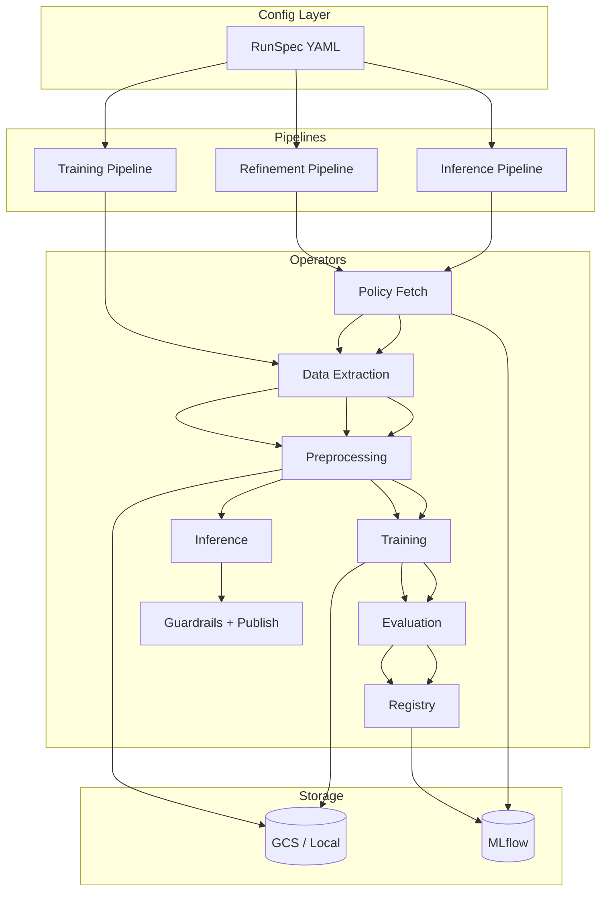
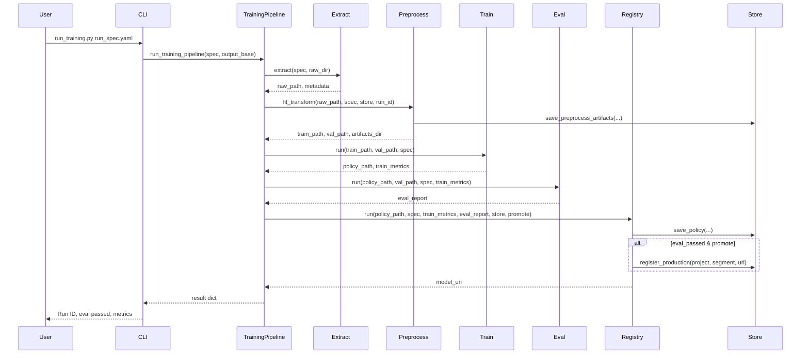
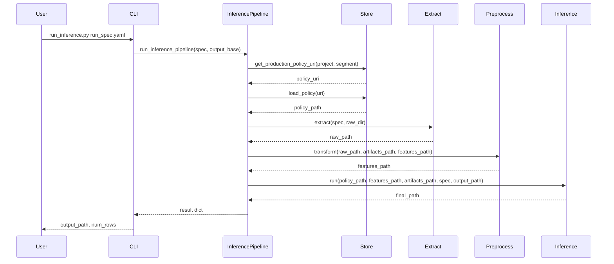

# VELA POC: Implementation & How-To

**Confluence target:** [VELA: Custom Reinforcement Learning Framework for Dynamic Pricing](https://borobudur.atlassian.net/wiki/spaces/DSMLE/pages/4682547367)

This page documents the **implemented POC**: tech stack, workflow, HLD, LLD, sequence diagrams, architecture, and how to use VELA to build an RL training and inference pipeline for a project.

---

## 1. Tech Stack

| Layer | Technology | Purpose |
| --- | --- | --- |
| **Config** | YAML (RunSpec) | Dataset window, features, reward weights, action buckets, algorithm (A2C/PPO), evaluation gates—no code change per project. |
| **Core** | Python 3.10+ | Domain models, interfaces (IDataExtractor, IPreprocessor, IArtifactStore, IRewardFn, IEvaluator). |
| **Data** | Pandas, Parquet | In-memory and file-based datasets; POC uses local/synthetic; production can swap to BigQuery. |
| **Preprocessing** | scikit-learn (StandardScaler) | Scaling, missing value handling; artifacts saved for inference. |
| **RL** | stable-baselines3 (A2C, PPO), Gymnasium | Discrete action space; config-driven hyperparameters. |
| **Artifacts** | Local filesystem / MLflow | Preprocess artifacts, policy checkpoints, RunSpec snapshot; PROD alias for promotion/rollback. |
| **CLI** | Python scripts | `run_training.py`, `run_inference.py` driven by RunSpec YAML. |
| **Dashboard** | Streamlit | Build/visualise workflow, trigger training/inference, view RunSpec and results. |
| **Orchestration (future)** | Kubeflow Pipelines (GKE) | Same operators; POC runs locally; KFP for production scheduling. |

**Cost:** POC runs on a single machine; production can use GKE autoscaling, preemptible nodes, and MLflow on GCP.

---

## 2. Workflow (Pipelines)

### 2.1 Training Pipeline (Full Train)

End-to-end flow driven by a single RunSpec:

| Step | Operator | Input | Output |
| --- | --- | --- | --- |
| 1 | Data Extraction | RunSpec (source, window, filters) | raw_dataset.parquet, dataset_metadata.json |
| 2 | Feature Preprocessing | raw_dataset, RunSpec (features) | train_features.parquet, val_features.parquet, preprocess_artifacts/ |
| 3 | Training | train/val features, RunSpec (algorithm, reward, actions) | policy_checkpoint, train_metrics.json |
| 4 | Evaluation & Gates | policy, val features, RunSpec (evaluation) | eval_report.json (PASS/FAIL + reasons) |
| 5 | Registry | policy, RunSpec, metrics, eval_report | Model version + optional PROD alias |

**Output:** Reproducible baseline policy + versioned artifacts for refinement and inference.

### 2.2 Policy Refinement Pipeline (Daily/Weekly)

| Step | Operator | Input | Output |
| --- | --- | --- | --- |
| 1 | Load PROD policy | Artifact store (project, segment) | base_policy_checkpoint |
| 2 | Incremental Data Extraction | RunSpec (latest window) | raw_dataset_incremental.parquet |
| 3 | Preprocessing (reuse transformers) | raw + saved preprocess_artifacts | refine_features.parquet |
| 4 | Refinement (warm start) | base policy, refine_features, RunSpec | candidate_policy_checkpoint |
| 5 | Evaluation & Safety Gates | candidate, stricter thresholds | PASS/FAIL |
| 6 | Promotion (conditional) | If PASS → register + update PROD alias | Updated or unchanged PROD |

**Output:** Safe, traceable policy updates; rollback = alias does not move.

### 2.3 Inference Pipeline (Batch)

| Step | Operator | Input | Output |
| --- | --- | --- | --- |
| 1 | Policy Fetch | Artifact store (PROD alias) | policy_checkpoint |
| 2 | Inference Data Build | RunSpec (latest eligible entities) | raw_dataset.parquet |
| 3 | Preprocess Apply | raw + saved preprocess_artifacts | inference_features.parquet |
| 4 | Policy Inference | policy, features | action + delta per entity |
| 5 | Consolidator + Guardrails | deltas, RunSpec (min/max delta, bounds) | bounded_delta, guardrail flags |
| 6 | Publish | final decisions | final_decisions.parquet (or BigQuery table) |

**Output:** final_decisions table with chosen_action, delta, bounded_delta for downstream pricing systems.

---

## 3. High-Level Design (HLD)

### 3.1 System Context

```
┌─────────────────────────────────────────────────────────────────────────────┐
│                           VELA RL Framework                                   │
├─────────────────────────────────────────────────────────────────────────────┤
│  ┌──────────────┐     ┌─────────────────────────────────────────────────┐   │
│  │  Dashboard   │────▶│  RunSpec (YAML) + CLI / API                       │   │
│  │  (Streamlit) │     │  Config-driven: data, features, reward, algorithm  │   │
│  └──────────────┘     └───────────────────────┬─────────────────────────┘   │
│                                                ▼                              │
│  ┌──────────────────────────────────────────────────────────────────────┐   │
│  │  Pipelines (Training | Refinement | Inference)                        │   │
│  │  Operators: Extract → Preprocess → Train/Refine → Eval → Register     │   │
│  │            → Fetch policy → Preprocess Apply → Infer → Guardrails   │   │
│  └───────────────────────┬──────────────────────────────────────────────┘   │
│                          ▼                                                    │
│  ┌──────────────────────────────────────────────────────────────────────┐   │
│  │  Artifact Store (Local / MLflow)                                      │   │
│  │  Preprocess artifacts, policy checkpoints, PROD alias                 │   │
│  └──────────────────────────────────────────────────────────────────────┘   │
└─────────────────────────────────────────────────────────────────────────────┘
```

### 3.2 HLD Diagram (Mermaid)



---

## 4. Low-Level Design (LLD)

### 4.1 Package Layout

```
vela/
├── core/
│   ├── run_spec.py          # RunSpec, DataConfig, FeatureConfig, ActionConfig, RewardConfig, TrainingConfig, EvaluationConfig
│   ├── domain/              # DatasetMetadata, TrainMetrics, EvalReport, RunMetadata
│   └── interfaces/          # IDataExtractor, IPreprocessor, IArtifactStore, IRewardFn, IEvaluator
├── envs/
│   └── pricing_env.py       # Gymnasium env: discrete action (buckets), configurable reward weights
├── operators/
│   ├── data_extraction.py   # LocalDataExtractor, DataExtractionOperator
│   ├── preprocessing.py     # SklearnPreprocessor, PreprocessingOperator
│   ├── training.py          # TrainingOperator (A2C/PPO)
│   ├── evaluation.py        # EvaluationOperator (gates + stability metrics)
│   ├── registry.py          # RegistryOperator (save + optional promote)
│   ├── artifact_store_impl.py  # LocalArtifactStore, MLflowArtifactStore
│   └── inference.py         # InferenceOperator (batch predict + guardrails)
├── pipelines/
│   ├── training_pipeline.py # run_training_pipeline()
│   └── inference_pipeline.py # run_inference_pipeline()
config/
├── run_spec_example.yaml    # Example RunSpec
run_training.py              # CLI: training
run_inference.py             # CLI: inference
dashboard/
└── app.py                   # Streamlit: workflow, RunSpec, run training/inference
```

### 4.2 Design Patterns & SOLID

| Pattern | Where | Purpose |
| --- | --- | --- |
| **Strategy** | IDataExtractor (Local vs BigQuery), IArtifactStore (Local vs MLflow), algorithm (A2C vs PPO) | Swap behaviour via config/dependency injection. |
| **Template Method** | Pipelines (training vs refinement vs inference) | Same operator chain; different steps/order. |
| **Dependency Inversion** | Pipelines depend on interfaces; concrete implementations injected | Testability and pluggable backends. |
| **Single Responsibility** | Each operator: one concern (extract, preprocess, train, evaluate, register, infer). | |
| **Interface Segregation** | Small interfaces per role (extract, preprocess, store, evaluate). | |

### 4.3 Key Interfaces

- **IDataExtractor:** `extract(spec, output_dir) -> (raw_path, DatasetMetadata)`
- **IPreprocessor:** `fit_transform(...) -> (train_path, val_path, artifacts_dir)`; `transform(raw_path, artifacts_path, output_path)`
- **IArtifactStore:** `save_preprocess_artifacts`, `load_preprocess_artifacts`, `save_policy`, `load_policy`, `get_production_policy_uri`, `register_production`
- **IEvaluator:** `evaluate(policy_path, features_path, spec, train_metrics) -> EvalReport`

---

## 5. Sequence Diagrams

### 5.1 Training Pipeline Run



### 5.2 Inference Pipeline Run



---

## 6. Architecture (RunSpec-Driven)

- **Single source of truth:** RunSpec YAML defines dataset, features, reward, actions, algorithm, evaluation gates, guardrails.
- **Artifact-first:** Each step produces versioned outputs (parquet, preprocess dir, policy, metrics, eval report).
- **Registry + traceability:** Policy and config snapshot stored; PROD alias for promotion/rollback.
- **Safety:** Evaluation gates (reward, stability, sign-flip rate); guardrails at inference (min/max delta); promotion only if gates pass.

---

## 7. How to Use: Build an RL Training and Inference Pipeline for a Project

### Step 1: Define RunSpec (YAML)

Create a YAML file (e.g. `config/my_project_segment.yaml`) with:

- **project_id**, **segment_id**, **pipeline_type** (training / inference).
- **data:** source_type (local / bigquery), query_or_path, run_date, lookback_days, filters.
- **features:** numeric_features, categorical_features, scale, missing_strategy.
- **actions:** type: discrete, buckets (e.g. [-0.5, -0.25, 0.0, 0.25, 0.5]).
- **reward:** template, weights (e.g. revenue: 0.7, stability: 0.3).
- **training:** algorithm (A2C or PPO), total_timesteps, learning_rate, n_steps, etc.
- **evaluation:** optional min_reward_per_episode, max_reward_std, max_sign_flip_rate, max_avg_delta.
- **guardrails:** min_delta, max_delta (for inference).

No code change: new project = new RunSpec.

### Step 2: Run Training

```bash
cd rl_pipeline_poc
pip install -r requirements.txt
python run_training.py config/my_project_segment.yaml -o vela_output --promote
```

- Produces: raw data, train/val features, preprocess artifacts, policy, train_metrics, eval_report.
- If gates pass and `--promote`: policy is set as PROD for that project/segment.

### Step 3: Run Inference (after at least one trained + promoted policy)

```bash
python run_inference.py config/my_project_segment.yaml -o vela_output
```

- Loads PROD policy and latest preprocess artifacts.
- Builds inference data, applies preprocessing, runs batch prediction, applies guardrails.
- Writes **final_decisions.parquet** (or path set in RunSpec `output_table_or_path`).

### Step 4: Dashboard (optional)

```bash
streamlit run dashboard/app.py
```

- View workflow (training vs inference).
- Edit RunSpec path, output dir, promote option.
- Click **Run** to trigger training or inference and see results.

### Step 5: Add a New Project or Segment

- Copy or extend a RunSpec YAML (new project_id/segment_id, data path, features, buckets, reward weights).
- Run training then inference as above. No change to operators or pipeline code.

---

## 8. References

- **VELA Confluence (target):** [VELA: Custom Reinforcement Learning Framework for Dynamic Pricing](https://borobudur.atlassian.net/wiki/spaces/DSMLE/pages/4682547367)
- **Orion B2B v3.0:** [Orion B2B v3.0 Reinforcement Learning Model](https://borobudur.atlassian.net/wiki/spaces/DSMLE/pages/4098886341)
- **Orion B2B Magnitude:** [Orion B2B Magnitude Model](https://borobudur.atlassian.net/wiki/spaces/DSMLE/pages/4098886402)
- **POC repo:** `rl_pipeline_poc/` (DESIGN.md, LLD.md, vela/, config/, dashboard/, run_*.py)
