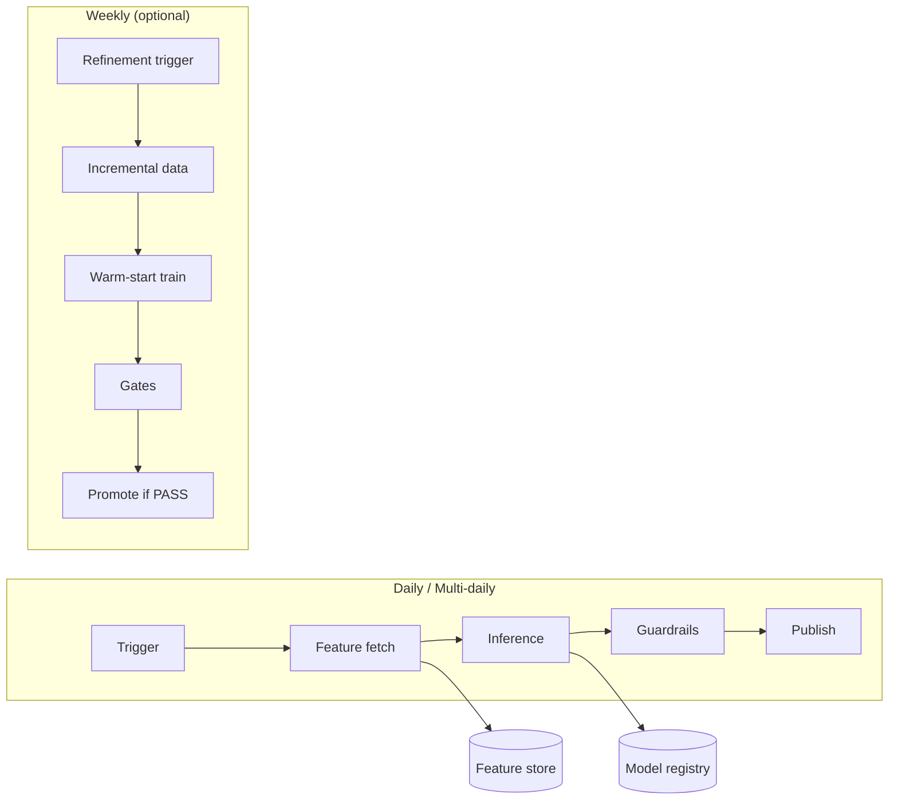

# End-to-End Architecture for Dynamic Pricing (RL)

**Jira:** [DAS-5702](https://borobudur.atlassian.net/browse/DAS-5702) – [MLE] Create Architecture for Musca  

**Scope:** End-to-end architecture covering data, training, inference, guardrails, deployment, and monitoring for **dynamic pricing (e.g. MUSCA flight pricing)** across **4 segments** (e.g. Domestic-High/Low, International-High/Low).  

**Reference:** [VELA: Custom Reinforcement Learning Framework for Dynamic Pricing](https://borobudur.atlassian.net/wiki/spaces/DSMLE/pages/4682547367) (pipeline design and operator flow).

---

## 1. High-Level System Diagram and Components

### 1.1 System Overview

```
┌─────────────────────────────────────────────────────────────────────────────────────────┐
│                    DYNAMIC PRICING (RL) – END-TO-END SYSTEM                               │
├─────────────────────────────────────────────────────────────────────────────────────────┤
│                                                                                           │
│  ┌─────────────────┐    ┌──────────────────────────────────────────────────────────┐   │
│  │ Feature Store   │    │  ORCHESTRATION (e.g. Kubeflow / Scheduler)                 │   │
│  │ + DBT           │───▶│  • Training pipeline (full / refinement)                  │   │
│  │ (source of      │    │  • Inference pipeline (batch, daily / multi-daily)         │   │
│  │  features)      │    └───────────────────────┬────────────────────────────────────┘   │
│  └─────────────────┘                            │                                        │
│           │                                      ▼                                        │
│           │              ┌──────────────────────────────────────────────────────────┐   │
│           │              │  TRAINING                                                    │   │
│           │              │  • Data extraction (from feature store / BigQuery)           │   │
│           │              │  • Feature preprocessing (scaling, encoding)                  │   │
│           │              │  • RL training (A2C/PPO, segment-specific)                   │   │
│           │              │  • Evaluation & gates → Model registry (MLflow)               │   │
│           │              └───────────────────────┬────────────────────────────────────┘   │
│           │                                      │                                        │
│           │              ┌───────────────────────┴────────────────────────────────────┐   │
│           │              │  INFERENCE                                                  │   │
│           │              │  • Policy fetch (PROD model per segment)                     │   │
│           └─────────────▶│  • Feature fetch (latest from feature store / DBT)           │   │
│                          │  • Preprocess apply → Policy inference → Guardrails         │   │
│                          └───────────────────────┬────────────────────────────────────┘   │
│                                                  │                                        │
│  ┌─────────────────┐    ┌───────────────────────┴────────────────────────────────────┐   │
│  │ GUARDRAILS      │◀───│  OUTPUT PUBLISH                                               │   │
│  │ • Margin floor  │    │  • Final action table (BigQuery / Kafka / API)                │   │
│  │ • Subsidy caps  │    │  • Consumed by pricing service / Kuber                        │   │
│  │ • Loss budgets  │    └──────────────────────────────────────────────────────────────┘   │
│  │ • Max step      │                                                                       │
│  └────────┬────────┘    ┌──────────────────────────────────────────────────────────────┐   │
│           │            │  MONITORING & ALERTS                                            │   │
│           │            │  • Run history, model versioning, drift, gate failures, latency │   │
│           └───────────▶└──────────────────────────────────────────────────────────────┘   │
│                                                                                           │
└─────────────────────────────────────────────────────────────────────────────────────────┘
```

### 1.2 Component Summary

| Component | Responsibility |
|-----------|----------------|
| **Feature store / DBT** | Single source of truth for training and inference features; DBT models for transformations and segment logic; point-in-time correct feature snapshots. |
| **Training** | Extract features → preprocess → train segment-specific RL policies (A2C/PPO) → evaluate → register in model registry (MLflow). Supports full train and policy refinement (warm start). |
| **Inference** | Load PROD policy per segment → fetch latest features → preprocess → run policy → apply guardrails → produce action table. |
| **Guardrails** | Enforce margin floor, subsidy caps, loss budgets, stability (max step / max Δ). Applied at inference and optionally in evaluation gates. |
| **Output publish** | Write final action table (entity_id, segment, chosen_action, final_margin/subsidy, guardrail_flags) to BigQuery and/or Kafka for consumption by pricing systems (e.g. Kuber). |
| **Monitoring** | Run history, model versioning, data/model drift, gate failures, SLA/latency; alerts for failures and threshold breaches. |

---

## 2. Daily / Multiple Times Daily Run Workflow

### 2.1 Schedule (Example)

| Run type | Frequency | Purpose |
|----------|-----------|---------|
| **Inference (batch)** | Daily and/or multiple times daily | Refresh pricing actions for all segments; output table consumed by pricing service. |
| **Policy refinement** | Weekly (e.g. Sunday) or daily | Update policy with latest outcomes; warm start from PROD; gates control promotion. |
| **Full training** | On-demand or periodic (e.g. monthly) | Train from scratch when segment definition or reward changes. |

### 2.2 Daily / Multi-Daily Inference Workflow

```
Time T (e.g. 06:00, 12:00, 18:00):
  1. Trigger inference pipeline (scheduler or event).
  2. For each segment (4 segments):
     a. Fetch PROD model from registry (MLflow alias prod_<segment>).
     b. Fetch latest feature table from feature store / DBT (as of T or T-1).
     c. Apply saved preprocessors → run policy inference → discrete action per entity.
     d. Apply guardrails (margin floor, subsidy cap, max step, loss budget).
     e. Write rows to output action table (and/or publish to Kafka).
  3. Log run_id, segment, model_version, row_count, guardrail_clamp_rate, latency.
  4. Monitoring: alert if run failed or latency/SLA breach.
```

### 2.3 Workflow Diagram (Mermaid)



---

## 3. Interfaces / Data Contracts

### 3.1 Input: Feature Table(s)

Training and inference consume **feature tables** produced by the feature store / DBT. One table per segment or one table with a `segment_id` column is acceptable.

**Schema (logical):**

| Column | Type | Description |
|--------|------|-------------|
| `entity_id` | STRING | Unique identifier (e.g. flight_key, hotel_id, route_id). |
| `segment_id` | STRING | Segment (e.g. domestic_high, domestic_low, international_high, international_low). |
| `run_date` | DATE | Snapshot date for point-in-time correctness. |
| `f1`, `f2`, … | FLOAT | Numeric features (e.g. demand, revenue, occupancy, competitor price). |
| `revenue_7d` | FLOAT | Example: rolling 7d revenue. |
| `prev_margin_pct` / `prev_subsidy` | FLOAT | Previous period margin or subsidy (for stability / delta). |
| *optional* categorical | STRING / INT | Encoded categoricals if required. |

**Contract:** Rows are **eligible entities** for the run (e.g. active routes). Missing values handled by preprocessing (impute or drop per config). Feature list and schema are **versioned** (e.g. in RunSpec or DBT tag) for reproducibility.

### 3.2 Output: Action Table

Inference writes the **action table** consumed by the pricing system.

**Schema (logical):**

| Column | Type | Description |
|--------|------|-------------|
| `entity_id` | STRING | Same as input. |
| `segment_id` | STRING | Segment. |
| `run_id` | STRING | Pipeline run identifier. |
| `run_ts` | TIMESTAMP | When the run completed. |
| `model_version` | STRING | MLflow model version or alias used. |
| `chosen_action` | INT | Discrete action index (e.g. 0..4 for 5 buckets). |
| `delta` | FLOAT | Raw delta from policy (e.g. margin or subsidy change). |
| `final_margin_pct` / `final_subsidy` | FLOAT | Value after guardrails (bounded). |
| `guardrail_margin_floor_applied` | BOOLEAN | True if clamped to margin floor. |
| `guardrail_subsidy_cap_applied` | BOOLEAN | True if clamped to subsidy cap. |
| `guardrail_max_step_applied` | BOOLEAN | True if delta was capped for stability. |
| `guardrail_loss_budget_applied` | BOOLEAN | True if constrained by loss budget. |

**Contract:** Downstream systems (Kuber, pricing API) read this table (or Kafka stream) to apply final prices. Run_id and model_version support traceability and rollback.

---

## 4. How Guardrails Are Enforced

Guardrails are applied **after** policy inference, in a **Consolidator + Guardrails** step (and optionally checked in evaluation gates before promotion).

| Guardrail | Description | Enforcement |
|-----------|-------------|-------------|
| **Margin floor** | Minimum allowed margin (e.g. 2%). | If `final_margin_pct < margin_floor` → set `final_margin_pct = margin_floor`; set `guardrail_margin_floor_applied = true`. |
| **Subsidy caps** | Maximum subsidy per entity or per segment. | If `subsidy > subsidy_cap` → set `subsidy = subsidy_cap`; set `guardrail_subsidy_cap_applied = true`. |
| **Loss budgets** | Max total loss or loss rate per segment/period. | After applying margin/subsidy rules, aggregate projected loss; if over budget, reduce subsidies (or apply fallback) until within budget; set `guardrail_loss_budget_applied = true` where adjusted. |
| **Stability / max step** | Limit change per step (e.g. max Δ margin 0.5% per day). | If `|delta| > max_step` → clamp `delta = sign(delta) * max_step`; set `guardrail_max_step_applied = true`. |

**Order of application (example):** (1) Apply max step to raw delta → bounded_delta. (2) Compute candidate margin/subsidy from bounded_delta. (3) Apply margin floor and subsidy cap per entity. (4) Apply loss budget at segment/aggregate level if configured. (5) Write final value and guardrail flags to the action table.

**Config:** Guardrail parameters (margin_floor, subsidy_cap, max_step, loss_budget) are set per segment or per project in config (e.g. RunSpec or feature-flag service) so they can be changed without code deploy.

---

## 5. Model/Versioning Strategy and Run History Logging

### 5.1 Model Registry (MLflow)

- **One registered model per (project, segment)** (e.g. `musca_domestic_high`).  
- **Versions:** Each training or refinement run that passes gates registers a new **model version** with artifacts (policy, preprocessors, RunSpec snapshot).  
- **Aliases:** `prod_<segment>` points to the current production version. Promotion updates the alias only when evaluation gates pass.  
- **Rollback:** Point `prod_<segment>` to a previous version; next inference run will use that version.

### 5.2 Run History Logging

Every pipeline run is logged with:

| Field | Description |
|-------|-------------|
| `run_id` | Unique run identifier. |
| `pipeline_type` | training \| refinement \| inference. |
| `segment_id` | Segment. |
| `started_at`, `finished_at` | Timestamps. |
| `status` | success \| failed. |
| `model_version` (if applicable) | Version used or registered. |
| `config_snapshot` | RunSpec or config hash/JSON for reproducibility. |
| `metrics` | Reward, gate result, guardrail clamp rate, row count. |
| `error_message` | If failed. |

**Storage:** Run history in a dedicated table (BigQuery) or in MLflow run metadata, so that any decision can be traced back to config and model version.

### 5.3 Versioning Strategy Summary

- **Training / refinement:** Produce candidate model → evaluate → if PASS, register as new version and update `prod_<segment>`; if FAIL, do not update alias.  
- **Inference:** Always reads `prod_<segment>`; logs run_id and model_version in the action table and run history.  
- **Reproducibility:** RunSpec (or equivalent) and feature set version are stored with each model version and run.

---

## 6. Monitoring and Alerts

### 6.1 What Is Monitored

| Area | Metrics / Signals |
|------|--------------------|
| **Pipeline runs** | Success/failure rate, duration (latency), run count per segment per day. |
| **Model / inference** | Model version in use, inference latency (p95), guardrail clamp rate (per guardrail type). |
| **Data** | Feature freshness (max run_date in feature table), row count per segment, null rate on key features. |
| **Evaluation gates** | Gate pass/fail rate, reward distribution, stability metrics (sign-flip rate, avg \|Δ\|). |
| **Business (optional)** | Revenue, margin, subsidy spend (from downstream systems). |

### 6.2 Alerts

| Alert | Condition | Severity | Action |
|-------|-----------|----------|--------|
| Inference run failed | Pipeline status = failed for a scheduled run. | High | Page on-call; retry or rollback. |
| Inference SLA breach | Inference run duration > threshold (e.g. 30 min). | Medium | Investigate latency; scale or optimize. |
| Gate failure rate high | % of refinement runs failing gates above threshold. | Medium | Review reward/data; avoid auto-promote. |
| Feature freshness stale | Latest feature run_date older than 24h (or config). | High | Check feature store / DBT pipelines. |
| Guardrail clamp rate spike | % of rows with any guardrail applied > threshold. | Low / Medium | Review policy or guardrail bounds. |
| Model drift (optional) | Input distribution shift vs training window. | Low | Consider retrain or refinement. |

### 6.3 Dashboard (Suggested)

- **Run history:** Table of runs (run_id, pipeline_type, segment, status, model_version, duration, timestamp).  
- **Inference health:** Success rate, latency trend, guardrail clamp rate by segment.  
- **Model versions:** Current PROD version per segment, last promotion time.  
- **Alerts:** Active alerts and history.

---

## 7. Document Link and References
 
- **Reference (pipeline design):** [VELA: Custom Reinforcement Learning Framework for Dynamic Pricing](https://borobudur.atlassian.net/wiki/spaces/DSMLE/pages/4682547367)  
- **Orion B2B (context):** [Orion B2B v3.0 RL Model](https://borobudur.atlassian.net/wiki/spaces/DSMLE/pages/4098886341), [Orion B2B Magnitude Model](https://borobudur.atlassian.net/wiki/spaces/DSMLE/pages/4098886402)

---
