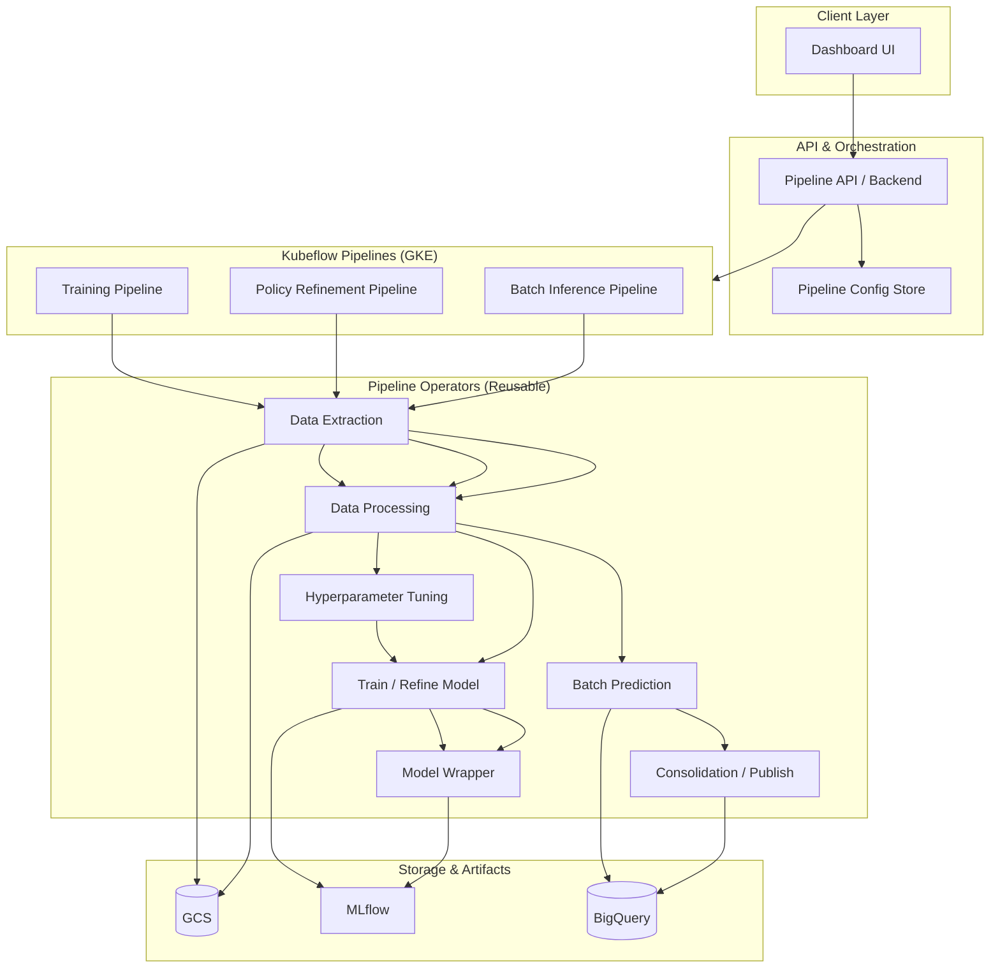

# Generic RL Pipeline POC – High-Level Design & Requirements

**Context:** Jira DAS-5702, Orion B2B RL (V3.0 / Magnitude Model) Confluence architecture.  
**Goal:** A reusable, pipeline-based reinforcement learning platform with a dashboard to build, visualize, and run RL pipelines, orchestrated by Kubeflow on GCP.

---

## 1. Reference Summary (Jira + Confluence)

| Source | Summary |
|--------|--------|
| **DAS-5702** | End-to-end architecture for MUSCA (flight dynamic pricing): data, training, inference, guardrails, deployment, monitoring; 4 segments; daily/multi-daily runs. |
| **Orion B2B Magnitude (V4)** | Direction + Magnitude (SAC); 4 segment-specific models; Training / Policy Refinement / Inference pipelines on Kubeflow; GCS, BigQuery, MLflow, Kafka. |
| **Orion B2B V3.0** | Direction (A2C) + config-based magnitude; same three pipelines; Data Extraction → Processing → Tuning/Training/Refinement → Inference → Consolidation. |
| **AB Test (DiD)** | Validates RL treatment effect (GBV, Net Revenue, Orders); policy refinement weekly, inference weekly. |

From this we derive: **generic RL pipeline template** = configurable pipelines (training, policy refinement, batch inference), Kubeflow operators, artifact store (e.g. MLflow), dashboard for pipeline authoring and visualization.

---

## 2. High-Level Design (HLD)

### 2.1 System Context

```
┌─────────────────────────────────────────────────────────────────────────────────┐
│                           RL Pipeline Platform (POC)                               │
├─────────────────────────────────────────────────────────────────────────────────┤
│  ┌──────────────┐     ┌─────────────────────────────────────────────────────┐   │
│  │   Dashboard  │────▶│  Pipeline API / Config Service                        │   │
│  │  (Build &    │     │  (Pipeline definitions, runs, templates)             │   │
│  │   Visualise) │     └───────────────────────┬─────────────────────────────┘   │
│  └──────────────┘                              │                                  │
│         │                                      ▼                                  │
│         │              ┌─────────────────────────────────────────────────────┐   │
│         └─────────────▶│  Kubeflow Pipelines (GKE)                            │   │
│                        │  • Training Pipeline   • Policy Refinement Pipeline   │   │
│                        │  • Batch Inference Pipeline                          │   │
│                        └───────────────────────┬─────────────────────────────┘   │
│                                                │                                  │
│  ┌──────────────┐     ┌───────────────────────┴─────────────────────────────┐   │
│  │  MLflow /    │◀────│  GCS (data, artifacts) • BigQuery (optional)          │   │
│  │  Model Reg.  │     │  • Raw features  • Processed data  • Predictions      │   │
│  └──────────────┘     └─────────────────────────────────────────────────────┘   │
└─────────────────────────────────────────────────────────────────────────────────┘
         │                                    │
         ▼                                    ▼
   [Users / MLE]                    [Downstream: Kafka, Kuber, etc.]
```

### 2.2 HLD Diagram (Mermaid)



### 2.3 Pipeline Types (Generic Template)

| Pipeline | Purpose | Typical schedule | Main operators |
|----------|---------|------------------|----------------|
| **Training** | First-time RL model training (e.g. A2C/SAC) | On-demand / weekly | Data Extract → Process → HPO → Train+Wrap → MLflow |
| **Policy Refinement** | Update policy with latest data | Weekly (e.g. Sunday) | Data Extract → Process (scaler from MLflow) → Refine → Wrap → MLflow |
| **Batch Inference** | Score entities (e.g. hotels), publish actions | Weekly/daily | Data Extract → Process → Predict → Consolidate → BigQuery/Kafka |

### 2.4 Data & Contract (Conceptual)

- **Input:** Feature table(s) per project (e.g. from BigQuery); schema defined per RL project.
- **Output:** Action/prediction table (e.g. direction, magnitude, final markup); schema + destination (BigQuery, Kafka) per project.
- **Artifacts:** Scaler, model, model wrapper versioned in MLflow; intermediate data in GCS.

---

## 3. Requirements

### 3.1 Functional Requirements

| ID | Requirement | Priority |
|----|-------------|----------|
| FR-1 | Dashboard allows creating/editing pipeline definitions (training, refinement, inference) from a generic RL template. | Must |
| FR-2 | Dashboard visualises pipeline DAG (stages and dependencies) for each pipeline type. | Must |
| FR-3 | Users can trigger pipeline runs (training, refinement, inference) from the dashboard or API. | Must |
| FR-4 | Pipeline runs are executed on Kubeflow (GKE); run status and logs are visible in the dashboard. | Must |
| FR-5 | Generic RL template supports configurable: data source (e.g. BQ query / GCS path), segment filters, reward weights, action bounds, algorithm (e.g. A2C, SAC). | Must |
| FR-6 | Training pipeline: data extraction → preprocessing (scaling, optional oversampling) → optional HPO (e.g. Optuna) → train → register model/scaler in MLflow. | Must |
| FR-7 | Policy refinement pipeline: load latest model/scaler from MLflow, run refinement on new data, save updated model to MLflow. | Must |
| FR-8 | Batch inference pipeline: load model/scaler from MLflow, run batch prediction, write to configurable sink (BigQuery and/or Kafka). | Must |
| FR-9 | Pipeline definitions and run history are stored and retrievable (e.g. DB + optional audit). | Should |
| FR-10 | Per-project overrides for feature schema, output schema, and guardrails (e.g. margin floor, max step). | Should |

### 3.2 Non-Functional Requirements

| ID | Requirement | Priority |
|----|-------------|----------|
| NFR-1 | Use cost-effective tech stack (see Section 5). | Must |
| NFR-2 | Pipelines are modular and reusable across projects (e.g. Orion, MUSCA). | Must |
| NFR-3 | Design follows SOLID and clear interfaces for operators and pipeline composition. | Must |
| NFR-4 | Dashboard and API are deployable on GCP with minimal vendor lock-in beyond GKE/Kubeflow. | Should |
| NFR-5 | Model and run versioning via MLflow; pipeline run metadata stored for traceability. | Must |

### 3.3 Out of Scope (POC)

- Real-time inference and online learning.
- Full guardrails engine (margin floor, subsidy caps, etc.) – can be a separate step/operator later.
- A/B experiment assignment and DiD analysis (handled outside this POC).

---

## 4. Architecture Decisions

| Decision | Choice | Rationale |
|----------|--------|-----------|
| Orchestration | Kubeflow Pipelines on GKE | Aligns with Orion; reusable operators; scalable batch jobs. |
| Model/artifact store | MLflow | Versioning, scaler + model + wrapper; fits existing Confluence setup. |
| Pipeline definitions | Config-driven (YAML/JSON) + API | Generic template; project-specific overrides without code change. |
| Dashboard | Lightweight web app (see tech stack) | Build & visualise pipelines; trigger runs; view status. |
| Backend | Small API service + DB for config and run metadata | Keeps dashboard stateless; single source of truth for pipeline config. |

---

## 5. Cost-Effective Tech Stack

| Layer | Technology | Rationale |
|-------|------------|-----------|
| **Dashboard** | React or Vue (or Streamlit for fast POC) | Low cost; easy to host on Cloud Run or static + API. |
| **Backend API** | Python (FastAPI) or Go | FastAPI: quick to build, good for ML tooling; optional Go for performance. |
| **Pipeline orchestration** | Kubeflow Pipelines (KFP) on GKE | Matches Orion; pay for cluster only when runs execute; use preemptible/node pools for cost. |
| **Config & run metadata** | PostgreSQL (Cloud SQL small instance) or Firestore | Managed DB; minimal ops. |
| **Object storage** | GCS | Standard choice for data and intermediate artifacts. |
| **Model registry** | MLflow (self-hosted on GKE or MLflow on Cloud) | Open source; versioning and reproducibility. |
| **Data source** | BigQuery (optional) + GCS | BigQuery for existing Orion-style features; GCS for raw/processed files. |
| **Visualisation (DAG)** | React flow / ELK / or Kubeflow UI embed | Pipeline DAG rendering; can embed KFP UI for run-level view. |

**Cost levers:** Autoscaling GKE, preemptible nodes for training, small API + DB, optional Spot for batch inference.

---

## 6. Success Criteria (POC)

1. One generic RL pipeline template (training, refinement, inference) runs end-to-end on Kubeflow.
2. Dashboard shows pipeline DAG and allows triggering at least one pipeline type and viewing run status.
3. Config (data source, algorithm, segments, output sink) is editable without changing operator code.
4. Design doc and LLD (classes, interfaces, SOLID) are in place for handoff and extension.

---

## 7. Document References

- Jira: **DAS-5702** – [MLE] Create Architecture for Musca  
- Confluence: Orion B2B Magnitude Model (Orion V4.0)  
- Confluence: Orion B2B v3.0 Reinforcement Learning Model  
- Confluence: Orion B2B AB Test V3.0 vs NML – Difference-in-Differences Analysis  
