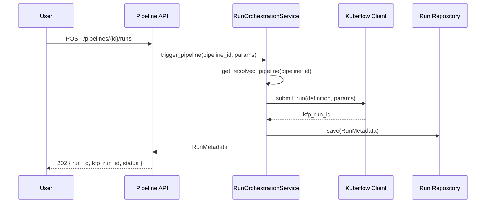

# Generic RL Pipeline POC – Low-Level Design (LLD)

**Design principles:** SOLID, modular components, clear interfaces, design patterns for pipeline and operators.  
**Scope:** Backend (API + pipeline/operator abstractions) and Kubeflow operator boundaries.

---

## 1. Package / Module Layout (Modular Approach)

```
rl_pipeline_poc/
├── api/                    # Dashboard backend / Pipeline API
│   ├── main.py
│   ├── routes/
│   │   ├── pipelines.py
│   │   ├── runs.py
│   │   └── templates.py
│   ├── services/
│   │   ├── pipeline_config_service.py
│   │   ├── run_orchestration_service.py
│   │   └── kubeflow_client.py
│   └── models/
│       ├── pipeline_schema.py
│       └── run_schema.py
├── core/                   # Domain & interfaces (Kubeflow-agnostic)
│   ├── interfaces/
│   │   ├── data_extractor.py
│   │   ├── data_processor.py
│   │   ├── model_trainer.py
│   │   ├── model_predictor.py
│   │   └── artifact_store.py
│   ├── domain/
│   │   ├── pipeline_definition.py
│   │   ├── run_metadata.py
│   │   └── rl_config.py
│   └── exceptions.py
├── operators/              # Kubeflow pipeline step implementations
│   ├── base.py
│   ├── data_extraction_op.py
│   ├── data_processing_op.py
│   ├── hpo_op.py
│   ├── training_op.py
│   ├── refinement_op.py
│   ├── prediction_op.py
│   └── consolidation_op.py
├── pipelines/               # Pipeline DAG definitions (KFP)
│   ├── base_pipeline.py
│   ├── training_pipeline.py
│   ├── refinement_pipeline.py
│   └── inference_pipeline.py
├── templates/              # Default RL pipeline templates (YAML/JSON)
│   ├── training_template.yaml
│   ├── refinement_template.yaml
│   └── inference_template.yaml
└── dashboard/              # Frontend (optional separate repo)
    └── ...
```

---

## 2. Design Patterns Used

| Pattern | Where | Purpose |
|---------|--------|---------|
| **Strategy** | Algorithm (A2C vs SAC), data source (BQ vs GCS) | Swap behaviour per project without changing pipeline code. |
| **Template Method** | Base pipeline (training/refinement/inference) | Define skeleton; subclasses fill steps. |
| **Factory** | Operator creation from config | Create the right operator implementation from template. |
| **Repository** | Pipeline config, run metadata | Abstract persistence (DB) from domain. |
| **Adapter** | Kubeflow component ↔ core interfaces | KFP components call core interfaces so logic stays testable. |
| **Dependency Injection** | Services and operators | Inject artifact store, data source, etc., for testability and flexibility. |

---

## 3. SOLID Mapping

| Principle | Application |
|-----------|-------------|
| **S – Single Responsibility** | Each operator does one thing (extract, process, train, predict, consolidate). Config service only manages pipeline definitions; run service only orchestrates runs. |
| **O – Open/Closed** | New pipeline types or operators extend base classes / implement interfaces; no change to existing pipeline composition code. |
| **L – Liskov Substitution** | Any `IDataExtractor` / `IDataProcessor` / etc. implementation can be swapped in pipeline without breaking the flow. |
| **I – Interface Segregation** | Small interfaces: `IDataExtractor`, `IDataProcessor`, `IModelTrainer`, `IModelPredictor`, `IArtifactStore`; no fat interface. |
| **D – Dependency Inversion** | Pipelines and services depend on abstractions (interfaces); concrete implementations (BQ extractor, MLflow store) injected at runtime or via config. |

---

## 4. Core Interfaces (Abstractions)

### 4.1 Data & Artifacts

```python
# core/interfaces/data_extractor.py
from abc import ABC, abstractmethod
from typing import Any, Optional
from pathlib import Path

class IDataExtractor(ABC):
    """Single responsibility: extract raw features from a source."""

    @abstractmethod
    def extract(self, config: "ExtractionConfig", output_path: Path) -> Path:
        """Extract data per config; write to output_path; return path to extracted data."""
        pass
```

```python
# core/interfaces/data_processor.py
from abc import ABC, abstractmethod
from pathlib import Path
from typing import Optional

class IDataProcessor(ABC):
    """Single responsibility: scale/transform and optionally resample."""

    @abstractmethod
    def fit_transform(self, data_path: Path, artifact_store: "IArtifactStore", run_id: str) -> Path:
        """Fit scaler on data, transform, persist scaler to artifact store; return path to processed data."""
        pass

    @abstractmethod
    def transform(self, data_path: Path, scaler_uri: str, output_path: Path) -> Path:
        """Load scaler from URI, transform data; return path to processed data."""
        pass
```

```python
# core/interfaces/artifact_store.py
from abc import ABC, abstractmethod
from typing import Optional, List

class IArtifactStore(ABC):
    """Single responsibility: persist and load models, scalers, metadata."""

    @abstractmethod
    def save_scaler(self, run_id: str, project: str, scaler: Any) -> str:
        """Persist scaler; return URI."""
        pass

    @abstractmethod
    def load_scaler(self, uri: str) -> Any:
        pass

    @abstractmethod
    def save_model(self, run_id: str, project: str, model: Any, wrapper_metadata: dict) -> str:
        """Persist model and wrapper metadata; return URI."""
        pass

    @abstractmethod
    def load_model(self, uri: str) -> Any:
        pass

    @abstractmethod
    def get_latest_model_uri(self, project: str, stage: str = "Production") -> Optional[str]:
        pass
```

### 4.2 Training & Prediction

```python
# core/interfaces/model_trainer.py
from abc import ABC, abstractmethod
from pathlib import Path
from typing import Any, Optional

class IModelTrainer(ABC):
    """Single responsibility: train or refine an RL model."""

    @abstractmethod
    def train(self, processed_data_path: Path, config: "RLTrainingConfig", artifact_store: "IArtifactStore", run_id: str) -> str:
        """Train from scratch; save model to artifact store; return model URI."""
        pass

    @abstractmethod
    def refine(self, processed_data_path: Path, base_model_uri: str, config: "RLTrainingConfig", artifact_store: "IArtifactStore", run_id: str) -> str:
        """Load base model, refine on new data; save updated model; return model URI."""
        pass
```

```python
# core/interfaces/model_predictor.py
from abc import ABC, abstractmethod
from pathlib import Path
from typing import Any

class IModelPredictor(ABC):
    """Single responsibility: batch inference given model and features."""

    @abstractmethod
    def predict(self, processed_data_path: Path, model_uri: str, output_path: Path) -> Path:
        """Run batch prediction; write results to output_path; return path."""
        pass
```

---

## 5. Domain Entities (Value Objects / Aggregates)

```python
# core/domain/pipeline_definition.py
from dataclasses import dataclass
from typing import Dict, Any, List
from enum import Enum

class PipelineType(str, Enum):
    TRAINING = "training"
    POLICY_REFINEMENT = "policy_refinement"
    INFERENCE = "inference"

@dataclass(frozen=True)
class PipelineDefinition:
    """Immutable pipeline config; open for extension via project_overrides."""
    id: str
    name: str
    project: str
    pipeline_type: PipelineType
    template_id: str
    steps: List[Dict[str, Any]]   # ordered steps with operator type + config
    overrides: Dict[str, Any]     # project-specific (reward weights, segments, etc.)
```

```python
# core/domain/run_metadata.py
from dataclasses import dataclass
from datetime import datetime
from typing import Optional
from enum import Enum

class RunStatus(str, Enum):
    PENDING = "pending"
    RUNNING = "running"
    SUCCEEDED = "succeeded"
    FAILED = "failed"

@dataclass
class RunMetadata:
    run_id: str
    pipeline_id: str
    status: RunStatus
    kfp_run_id: Optional[str]
    started_at: Optional[datetime]
    finished_at: Optional[datetime]
    error_message: Optional[str] = None
```

```python
# core/domain/rl_config.py
from dataclasses import dataclass
from typing import Dict, Any, Optional

@dataclass
class RLTrainingConfig:
    """Algorithm-agnostic training config; strategy chosen by implementation."""
    algorithm: str  # "A2C", "SAC"
    hyperparameters: Dict[str, Any]
    reward_weights: Dict[str, float]
    action_bounds: Dict[str, Any]
    segment_filter: Optional[Dict[str, Any]] = None
```

---

## 6. Operator Implementations (Strategy + Adapter)

Operators are **adapters**: they receive KFP inputs/outputs and delegate to core interfaces. Algorithm and data source are **strategies** injected via config.

```python
# operators/base.py
from abc import ABC
from typing import Any, Dict
from core.interfaces import IDataExtractor, IDataProcessor, IArtifactStore, IModelTrainer, IModelPredictor

class BaseOperator(ABC):
    """Base for all KFP components; ensures consistent logging and error handling."""
    def __init__(self, config: Dict[str, Any]):
        self.config = config

    def execute(self, **kwargs) -> Any:
        """Override in subclasses; called by KFP component."""
        raise NotImplementedError
```

```python
# operators/data_extraction_op.py
from pathlib import Path
from core.interfaces import IDataExtractor
from operators.base import BaseOperator

class DataExtractionOperator(BaseOperator):
    """KFP component: delegates to IDataExtractor strategy (e.g. BigQuery, GCS)."""
    def __init__(self, config: dict, extractor: IDataExtractor):
        super().__init__(config)
        self.extractor = extractor

    def execute(self, output_path: str, extraction_config: dict) -> str:
        path = self.extractor.extract(extraction_config, Path(output_path))
        return str(path)
```

```python
# operators/training_op.py
from core.interfaces import IDataProcessor, IModelTrainer, IArtifactStore
from core.domain import RLTrainingConfig
from operators.base import BaseOperator

class TrainingOperator(BaseOperator):
    """KFP component: process data then train; depends on abstractions."""
    def __init__(self, config: dict, processor: IDataProcessor, trainer: IModelTrainer, artifact_store: IArtifactStore):
        super().__init__(config)
        self.processor = processor
        self.trainer = trainer
        self.artifact_store = artifact_store

    def execute(self, data_path: str, run_id: str, training_config: dict) -> str:
        processed_path = self.processor.fit_transform(
            Path(data_path), self.artifact_store, run_id
        )
        rl_config = RLTrainingConfig(**training_config)
        return self.trainer.train(processed_path, rl_config, self.artifact_store, run_id)
```

Similar structure for **RefinementOperator** (uses `trainer.refine` + `processor.transform` with existing scaler) and **PredictionOperator** (uses `processor.transform` + `predictor.predict`).

---

## 7. Pipeline Composition (Template Method)

```python
# pipelines/base_pipeline.py
from abc import ABC, abstractmethod
from typing import List, Any
import kfp.dsl as dsl

class BaseRLPipeline(ABC):
    """Template Method: define pipeline skeleton; subclasses add steps."""
    pipeline_type: str

    @abstractmethod
    def build(self, pipeline_config: dict) -> dsl.PipelineSpec:
        """Build KFP pipeline from config; steps order defined here."""
        pass

    def _create_data_extraction_step(self, config: dict) -> dsl.ContainerOp:
        raise NotImplementedError

    def _create_data_processing_step(self, config: dict) -> dsl.ContainerOp:
        raise NotImplementedError
```

```python
# pipelines/training_pipeline.py
import kfp.dsl as dsl
from pipelines.base_pipeline import BaseRLPipeline

class TrainingPipeline(BaseRLPipeline):
    pipeline_type = "training"

    def build(self, pipeline_config: dict) -> dsl.PipelineSpec:
        @dsl.pipeline(name=pipeline_config["name"], description="Generic RL Training")
        def _pipeline():
            extract = self._create_data_extraction_step(pipeline_config["steps"][0])
            process = self._create_data_processing_step(pipeline_config["steps"][1]).after(extract)
            hpo = self._create_hpo_step(pipeline_config["steps"][2]).after(process)
            train = self._create_training_step(pipeline_config["steps"][3]).after(hpo)
            wrap = self._create_wrap_step(pipeline_config["steps"][4]).after(train)
        return _pipeline
```

Refinement and inference pipelines override `build()` with their own step order (no HPO for refinement; no train for inference).

---

## 8. API Layer (Repository + Services)

```python
# api/services/pipeline_config_service.py
from typing import Optional, List
from core.domain import PipelineDefinition
# Repository interface (abstraction over DB)
class IPipelineRepository(ABC):
    @abstractmethod
    def get(self, pipeline_id: str) -> Optional[PipelineDefinition]:
        pass
    @abstractmethod
    def list_by_project(self, project: str) -> List[PipelineDefinition]:
        pass
    @abstractmethod
    def save(self, definition: PipelineDefinition) -> None:
        pass

class PipelineConfigService:
    """Single responsibility: CRUD and resolve pipeline definitions."""
    def __init__(self, repo: IPipelineRepository, template_loader: "ITemplateLoader"):
        self.repo = repo
        self.template_loader = template_loader

    def get_resolved_pipeline(self, pipeline_id: str) -> Optional[PipelineDefinition]:
        return self.repo.get(pipeline_id)

    def create_from_template(self, project: str, name: str, template_id: str, overrides: dict) -> PipelineDefinition:
        template = self.template_loader.load(template_id)
        definition = PipelineDefinition(id=..., name=name, project=project, template_id=template_id, steps=template["steps"], overrides=overrides)
        self.repo.save(definition)
        return definition
```

```python
# api/services/run_orchestration_service.py
from core.domain import RunMetadata
# Depends on Kubeflow client abstraction (interface)
class IRunOrchestrator(ABC):
    @abstractmethod
    def submit_run(self, pipeline_definition: PipelineDefinition, params: dict) -> str:
        """Submit to KFP; return KFP run id."""
        pass

class RunOrchestrationService:
    """Single responsibility: submit runs and persist run metadata."""
    def __init__(self, orchestrator: IRunOrchestrator, run_repository: "IRunRepository"):
        self.orchestrator = orchestrator
        self.run_repository = run_repository

    def trigger_pipeline(self, pipeline_id: str, params: dict) -> RunMetadata:
        definition = self.pipeline_config_service.get_resolved_pipeline(pipeline_id)
        kfp_run_id = self.orchestrator.submit_run(definition, params)
        run = RunMetadata(run_id=..., pipeline_id=pipeline_id, status=RunStatus.RUNNING, kfp_run_id=kfp_run_id, ...)
        self.run_repository.save(run)
        return run
```

---

## 9. Class Diagram (LLD Overview)

```mermaid
classDiagram
    class IDataExtractor {
        <<interface>>
        +extract(config, output_path) Path
    }
    class IDataProcessor {
        <<interface>>
        +fit_transform(data_path, artifact_store, run_id) Path
        +transform(data_path, scaler_uri, output_path) Path
    }
    class IArtifactStore {
        <<interface>>
        +save_scaler(run_id, project, scaler) str
        +load_scaler(uri)
        +save_model(run_id, project, model, metadata) str
        +load_model(uri)
        +get_latest_model_uri(project, stage) str
    }
    class IModelTrainer {
        <<interface>>
        +train(processed_path, config, artifact_store, run_id) str
        +refine(processed_path, base_uri, config, artifact_store, run_id) str
    }
    class IModelPredictor {
        <<interface>>
        +predict(processed_path, model_uri, output_path) Path
    }
    class DataExtractionOperator {
        -extractor: IDataExtractor
        +execute(output_path, extraction_config) str
    }
    class TrainingOperator {
        -processor: IDataProcessor
        -trainer: IModelTrainer
        -artifact_store: IArtifactStore
        +execute(data_path, run_id, training_config) str
    }
    class BaseRLPipeline {
        <<abstract>>
        +build(pipeline_config) PipelineSpec
    }
    class TrainingPipeline {
        +build(pipeline_config) PipelineSpec
    }
    class PipelineConfigService {
        -repo: IPipelineRepository
        -template_loader: ITemplateLoader
        +get_resolved_pipeline(id) PipelineDefinition
        +create_from_template(project, name, template_id, overrides) PipelineDefinition
    }
    DataExtractionOperator ..> IDataExtractor : uses
    TrainingOperator ..> IDataProcessor : uses
    TrainingOperator ..> IModelTrainer : uses
    TrainingOperator ..> IArtifactStore : uses
    TrainingPipeline --|> BaseRLPipeline : extends
    PipelineConfigService ..> IPipelineRepository : uses
```



---

## 10. Sequence: Trigger Training Run from Dashboard



---

## 11. Dashboard DAG Visualisation (Data Contract)

Backend exposes pipeline DAG for the dashboard:

```json
{
  "pipeline_id": "rl-orion-training-1",
  "name": "Orion B2B Training",
  "type": "training",
  "nodes": [
    { "id": "extract", "label": "Data Extraction", "type": "operator" },
    { "id": "process", "label": "Data Processing", "type": "operator" },
    { "id": "hpo", "label": "Hyperparameter Tuning", "type": "operator" },
    { "id": "train", "label": "Train Model", "type": "operator" },
    { "id": "wrap", "label": "Model Wrapper", "type": "operator" }
  ],
  "edges": [
    { "from": "extract", "to": "process" },
    { "from": "process", "to": "hpo" },
    { "from": "hpo", "to": "train" },
    { "from": "train", "to": "wrap" }
  ]
}
```

Dashboard (e.g. React + React Flow / ELK) renders `nodes` and `edges`; run status can be fetched from `/runs/{run_id}` and optionally linked to KFP UI for logs.

---

## 12. Summary

| Aspect | Implementation |
|--------|----------------|
| **Modularity** | `core` (interfaces + domain), `operators` (KFP adapters), `pipelines` (DAG composition), `api` (config + runs). |
| **SOLID** | SRP per operator/service; OCP via new operators/pipelines; LSP via interfaces; ISP with small interfaces; DIP via injection of IDataExtractor, IArtifactStore, etc. |
| **Patterns** | Strategy (algorithm, data source), Template Method (base pipeline), Factory (operators from config), Repository (config + runs), Adapter (KFP ↔ core). |
| **Extensibility** | New project = new config + optional new strategy implementations; no change to pipeline DAG or operator signatures. |

This LLD enables a generic RL pipeline template reusable across projects (e.g. Orion, MUSCA) with a dashboard to build and visualise pipelines and trigger runs on Kubeflow.
